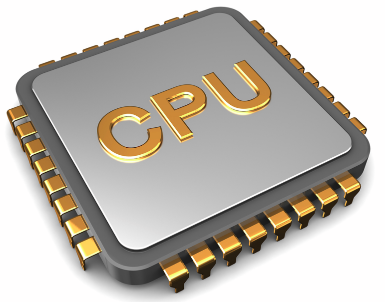
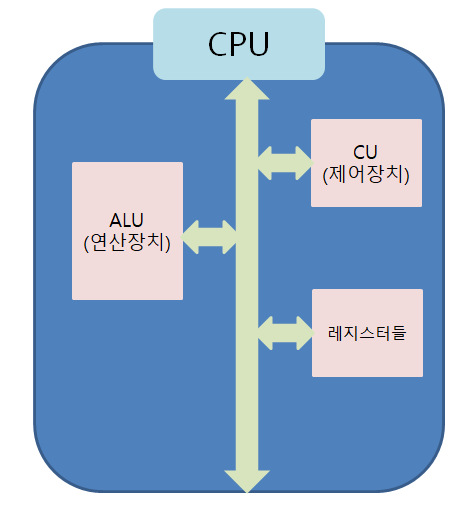

컴퓨터는 CPU, DMA 컨트롤러, 메모리, 타이머, 디바이스 컨트롤러 등으로 이루어져 있습니다.

## CPU

CPU란 (Central Processing Unit)의 약자로 중앙 처리 장치라고 부르기도 하며, 제어장치, 레지스터, 산술논리연산장치로 이어져 있습니다. 컴퓨터의 두뇌로서, 명령어를 해석하고 실행하는 역할을 수행합니다. 산술 및 논리 연산, 데이터처리, 제어 등의 작업을 처리합니다. 

### 레지스터(Register) 

CPU 내부에 위치한 작고 빠른 기억 장소로, 명령어와 데이터를 일시적으로 저장하는 역할을 합니다. 레지스터는 CPU에서 가장 빠른 액세스 속도를 가지므로, 중앙 처리 장치와 메모리 간의 데이터 이동을 감소시키고 연산 속도를 향상시킵니다. 또한 주소 레지스터, 데이터 레지스터, 명령어 레지스터 등 다양한 유형의 레지스터가 있습니다.

### 산술 논리 연산장치(ALU, Arithmetic Logic Unit)

산술 연산(덧셈, 뺄셈 등)과 논리 연산(AND, OR, NOT 등)을 수행하는 장치입니다. ALU는 레지스터에서 데이터를 받아서 연산을 수행하고, 그 결과를 다시 레지스터에 저장합니다. 이를 통해 데이터의 처리, 비교, 조작 등 다양한 연산을 수행할 수 있습니다. ALU는 CPU의 핵심적인 구성 요소 중 하나로, 컴퓨터의 계산 능력을 결정하는 요소 중 하나입니다.

### 제어장치(Control Unit)

CPU의 구성 요소 중 하나로, 컴퓨터 시스템의 모든 동작을 조정하고 제어하는 역할을 합니다. 명령어 해석, 실행, 데이터 전송 등의 작업을 수행합니다. 제어장치는 명령어를 해독하고 실행 단계를 조정하여 다른 하드웨어 구성 요소들이 올바른 순서로 동작하도록 합니다.

### CPU의 연산 처리 순서

1. 제어장치가 메모리에 계산할 값을 로드한다. 또한, 레지스터에도 로드 
2. 제어장치가 레지스터에 있는 값을 계산하라고 산술논리연산장치(ALU)에 명령
3. 제어장치가 계산된 값을 다시 레지스터에서 메모리로 계산된 값을 저장

## 인터럽트(Interrupt)

인터럽트란 컴퓨터 시스템에서 발생하는 이벤트로, 어떤 신호가 들어왔을 때 CPU를 잠시 정지시킨 후 우선 순위가 더 높은 작업을 처리하도록 하는 메커니즘입니다. 인터럽트는 외부 장치의 상태 변화나 예외 상황 발생 등 다양한 상황에서 발생할 수 있다.

인터럽트가 발생되면 인터럽트 핸들러 함수가 모여 있는 인터럽트 백터로 가서 인터럽트 핸들러 함수가 실행됩니다. 인터럽트 간에는 우선순위가 있기 때문에 우선순위에 따라 실행됩니다. 인터럽트는 소프트웨어 인터럽트와 하드웨어 인터럽트로 나눌 수 있습니다.

### 하드웨어 인터럽트 

하드웨어 장치에서 발생하는 인터럽트로, 주로 외부 장치가 CPU의 관심이 필요한 작업을 알리는 역할을 합니다.  이때 인터럽트라인이 설계된 이후 순차적인 인터럽트 실행을 중지하고 운영체제에 시스템 콜을 요청해서 원하는 디바이스로 향해 디바이스에 있는 작은 로컬 버퍼에 접근하여 일을 수행합니다. 예를 들어, 키보드 입력, 마우스 클릭, 타이머 등이 있습니다.

### 소프트웨어 인터럽트

소프트웨어에서 발생하는 인터럽트로, 트랩(trap)이라고 부르기도 하며 주로 프로그램 실행 중 예외 상황이나 특정 이벤트에 응답하기 위해 사용됩니다. 예를 들어, 0으로 나누기 오류, 메모리 보호 오류, 시스템 호출 등이 있습니다.

## DMA 컨트롤러

DMA(Direct Memory Access) 컨트롤러는 컴퓨터 시스템에서 데이터를 메모리와 주변 장치 간에 직접 전송하는 데 사용되는 하드웨어 장치입니다. DMA 컨트롤러는 CPU의 개입 없이 데이터 전송을 처리하므로, CPU가 다른 작업에 전념할 수 있도록 합니다.

일반적으로, 데이터를 전송하는 과정에서 CPU는 데이터를 읽어오고, 그 다음 주변 장치로 전송하거나 메모리로부터 데이터를 가져와 주변 장치에 전송하는 역할을 수행합니다. 이렇게 CPU가 직접 데이터 전송을 처리하면 처리 속도가 느려지거나 CPU의 성능이 저하될 수 있습니다.

DMA 컨트롤러는 이러한 문제를 해결하기 위해 도입되었습니다. DMA 컨트롤러는 CPU의 개입 없이 주변 장치와 메모리 간 데이터 전송을 수행합니다. CPU는 DMA 컨트롤러에 전송 작업을 지시하고, DMA 컨트롤러는 주변 장치와 메모리 사이의 데이터 전송을 독립적으로 처리합니다.

## 메모리(Memory)

메모리는 전자회로에서 데이터나 상태, 명령어 등을 기록하는 장치를 말합니다. 데이터의 읽기와 쓰기 작업을 수행하며, 프로그램과 데이터를 영구적으로 저장합니다.

### 주 기억장치 (Main Memory)

주 기억장치는 컴퓨터가 실제로 작동할 때 프로그램과 데이터를 저장하는 공간입니다. 주로 랜덤 액세스 메모리(RAM)이 사용됩니다. RAM은 읽기와 쓰기 모두가 가능하며, 전원이 공급되는 동안 데이터를 유지합니다. ***주 메모리는 컴퓨터가 작동 중일 때만 데이터에 접근할 수 있으며, 전원이 꺼지면 저장된 데이터가 손실됩니다.***

### 캐시 메모리 (Cache Memory)

캐시 메모리는 CPU가 주로 사용하는 메모리 계층 중 하나로, 주 기억장치와 CPU 사이의 속도 차이를 극복하기 위해 사용됩니다. 캐시는 주로 속도가 빠른 SRAM(Static Random Access Memory)으로 구성되며, CPU가 자주 사용하는 데이터와 명령어를 임시로 저장합니다. ***캐시는 CPU에 가까워 데이터 액세스 속도가 빠르며, 주 메모리로부터 데이터를 미리 가져와 CPU의 대기 시간을 줄입니다.***

### 보조 기억장치 (Secondary Storage) 

보조 기억장치는 주 기억장치와는 달리 데이터를 영구적으로 저장하는 데 사용됩니다. 주로 하드 디스크 드라이브(HDD) 또는 고체 상태 드라이브(SSD)와 같은 장치를 의미합니다. 보조 기억장치는 주로 대용량 저장 공간을 제공하며, 컴퓨터의 운영 체제, 프로그램, 파일 등을 저장합니다. 보조 기억장치는 ***주 메모리보다 접근 속도가 느리지만, 비휘발성이므로 전원이 꺼져도 데이터가 보존됩니다.***

> 각 메모리 유형은 속도, 용량, 비용 등의 측면에서 서로 다른 특징을 가지고 있으며, 컴퓨터 구조의 성능과 기능을 결정하는 요소 중 하나입니다.

## 타이머(Timer)

타이머는 몇 초안에는 작업이 끝나야 한다는 것을 정하고 특정 프로그램에 시간을 제한을 다는 역할을 합니다. 시간이 많이 걸리는 프로그램이 작동할 때 제한을 걸기 위해 존재합니다.

## 디바이스 컨트롤러(Device controller)

디바이스 컨트롤러는 컴퓨터와 연결되어 있는 입출력 디바이스들의 작은 CPU를 말합니다.

reference : https://blog.naver.com/dlaxodud2388/221613076571 , 면접을 위한 CS 전공지식 노트(저자: 주홍철)

