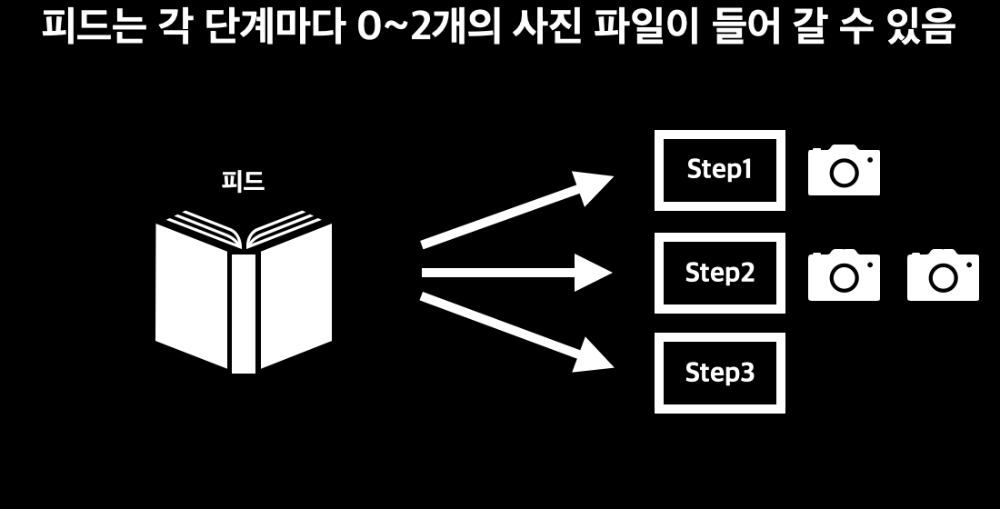
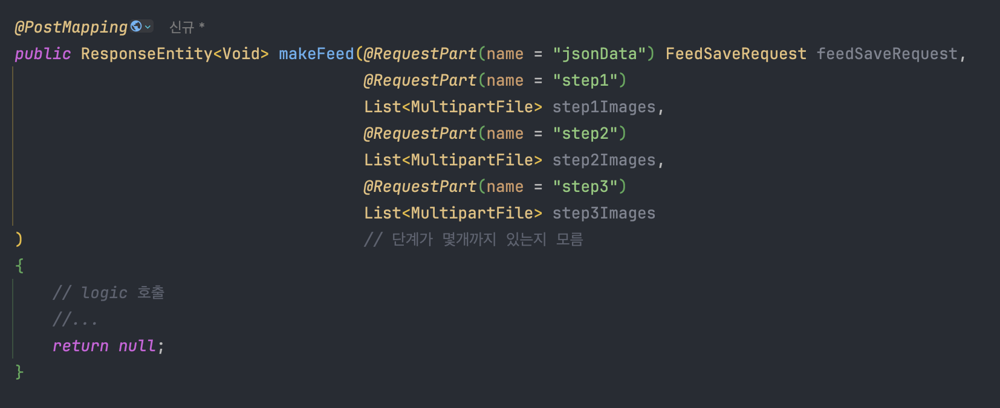
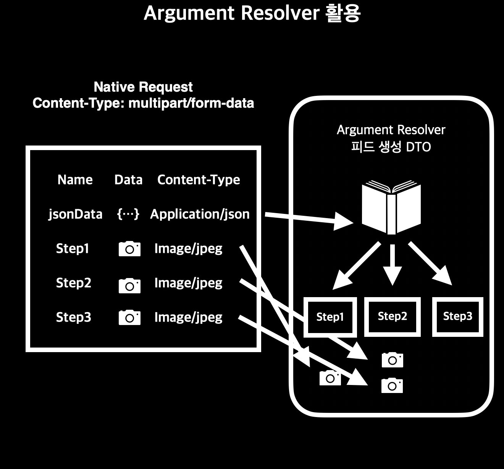
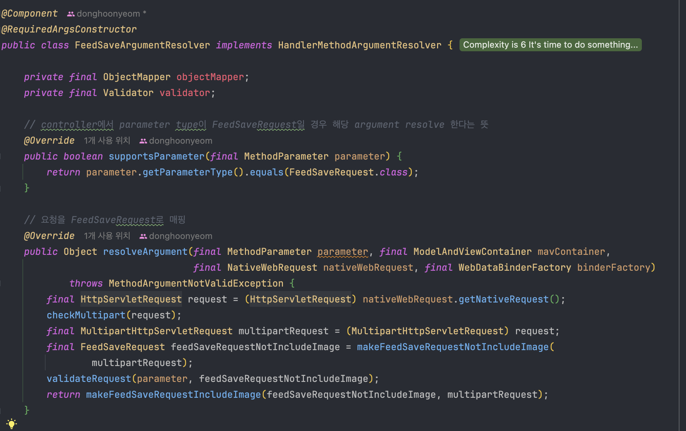
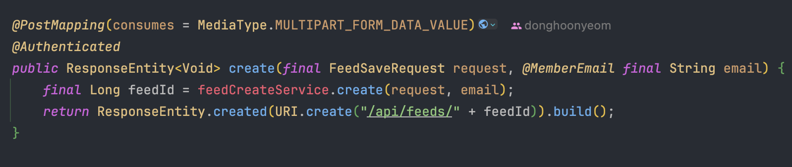

## [들어가며]

프로젝트를 진행하며 쉽지 않은 요구사항을 기술적으로 해결한 사례에 대해서 기록하고자 이 글을 쓰게 되었다.

## [요구사항]

피드를 생성하는 API를 만들어야하는데 다음과 같은 특이한 요구사항이 있다.

요구사항을 정리하면 다음과 같다.

> 1. 피드는 여러개의 단계를 가질 수 있다. 단계의 수는 가변적이다.
> 2. 각 단계는 0~2개의 사진 파일을 가질 수 있다. 즉, 사진의 수도 가변적이다.
> 3. 피드 생성에 필요한 다른 데이터는 json 형식으로 넘어온다.
> 4. 위 요구사항을 하나의 API로 해결해야한다.

## [고려한 방법들]

다음과 같은 방법들을 고려했었다.

### API 분리

처음에는 이 정도로 큰 요청은 분리를 하는게 맞다고 생각했다. 애초에 API 설계가 잘못되었다는 생각이 들었고, 한번에 해결하기에는 너무 무거운 API라고 생각이 들었다. 그래서 다음과 같은 API 설계로 변경하려고 했다.

> 1. 피드 생성에 필요한 다른 데이터를 통해 피드를 일단 생성하는 API. 이 요청에서는 사진 파일을 제외한 모든 피드를 생성한다.
> 2. 생성된 피드의 각각의 단계에 0~2개의 사진 데이터를 받는 API. 이 요청은 각 단계마다 각각 받거나, 한번에 모두 받는 것 둘 다 고려했다.

이런 API는 다음과 같은 문제점을 가지고 있다.

1. #### 완성되지 않은 피드를 생성한다.

2번 API를 각 단계마다 각각 사진 데이터를 받는 형식으로 사용하면, 하나의 피드를 생성하는데 여러번의 API 호출을 해야한다는 문제점이 있다. 만약 그 사이에 해당 피드에 접근하게 되면 완성되지 않은 피드를 사용자가 보게된다. 한번에 모두 받는 방식도 여전히 이러한 문제점이 발생할 여지가 있다.

2. #### 어차피 무거운 요청인 것은 변하지 않는다.

2번 API를 각각의 단계에 해당하는 모든 사진을 한번에 받도록하면 원래 API랑 다를게 없다. 원래 API는 2번 API에 단순히 피드 생성에 필요한 json data만 더 받는 것이다. API의 크기의 차이가 아주 미미하다.

기존의 문제점을 해결하지 못하면서 오히려 다른 기술로 해결할 수 있는 여지를 없애는 방법이다.

### `@RequestPart` 활용

`@RequesetPart`를 활용할 생각을 해봤지만 애초에 불가능하다. `@RequestPart`는 `name`으로 구분지어서 json data, 각 단계의 사진들을 받는다. 하지만 각 단계들이 가변적이다. 그래서 애초에 요청을 만들 수가 없다.

## [해결]

요구사항 자체를 변경하거나, Spring에서 제공하는 file 매핑 기술을 사용하지 못한다. 그래서 요청을 다음과 같이 정의하고 Argument Resolver에서 Native한 Request를 받아서 직접 매핑해주기로 했다.

multipart/form-data는 name을 key(unique할 필요 없음) data를 value로 하는 테이블 형식과 비슷하다. 그래서 요청을 다음과 같이 받을 수 있다.

> 1. jsonData라는 name으로 피드 생성에 필요한 데이터를 받는다.
> 2. 각 단계의 이름을 name으로 사진 파일을 받는다. name이 같을 경우 해당 단계의 다른 사진으로 인식하여 한 단계의 여러개의 사진을 받을 수 있다. 만약 0개의 사진을 가지고있는 단계의 경우(위 사진의 step2), 그냥 해당 단계를 name으로 가지는 열을 만들지 않으면 된다.

그리고 Arument Resolver에서 원하는 객체 형태로 매핑을 해주고, handler로 넘겨주면 된다. 

실제로는 더 복잡하게 동작을 하지만 본 메소드는 위와 같다.

controller 부분은 다음과 같다.

## [정리]

요청 자체가 복잡한 API를 Argument Resolver에서 Native한 Request를 직접 만져서 해결할 수 있다. 요청이 복잡하더라도 겁먹지 말고 Argument Resolver를 적극 활용해보자.

