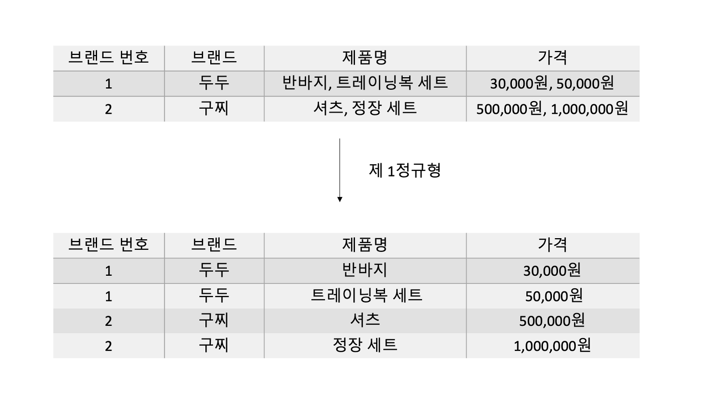
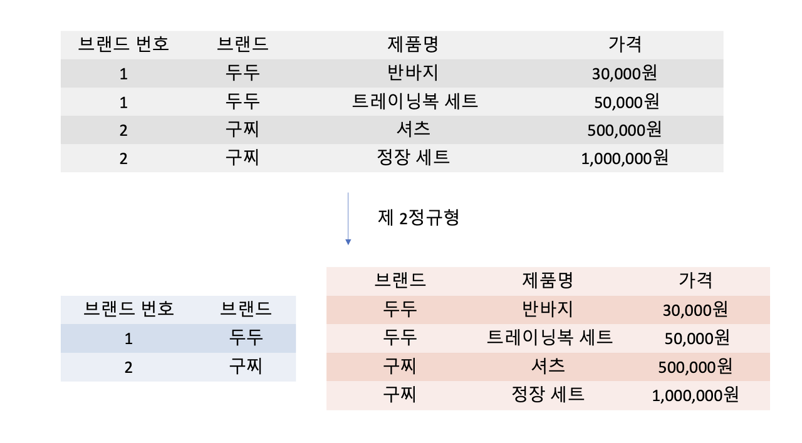
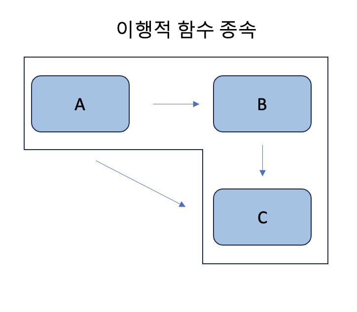
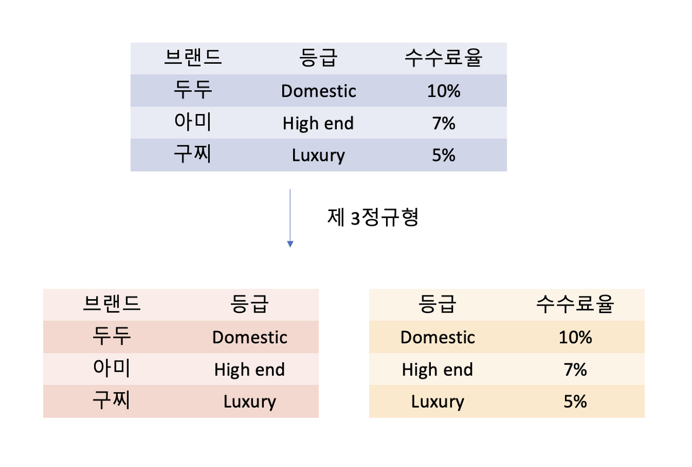
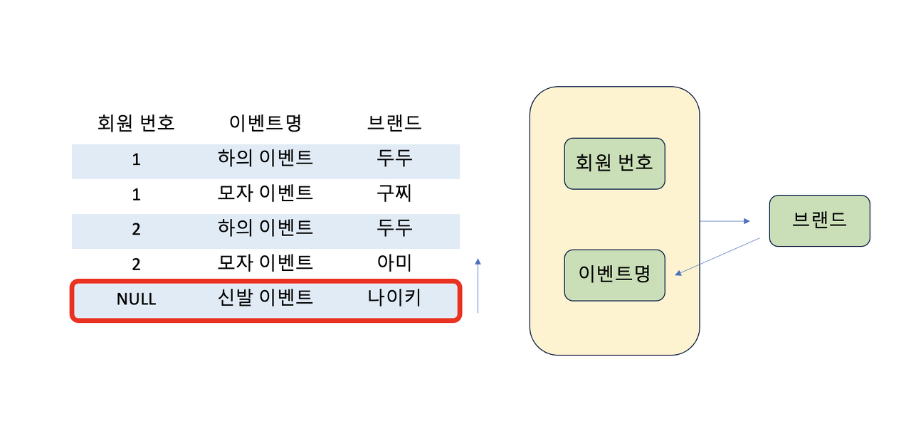
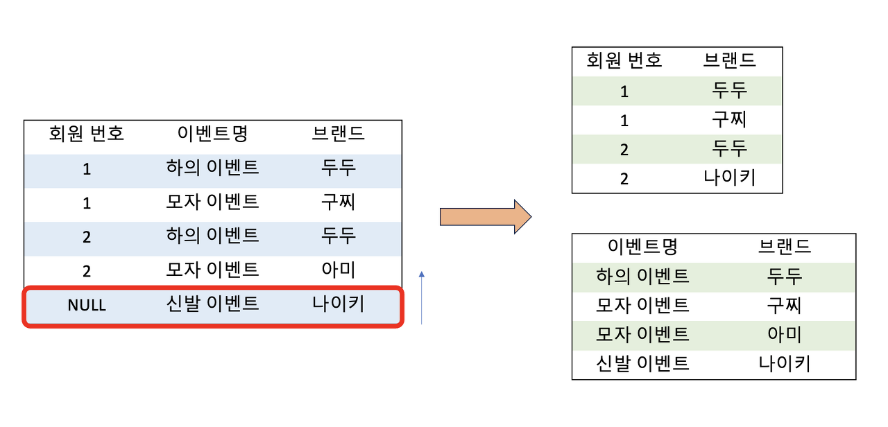

## 들어가며

***정규화 과정은 릴레이션 간의 잘못된 종속 관계로 인해 데이터베이스 이상 현상이 일어나 이를 해결하거나, 저장공간을 효율적으로 사용하기 위해 릴레이션을 여러 개로 분리하는 과정을 말한다.***

여기서 말하는 데이터베이스 이상 현상은 예를 들어 회원이 한 가지의 등급을 가져야 하는 상황에서 여러 개의 등급을 가지고 있거나, 데이터를 삭제할 때 필요한 데이터가 같이 삭제되고, 데이터를 삽입하는데 하나의 필드값이 NULL이 되면 삽입이 안 되어서 삽입하기 어려운 현상을 말한다.

정규화는 정규화 원칙을 기반으로 정규형을 만들어가는 과정이며, 정규화된 정도를 정규형으로 표현한다. 기본 정규형은 ***제 1정규형, 제2 정규형, 제3 정규형, 보이스-코드 정규형(BCNF)***이 있고, 고급 정규형으로는 ***제4 정규형과 제5 정규형***이 있다.

## 정규형 원칙

정규형의 원칙은 데이터베이스 설계에서 데이터의 중복을 최소화하고 데이터의 무결성을 보장하기 위해 정의된 일련의 규칙입니다. 주로 관계형 데이터베이스에서 사용되며, 데이터베이스의 효율성과 유지보수성을 높이는데 도움이 된다.

### 제1 정규형(1NF)

- 각 테이블은 원자적인 값만을 포함해야 한다. 즉, 더 이상 나눌 수 없는 단위여야 한다.
- 각 속성은 하나의 값을 가져야 하며, 여러 개의 값을 포함하는 복합 속성은 허용되지 않는다.

그림처럼 두두라는 브랜드에 판매 제품이 반바지, 트레이닝복 세트 이렇게 있을 때 이것을 나눠서 반복 속성을 제거하는 것을 볼 수 있다.
구찌라는 브랜드도 마찬가지로 셔츠와 정장세트를 나눠서 반복 속성을 제거해준 것을 확인할 수 있다.

### 제2 정규형(2NF)

- 1NF를 만족해야 한다.
- 기본 키가 아닌 모든 속성들이 기본 키 전체에 대해 완전 함수 종속해야 한다. 즉, 기본 키 중 어떤 부분에도 의존하지 않아야 한다.

그림을 확인해 보면 기본키인 {브랜드, 제품명}과 정말 종속되어 있는 브랜드번호 릴레이션과 {브랜드, 제품명}에 따른 가격 릴레이션으로 분리되어 있는 것을 확인할 수 있다. 주의점으로는 릴레이션을 분해할 때 동등한 릴레이션으로  분해해야 하고, 정보 손실이 발생하지 않는 무손실 분해로 분해되어야 한다는 점이다.

### 제3 정규형(3NF)

- 2NF를 만족해야 한다.
- 기본 키가 아닌 모든 속성들이 기본 키에 대해서만 종속되어야 한다. 즉, 기본 키가 아닌 속성들 간에는 종속 관계가 없어야 한다.

> 이행적 함수 종속
> 
> 
> 
> 이행적 함수 종속이란 A -> B와 B -> C 존재할 때, 논리적으로 A -> C도 성립하는데, 이때 집합 C가 집합 A에 이행적으로 함수 종속이 되어있다고 말한다.

예를 들어 dudu라는 패션 플랫폼이 있다고 가정하고, 각각의 브랜드의 등급, 수수료율이 정해져 있는 테이블을 아래의 그림과 같이 분해하는 것을 말한다.

### 보이스-코드 정규형(BCNF)

- 모든 결정자(Candidate Key)가 키 전체에 대해 함수 종속되어야 한다.
- 제3 정규형을 만족하면서 부분적으로 함수 종속되는 문제를 해결한다.

> ***결정자*** : 함수 종속 관계에서 특정 종속자(dependent)를 결정짓는 요소이다. 예를 들어 A -> B일 때, A는 결정자, B는 종속자이다.

dudu 플랫폼에서 브랜드별 이벤트를 진행한다고 했을 때, 요구 사항은 다음과 같다고 가정해 보겠습니다.

- 각 이벤트에 대해 한 명의 고객은 오직 하나의 브랜드의 이벤트만 참여할 수 있다.
  (ex : ***만약 1번 고객이 구찌의 모자 이벤트를 참여했다면, 아미의 모자 이벤트는 참여할 수 없다.***)
- 각 브랜드는 하나의 이벤트만 진행할 수 있다.
- 하나의 이벤트는 여러 브랜드가 담당할 수 있다.

위 릴레이션을 보면 {회원 번호, 이벤트명} 또는 {회원 번호, 브랜드}가 후보키가 되며, 만약 나이키라는 브랜드가 신발 이벤트를 진행할 때, 이를 삽입하면 회원 번호가 NULL이 되는 문제가 발생한다.

함수 종속을 확인해보면 브랜드가 결정자지만 후보키가 아니므로 브랜드 속성을 분리해줘야 한다.

위 그림을 확인해 보면 나이키의 신발 이벤트가 정상적으로 들어갔으며 회원 번호와 브랜드. 이벤트명과 브랜드로 잘 나눠진 모습을 확인할 수 있다.

정규형의 원칙을 따르면 데이터의 중복을 최소화하고, 데이터의 일관성과 무결성을 유지할 수 있다. 하지만 ***과도한 정규화는 성능 저하를 초래할 수 있으므로***, 실제 서비스 운영 환경에서는 성능과의 균형을 고려하여 적절한 정규화 수준을 선택해야 한다. 또한, 정규형을 만족하지 못하는 경우에는 데이터의 수정, 삽입, 삭제 시 데이터 무결성을 유지하기 어려울 수 있으므로, 정규형을 따르는 것이 좋다고 생각한다.
