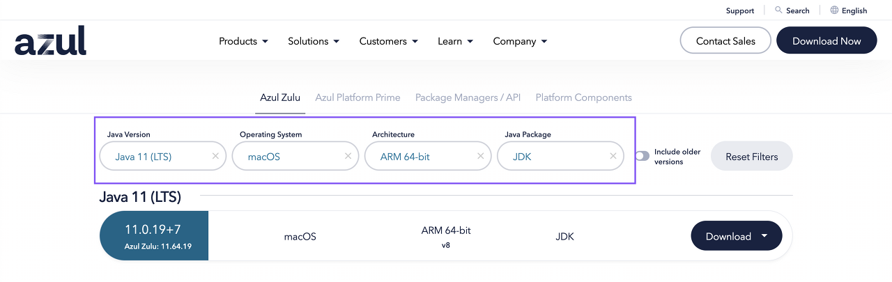

오늘은 자바의 개발 환경을 구축하기 위해 JDK 설치와 IntelliJ 설치해보려고 한다.

Mac M1 사용중이기 때문에 Mac 기반으로 작성 되었습니다.

- JDK는 Zulu openJDK 사용
- IntelliJ는 Community Edition 사용

### Zulu openJDK의 장점

1. 멀티 플랫폼 지원: Zulu OpenJDK는 Windows, macOS, Linux 및 다른 운영 체제에서 실행할 수 있다. 이는 Java 프로그램을 개발하고 배포하는 데 있어서 대규모 시스템에서 이식성이 높은 솔루션을 제공한다.

2. Java SE 호환성: Zulu OpenJDK는 Java SE의 최신 버전과 호환된다. 이는 Java SE API와 플랫폼 특성을 모두 지원하며 Java SE에서 작성된 코드가 Zulu OpenJDK에서 작동할 수 있도록 한다.

3. 안전한 애플리케이션 개발: Zulu OpenJDK는 Java 애플리케이션에서 발생할 수 있는 보안 취약점을 예방하는 기능을 제공한다. 이는 Java 애플리케이션 개발자들에게 높은 수준의 보안성을 제공합니다. 또한 Zulu OpenJDK는 업데이트와 유지보수가 지속적으로 이루어지며, Azul Systems는 기술 지원과 컨설팅 서비스를 제공하므로 개발자들이 안심하고 Java 애플리케이션을 개발할 수 있도록 도와준다.

###  1. [Zulu openJDK 다운로드 페이지](https://www.azul.com/downloads/?version=java-11-lts&os=macos&architecture=arm-64-bit&package=jdk#zulu) 접속 후 Java의 버전, OS, Architecture 를 선택

### 2. dmg를 선택하여 다운로드

### 3. 다운로드 완료 후 실행 하시고 오른쪽 박스 클릭

### 4. 계속 눌러주면 설치 완료
