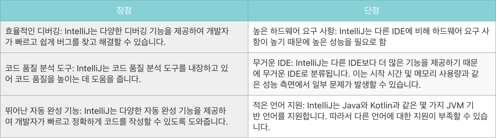
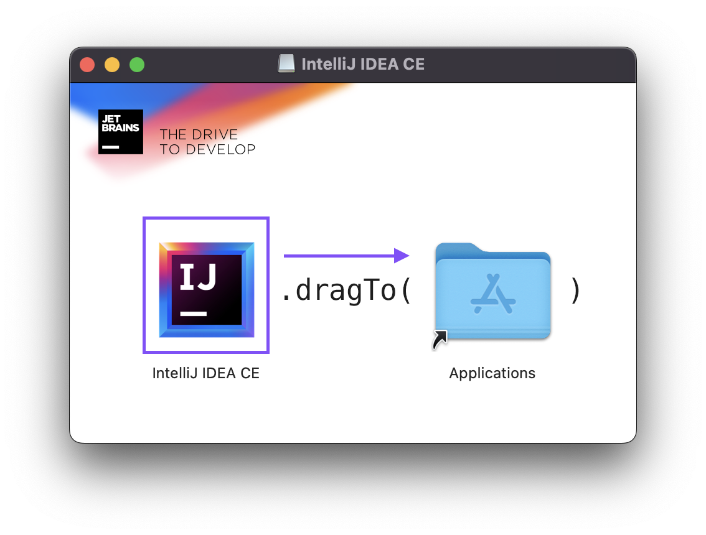

이번 글에서는 IntelliJ 설치를 해보려고 합니다.

IntelliJ는 IDE 중 하나로 stackOverflow 커뮤니티의 매년 개발자 설문조사 실행하는데 "전 세계 개발자에게 인기 있는 개발툴 TOP 5"에 들어갈 정도로 많이 사용하는 IDE 중 하나로 알고 있다.

### IntelliJ의 장단점

### 1. [IntelliJ 다운로드](https://www.jetbrains.com/ko-kr/idea/download/?section=mac#section=mac)에 접속 후 다운로드

### 2. IntelliJ 아이콘을 화살표 방향대로 드래그

