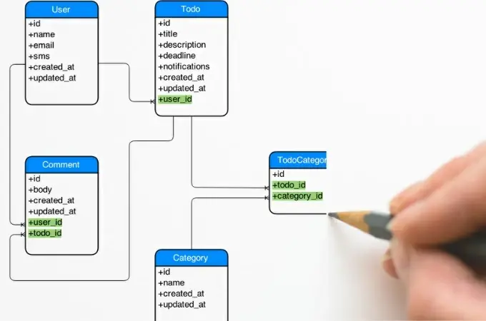

## ERD 의미

ERD(Entity Relationship Diagram)는 ***데이터베이스를 구축할 때 가장 기초적인 뼈대 역할을 하며, 릴레이션 간의 관계들을 정리한 것이다.*** 설계 과정에서 중요한 도구로서 데이터베이스의 구조를 이해하고 분석하는 데 도움을 주며, 데이터베이스의 효율성과 일관성을 유지하고 향상하는 데 기여한다. 또한 팀 간의 협업과 유지 보수를 간편하게 만들어준다. 따라서 프로젝트의 성공을 위해 ERD를 적절하게 활용하는 것이 중요하다. 만약 우리가 서비스를 구축한다고 하면 가장 신경 써야 할 부분이다.

## ERD의 중요성

ERD는 시스템의 요구 사항을 기반으로 작성되며 이 ERD를 기반으로 데이터베이스를 구축한다. 데이터베이스를 구축한 후에도 디버깅이나 비즈니스 프로세스 재설계가 필요한 경우에 설계도 역할을 담당한다.

하지만 ERD는 관계형 구조로 표현하는 데이터를 표현할때 유용하지만, 비정형 데이터를 표현할 수는 없다.

> ***비정형 데이터***란? 비구조화 데이터를 말하며, 미리 정의된 데이터 모델이 없거나 미리 정의된 방식으로 정리되지 않은 정보다. 이러한 데이터는 일반적인 행-열 구조가 없으며, 데이터베이스나 테이블 등으로 쉽게 정리하거나 저장하기 어렵다.

비정형 데이터는 사람의 언어, 이미지, 비디오, 소셜 미디어 게시물, 웹 페이지 등 다양한 형태로 존재한다.

### 데이터베이스 구조 시각화

복잡한 데이터베이스 구조를 시각화하여 이해하기 쉽게 도와준다. 개체(Entity)와 개체들 간의 관계를 명확하게 보여주기 때문에 데이터베이스의 구조를 파악하는 데 도움이 된다.

### 요구 사항 분석

ERD를 작성함으로써 요구 사항을 명확하게 파악할 수 있다. 데이터베이스 설계는 사용자 요구 사항에 기반해 이루어지며, ERD를 통해 개체들의 속성과 관계를 정확히 정의함으로써 프로젝트의 성공 가능성을 높일 수 있다.

### 데이터 일관성 유지

데이터베이스의 구조를 명확하게 정의함으로써 데이터의 일관성을 유지하는 데 도움이 된다. 올바른 관계를 설정하고 적절한 속성을 지정함으로써 데이터의 중복을 줄이고 무결성을 유지할 수 있다.

### 데이터베이스 효율성

올바른 ERD를 사용하면 데이터베이스의 성능과 효율성을 향상할 수 있다. 적절한 인덱스를 설정하거나 쿼리 최적화를 수행하는 등 ERD를 기반으로 데이터베이스를 튜닝할 수 있다.

### 개발자와 협업

ERD는 개발자, 데이터베이스 관리자, 프로젝트 관리자 등 다양한 팀원들 사이의 소통과 협업을 간소화할 수 있다. ERD를 통해 모든 팀원들이 데이터베이스 구조를 쉽게 이해하고 작업할 수 있다.

### 유지 보수 용이성

데이터베이스가 변경되어야 하는 경우에도 유지 보수를 용이하게 만든다. 데이터베이스 구조를 시각화하고 문서화하면 변경 사항을 파악하고 적용하는 데 도움이 된다.

