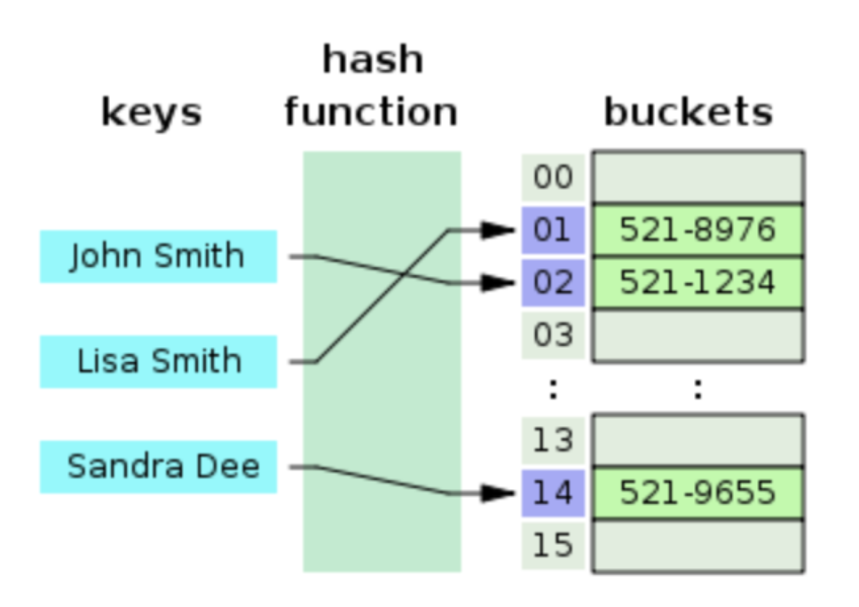

## 해시 테이블(Hash Table)이란?

데이터를 저장하고 검색하는 데 사용되는 자료구조 중 하나. 특히, 데이터를 효율적으로 검색할 수 있도록 설계되어 있다. 해시 테이블은 '해시 함수'라는 함수를 사용하여 데이터를 배열의 인덱스로 변환하고, 해당 인덱스에 데이터를 저장한다.

해시 함수는 데이터의 특정 특성을 활용하여 고유한 해시 값(해시 코드 또는 해시 키)을 생성하는 역할을 한다. 이렇게 생성된 해시 값은 배열의 인덱스로 사용되어 데이터가 해시 테이블 내 어느 위치에 저장되어야 할지를 결정한다.

일반적으로 해시 함수는 입력 데이터와 출력 해시 값의 길이가 다르더라도, 동일한 입력에 대해 항상 동일한 해시 값을 반환해야 한다. 이렇게 해시 함수를 설계함으로써 해시 충돌을 최소화 할 수 있다.

### 해시 테이블의 특징

- 빠른 검색과 삽입 : 해시 함수를 사용하여 데이터를 빠르게 찾고 삽입할 수 있다. 평균적으로 O(1)의 시간 복잡도로 검색과 삽입이 가능
- 해시 충돌 : 서로 다른 데이터가 같은 해시 값으로 매핑될 수 있는데, 이를 해시 충돌이라고 한다. 충돌이 발생하는 경우에 대처할 수 있는 방법들이 있는데, 가장 일반적인 방법은 해시 테이블의 각 버킷에 연결 리스트를 사용하여 충돌이 발생한 데이터를 연결하는 것이다.
- 공간 효율성 : 해시 테이블은 적은 메모리 공간으로 많은 데이터를 효율적으로 관리할 수 있다.
- 해시 함수의 선택 : 해시 함수의 선택은 해시 테이블의 성능에 큰 영향을 준다. 좋은 해시 함수는 데이터를 가능한 한 균일하게 해시 테이블에 분배하여 충돌을 최소화해야 한다.

 