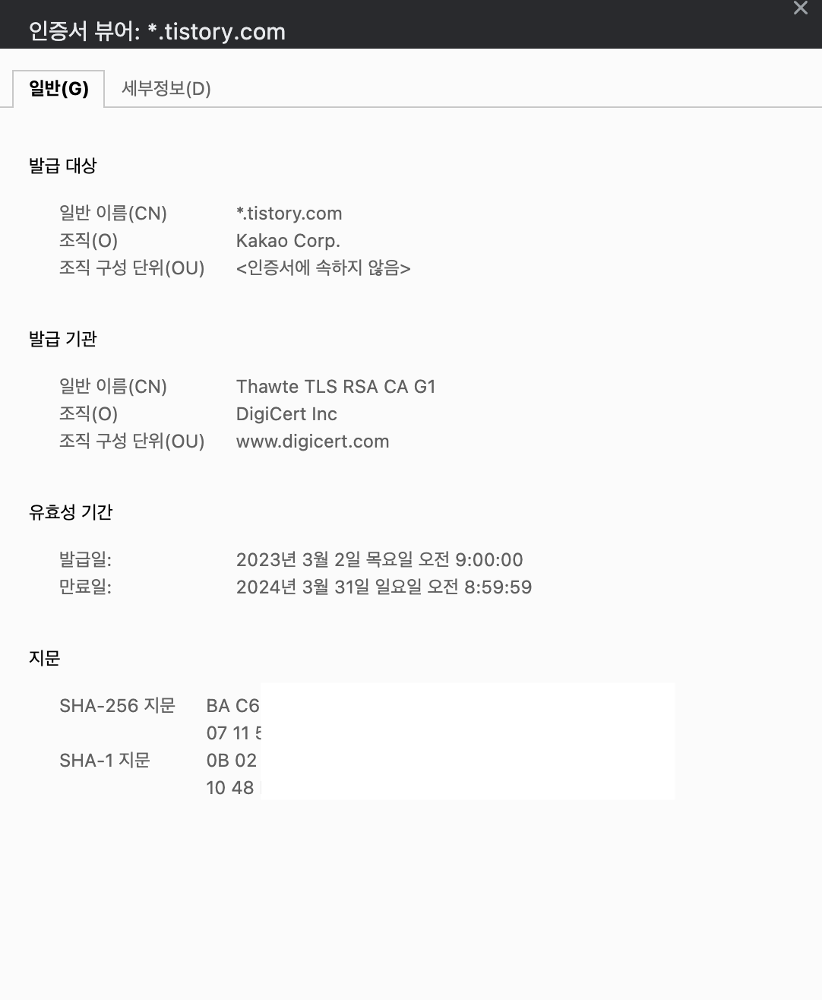

## HTTPS의 의미

HTTPS의 사전적 의미는 하이퍼텍스트 전송 프로토콜 보안(HTTPS)은 웹 브라우저와 웹 사이트 간에 데이터를 전송하는 데 사용되는 기본 프로토콜인 HTTP의 보안 버전입니다. HTTPS는 데이터 전송의 보안을 강화하기 위해 암호화됩니다. 이는 사용자가 은행 계좌, 이메일 서비스, 의료 보험 공급자에 로그인하는 등 중요한 데이터를 전송할 때 특히 중요합니다.

모든 웹 사이트, 특히 로그인 자격 증명이 필요한 웹 사이트는 HTTPS를 사용해야 합니다. 크롬 등 최신 웹 브라우저에서는 HTTPS를 사용하지 않는 웹 사이트가 HTTPS를 사용하는 웹 사이트와 다르게 표시됩니다.

## HTTPS의 특징

### 1. 암호화

외부인이 서버와 클라이언트가 주고받는 정보를 탈취할 수 없도록 한다. 서버와 클라이언트가 HTTPS를 사용하면 서로 합의한 방식으로 데이터를 암호화하여 주고받는다. 이때 외부인이 데이터 탈취에 성공하더라도 암호화되어 알아볼 수 없게 된다. 하지만 HTTP는 데이터 암호화가 따로 적용되지 않아서 외부인이 데이터 탈취 시에 쉽게 정보를 확인할 수 있다.

여기서 서버와 클라이언트의 암호화 방식은 대칭키 방식과 비대칭키 방식을 혼용하여 사용한다. 대칭키 방식은 비대칭키 방식 보다 알고리즘이 덜 복잡하여 대칭키를 사용하여 암복호화 하는 편이 컴퓨터에 부담을 덜 줄 수 있기 때문에 서버와 클라이언트가 데이터를 주고 받을 때 사용 합니다. 대칭키 방식은 공통의 비밀키를 공유하여 서로의 데이터를 암호화 복호화할 수 있고, 비대칭키 방식은 각각 공개키와 비밀키(개인키)를 가지고 상대가 나의 공개키로 암호화한 데이터를 개인이 가진 비밀키로 복호화하는 것을 의미합니다.

여기서 대칭키를 주고 받는 상황에서 데이터 탈취가 일어난다면 암호화를 하게 되더라도 복호화될 가능성이 높습니다. 그래서 HTTPS는 대칭키를 주고 받을때는 비대칭키 방식을 사용하도록 되어 있습니다.

### 2. 인증서

HTTPS는 브라우저가 서버의 응답과 함께 전달된 인증서를 확인할 수 있습니다. 인증서는 서버의 신원을 보증하여 접속한 사이트가 가짜 사이트가 아닌 것을 보증합니다. 이때 이를 보증할 수 있는 제삼자를 Certificate Authority, ***CA***라고 부릅니다.
CA는 인증서를 발급해 주는 엄격하게 공인된 기관들을 말하는데,  이러한 CA들은 서버의 공개키와 정보를 CA의 비밀키로 암호화하여 인증서를 발급합니다.

인증서를 발급한 CA, 서명에 사용한 알고리즘, 서명, tstory 공개키 정보 등이 들어있는 것을 확인할 수 있습니다.
서버가 클라이언트에게 CA에서 발급받은 인증서를 전달하면 클라이언트는 OS 또는 브라우저에 미리 내장되어 있던 CA 리스트를 통해 브라우저에서 인증된 CA에서 발급받은 인증서인지 먼저 확인했을 때  만약 인증된 CA에서 발급한 인증서가 아니라면 화면에 경고창을 보여주고, 반대로 CA에서 발급한 인증서 일시 브라우저에서 제공된 CA 기관의 공대키로 서버 인증서를 복호화합니다.