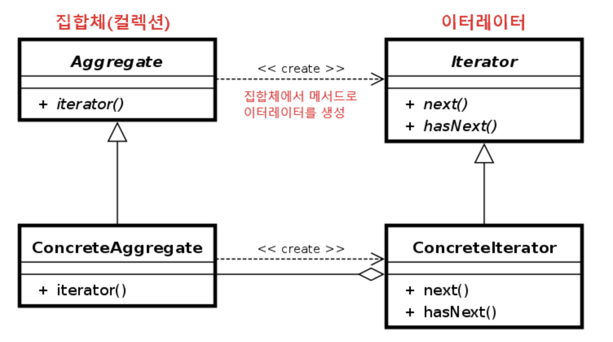

## 들어가며

이터레이터 패턴은 이터레이터(Iterator)를 사용하여 컬렉션(Collection)의 요소들에 접근하는 디자인 패턴입니다.
이를 통해 순회할 수 있는 여러 가지 자료형의 구조와는 상관없이 이터레이터라는 하나의 인터페이스로 순회가 가능합니다.

## 이터레이터 패턴 구성 요소

이터레이터 패턴은 주로 다음과 같은 구성 요소로 구성됩니다.

1. Iterator(반복자): 검색된 요소를 순회하는 역할을 담당합니다. 다음 요소로 이동하거나 현재 요소에 접근하는 방법을 제공합니다.
2. ConcreteIterator(구체적인 반복자): Iterator 인터페이스를 구현하여 실제로 모음을 순회하는 로직을 구현합니다.
3. Aggregate(집합체): 객체들의 집합체를 인터페이스입니다. 이 인터페이스를 구현하는 컬렉션 클래스는 iterator() 메서드를 제공하여 ConcreteIterator 객체를 생성합니다.
4. ConcreteAggregate(구체적인 집적체): Aggregate 인터페이스를 구현하여 실제로 집합을 관리하고 iterator() 메서드를 통해 ConcreteIterator 객체를 생성합니다.

 

## Iterator 예제 코드

### 1. Iterator(반복자)
```java
// Aggregate 인터페이스 => 집합체 객체 (컬렉션)
interface Aggregate {
    Iterator<Integer> iterator();
}
```

### 2. ConcreteIterator(구체적인 반복자)

```java
// ConcreteAggregate 클래스
class ArrayCollection implements Aggregate {

    // 데이터 집합 (컬렉션)
    private int[] collection;

    public ArrayCollection(int[] collection) {
        this.collection = collection;
    }

    //내부 컬렉션을 인자로 넣어 이터레이터 구현체를 클라이언트에 반환
    @Override
    public Iterator<Integer> iterator() {
        return new ArrayIterator(collection);
    }
}
```

### 3. Aggregate(집합체)

```java
// 반복체 객체
interface Iterator<T> {
    boolean hasNext();
    T next();
}
```

### 4. ConcreteAggregate(구체적인 집적체)

```java
// ConcreteIterator 클래스
class ArrayIterator implements Iterator<Integer> {
    private int[] collection;
    private int position; // 커서 (for문의 i 변수 역할)
    
    // 생성자로 순회할 컬렉션을 받아 필드에 참조 시킴
    public ArrayIterator(int[] collection) {
        this.collection = collection;
        this.position = 0;
    }

    // 순회할 다음 요소가 있는지 true / false
    @Override
    public boolean hasNext() {
        return position < collection.length;
    }

    // 다음 요소를 반환하고 커서를 증가시켜 다음 요소를 바라보도록 한다.
    @Override
    public Integer next() {
        return collection[position++];
    }
}
```

### `Main`코드
```java
// 클라이언트 코드
public class Main {
    public static void main(String[] args) {

        // 1. 집합체 생성
        int[] arr = {1, 2, 3, 4, 5};
        ArrayCollection collection = new ArrayCollection(arr);

        // 2. 집합체에서 이터레이터 객체 반환
        Iterator<Integer> iterator = collection.iterator();
        
        // 3. 이터레이터 내부 커서를 통해 순회
        while (iterator.hasNext()) {
            int element = iterator.next();
            System.out.println(element);
        }
    }
}
```

## 이터레이터 패턴의 장점과 단점

### 장점

- 일관된 이터레이터 인터페이스를 사용해 여러 형태의 컬렉션에 대해 동일한 순회 방법을 제공한다.
- 컬렉션의 내부 구조 및 순회 방식을 알지 않아도 된다.
- 집합체의 구현과 접근하는 처리 부분을 반복자 객체로 분리해 결합도를 줄 일 수 있다.

### 단점

- 클래스가 늘어나고 복잡도가 증가한다.
- 구현 방법에 따라 캡슐화를 위배할 수 있다.

## 마치며

컬렉션에 대한 순회 논리를 Iterator에 위임함으로써 코드의 확장성이 증가하고, 새로운 컬렉션을 추가하거나 기존 컬렉션의 내부 구조를 변경해도 클라이언트 코드를 수정할 필요가 없다는 점이 눈에 띄게 좋았다.
이러한 경험을 통해 디자인 패턴이 어떻게 코드의 품질을 향상시키고 유지보수를 용이하게 만드는지에 대해 조금은 더 알게된것 같다.