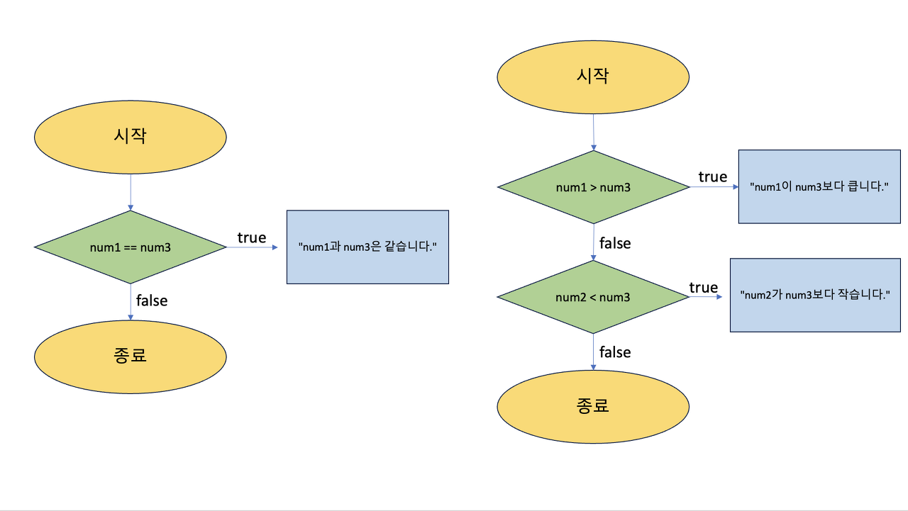

조건문은 말 그대로 주어진 조건식의 결과에 따라 별도의 명령을 수행하도록 제어하는 명령문입니다.
자바에서 사용되는 조건문은 크게 ***if문***과 ***switch문***이 있습니다.

## if문

if문은 소괄호 안에는 boolean 값으로 평가될 수 있는 조건식을 넣어주고, 중괄호 안의 실행 블록에는 조건식이 참일 때 실행하고자 하는 코드를 적어주면 된다. 소괄호 안에 조건문이 참(true) 일 때만 주어진 명령문이 실행된다.

> 참고로 else문은 생략이 가능하다.

```java
public class ifexam {
    public static void main(String[] args) {
        int num1 = 10;
        int num2 = 5;
        int num3 = 10;

        if (num1 == num3) { //if문의 조건식이 참이어서 실행
            System.out.println("num1과 num3은 같습니다.");
        }

        if (num1 == num2) { // if문은 거짓이기 때문에 else문이 바로 실행 되어 "다릅니다." 출력
            System.out.println("같습니다.");
        } else { //else는 if문이 거짓일때 실행
            System.out.println("다릅니다.");
        }

        if (num1 > num3) { //if문은 거짓, else if문은 참이기 때문에 "num2가 num3보다 작습니다." 출력
            System.out.println("num1이 num3보다 큽니다.");
        } else if (num2 < num3) { //else if는 if문이 거짓이고, else if문의 조건식이 참 일경우 실행
            System.out.println("num2가 num3보다 작습니다.");
        }
    }
}
```



## switch 문

switch문은 if문과 같은 조건문이지만, 변수가 어떤 값을 갖느냐에 따라 실행문이 선택됩니다. switch 문은 if /else 문보다 가독성이 더 좋으며, 컴파일러가 최적화를 쉽게 할 수 있어 속도 또한 빠른 편입니다.

```java
import java.util.Scanner;

public class switchExam {
    static Scanner num = new Scanner(System.in);

    public static void main(String[] args) {
        String dice = num.nextLine(); //주사위 번호를 입력한다.

        switch (dice) {
            case "1":
                System.out.println("1칸 이동");
                break; //break는 다음 case를 실행하지 않고, switch문 탈출할 수 있습니다.
            case "2":
                System.out.println("2칸 이동");
                break;
            case "3":
                System.out.println("3칸 이동");
                break;
            case "4":
                System.out.println("4칸 이동");
                break;
            case "5":
                System.out.println("5칸 이동");
                break;
            case "6":
                System.out.println("6칸 이동");
                break;
            default: //switch문의 괄호 안 값과 같은 값이 없으면, 여기서 실행문을 실행합니다.
                System.out.println("없는 숫자입니다! " + dice);
                break;
        }
    }
}
```

Scanner를 이용하여 1 ~ 6의 숫자를 입력 받아 각각의 case에서 출력해 주고 종료되고 있습니다. 만약 1 ~ 6이 아닌 숫자를 받을 경우, "없는 숫자입니다."가 출력되고 종료됩니다.