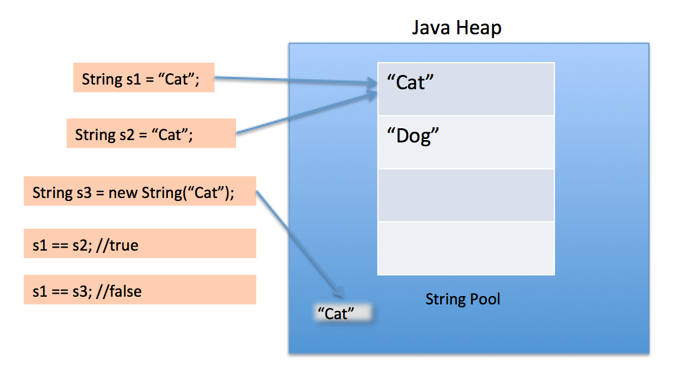

자바에서 **String은 텍스트 데이터를 저장하고 조작하는 데 사용되는 클래스입니다.** String 클래스는 자바의 내장 클래스로, java.lang 패키지에 속해 있으므로 추가적인 임포트 없이 사용할 수 있습니다.
String 객체는 한 번 생성되면 변경할 수 없는 불변(immutable) 객체이기 때문에 문자열을 수정하면 실제로는 새로운 문자열 객체가 생성되는 것이며, 원래의 문자열은 그대로 유지됩니다. 

String 객체는 문자열 리터럴로 초기화하거나 new 키워드를 사용하여 생성할 수 있습니다.

```java
String name1 = "Hello!"; // 문자열 리터럴을 사용한 초기화
String name2 = new String("dudu"); // new 키워드를 사용한 생성
```


String 클래스는 다양한 메서드를 제공하여 문자열을 조작하고 검색하는 데 사용할 수 있습니다. 일반적인 메서드에는 문자열의 길이를 반환하는 `length()`, 두 문자열을 연결하는 `concat()`, 특정 문자 또는 문자열을 포함하는지 확인하는 `contains()`, 문자열을 분할하는 `split()`, 대소문자 변환을 수행하는 `toLowerCase()` 와 `toUpperCase()` 등이 있습니다.

## `length()`

문자열의 length() 메서드는 해당 문자열의 길이(문자의 개수)를 반환합니다. 

```java
String name1 = "Hello!"; // 문자열 리터럴을 사용한 초기화
String name2 = new String("dudu"); // new 키워드를 사용한 생성

System.out.println(name1.length()); //출력값: 6
System.out.println(name2.length()); //출력값: 4
```

## `concat()`

자바의 concat() 메서드는 문자열(String)에 다른 문자열을 이어붙일 때 사용하는 메서드입니다. 

```java
String name1 = "Hello!"; // 문자열 리터럴을 사용한 초기화
String name2 = new String("dudu"); // new 키워드를 사용한 생성
String result = name1.concat(name2); //concat을 이용하여 이어붙임

System.out.println(result); //출력값: Hello!dudu
```

## `contains()`

자바의 contains() 메서드는 문자열(String)이 특정 문자열을 포함하고 있는지를 확인하기 위해 사용되는 메서드입니다. contains() 메서드는 호출된 문자열에 대상 문자열이 포함되어 있는 경우 true를 반환하고, 포함되어 있지 않은 경우 false를 반환합니다.

```java
String name1 = "Hello!"; // 문자열 리터럴을 사용한 초기화
String name2 = new String("dudu"); // new 키워드를 사용한 생성
boolean result = name2.contains("du"); //contains을 이용하여 문자열을 포함하는지 확인

System.out.println(result); //출력값: true
```

변수를 사용하여 동적으로 포함 여부를 확인할 수도 있습니다.

```java
String name1 = "Hello"; // 문자열 리터럴을 사용한 초기화
String name2 = new String("Hello, dudu"); // new 키워드를 사용한 생성
boolean result = name2.contains(name1); //contains을 이용하여 문자열을 포함하는지 확인

System.out.println(result); //출력값: true
```

`contains()` 메서드는 대소문자를 구분하여 문자열을 비교합니다. 따라서 "World"와 "world"는 서로 다른 문자열로 처리됩니다. 문자열을 대소문자 구분 없이 비교하고 싶다면, `toLowerCase()` 또는 `toUpperCase()`를 이용하여 대문자 또는 소문자로 통일한 후 `contains()` 메서드를 사용할 수 있습니다.

```java
String name1 = "Hello"; // 문자열 리터럴을 사용한 초기화
String name2 = new String("Hello, dudu"); // new 키워드를 사용한 생성

//toUpperCase를 이용하여 name2 문자열을 대문자로 변경 후 특정 문자열을 포함하는지 확인
boolean result = name2.toUpperCase().contains("DUDU"); 

System.out.println(result); //출력값: true
```

