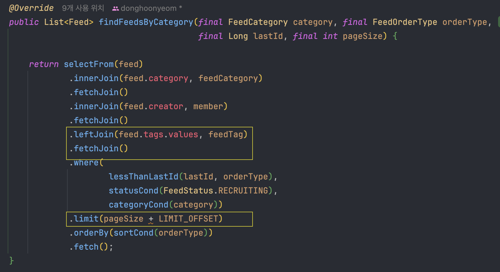
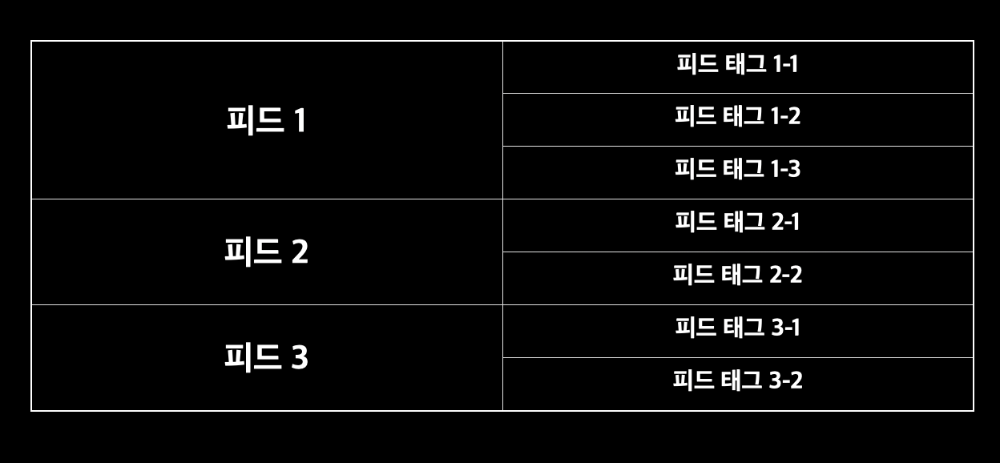
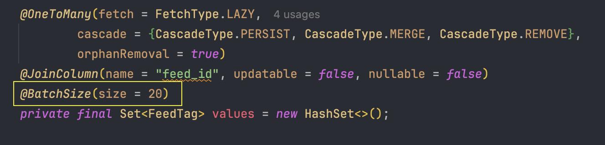
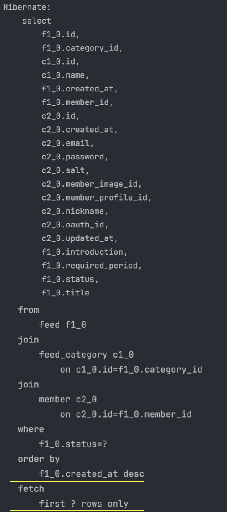

## [들어가며]

톰캣 성능테스트를 하기 위해 특정 API에 대하여 한 번에 많은 요청을 보냈고, 평소에 잘 동작하던 API가 OutOfMemoryError를 던지면서 모든 요청에 대해 실패하였다.
이 문제를 해결하기 위해 어떤 과정을 거쳤는지 자세히 살펴보자

## [문제 상황]

톰캣 성능테스트를 하기 위해 Jmeter를 사용하였고, 1초에 500번의 피드 목록 조회 요청을 보내도록 설정했다.
그런데 500번의 요청이 모두 실패했고, 어떤 에러 메세지가 담겨있는지 확인했다.
메세지는 다음과 같았다.

> Handler dispatch failed: java.lang.OutOfMemoryError: Java heap space

상상도 못한 OutOfMemoryError가 발생했다. 이전에는 한 번도 만나보지 못했던 에러였다.

바로 어플리케이션의 로그를 확인했다.
그리고 다음과 같은 경고가 떠 있는 것을 발견할 수 있었다.

> [WARN] [http-nio-9000-exec-483] [org.hibernate.orm.query] - HHH90003004:
firstResult/maxResults specified with collection fetch; applying in memory

바로 쿼리에 문제가 있었다는 것을 알게되었다.
그럼 피드 목록 조회 요청 때 사용하는 쿼리를 살펴보자!

## [엔티티 연관관계]

그 전에 이해를 돕기 위해 엔티티의 연관관계에 대해서 간단하게 설명하면

- '피드'와 '피드 태그'라는 엔티티는 1:N 관계이다.
- 한 '피드'에 대하여 '피드 태그'는 최소 1개부터 최대 5개까지 존재할 수 있다.

### 문제의 쿼리

무한 스크롤을 위해 피드 목록을 가져올 때 요청받은 사이즈만큼 피드를 전달하는데, 이때 피드와 피드 태그를 모두 반환한다.
피드 태그는 지연 로딩으로 설정해놓았기 때문에, N+1 문제를 방지하기 위해 fetchJoin을 붙여 한 번에 가져오도록 했다.

다음은 실제 QueryDsl로 작성한 쿼리문이다.



피드 태그를 가져오기 위해 leftJoin과 fetchJoin을 한 것을 확인할 수 있다.
그리고 요청받은 사이즈만큼 피드를 조회하기 위해 limit 구문을 추가했다.

그런데 실제 쿼리가 나간 것을 확인해보니 limit 구문이 적용이 되지 않고 있었다. 

```java
select
    --...
from
    feed f1_0 
    --...
left join
    feed_tag v1_0 
        on f1_0.id=v1_0.feed_id 
where
    f1_0.status=? 
order by
    f1_0.created_at desc
```

## 이유

그 이유는 fetchJoin과 limit을 함께 써서 그렇다.
N쪽의 테이블에서 몇 개의 데이터를 가져와야하는지 알 수 없어서 테이블 정보를 모두 가져올 수 밖에 없다는 것이다.

아래 그림과 같이 피드가 존재한다고 하자.
피드 3개를 가져오기 위해 limit 3을 걸었다.
우선 피드 태그에 fetchJoin을 붙이지 않으면 어떤 결과가 나올까?



결과는 피드1 밖에 가져오지 못한다.

그 이유는 피드와 피드 태그를 Join 했기 때문에,

(피드1, 피드 태그1-1)
(피드1, 피드 태그1-2)
(피드1, 피드 태그1-3) 

이렇게 3개의 데이터가 조회되었고, 엔티티로 변환되면서 피드 1개만 반환되는 것이다.

그래서 이 문제를 해결하기 위해 fetchJoin을 사용해서 원하는대로 피드 3개를 받았지만,
앞서 말했던 limit 구문이 적용되지 않는 문제가 생겼다.

피드 태그 테이블을 모두 가져와 메모리에 올려놓고 어플리케이션 단에서 limit 만큼 자르기 때문에,
요청을 한 번에 많이 보냈을 때 Out of Memory 문제가 생겼던 것이다.

## 해결방법

쿼리를 한 번만 보내서 모든 정보를 가져오자는 욕심을 버리고 쿼리를 두 번 날리도록 수정했다.
이때 @BatchSize라는 어노테이션을 붙여주었다.
이 어노테이션을 붙이면 지정한 size만큼 In절을 이용해 select할 수 있다.

피드 엔티티의 피드 태그 필드에 @BatchSize를 적용했다.



피드를 조회할 때 20개보다 넘게 조회할 일이 없기 때문에 적절하게 사이즈를 20으로 지정해주었다.

그럼 이제 피드 목록을 조회할 때 
1. 피드를 지정된 사이즈 만큼 조회하는 쿼리 
2. 조회한 피드의 태그를 조회하는 쿼리 이렇게 두 번의 쿼리가 날아간다.

다음과 같이 쿼리가 제대로 나가는 것을 확인할 수 있었다.
기존 쿼리와 다른 점은 첫번째 쿼리에서는 피드 태그를 조회하지 않는다. 따라서 limit 절이 제대로 적용되었다.




이후 두번째 쿼리에서는, 앞서 조회한 피드의 각각의 태그를 조회하는 데, 이때 In절을 이용하여 한번의 쿼리로 모든 피드의 태그를 조회하였다.

```sql
Hibernate:
    select
        v1_0. feed_id,
        v1_0.id, v1_0. name
    from
        feed_tag v1_0
    where
        array_contains(?,v1_0.feed_id) 
```

## [정리]

1:N 연관관계에서 fetchJoin과 Limit 구문을 함께 쓰지 않도록 조심하자.
또 N+1 문제를 피하기 위해 무작정 fetchJoin을 붙이지말고 신중하게 하자.
실제 쿼리가 어떻게 나가는지도 꼭 확인하는 것이 필요할 것 같다.

 