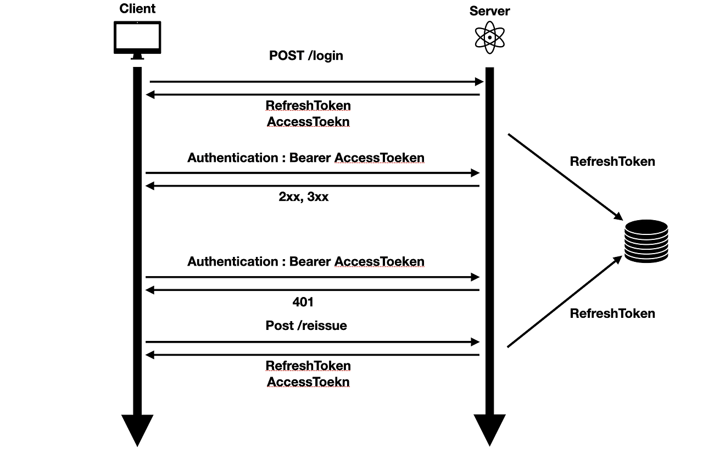

## [들어가며]

이번 프로젝트를 진행하면서 토큰을 이용한 인증/인가에서 jwt를 사용하게 되었다. 그 과정에서 알게된 jwt의 특성과 경험을 기록하기 위해 이 글을 쓰게 되었다.

## [JWT란?]

JWT는 JSON Web Token의 줄임말로, 두 개체(ex -> 서버와 서버) 사이에 정보를 안전하게 전송하기 위한 토큰 인증 방법이다. 이는 RFC 7519에 정의 되어있고 토큰 인증 방식에서 많이 사용되는 방법이라고 볼 수 있다.


jwt가 안전한 이유는 jwt토큰 자체가 디지털 서명이 되어있기 때문이다. 비밀키를 알고있어야 jwt가 유효한지 알 수 있기 때문에 중간에 토큰이 오염이 되지 않았음을 보장할 수 있다.

## [JWT 토큰 구조]

JWT는 Header, Payload, Signature로 나눠진다. 각각에 대해서 알아보자.

- Header
  - 헤더는 일반적으로 토큰 유형(JWT)과 사용 중인 서명 알고리즘 두 부분으로 구성된다. 토큰 전체의 메타 정보 같은 느낌으로 다른 정보가 추가적으로 들어갈 수 있다. 이 부분은 단순히 Base64Url을 사용해서 인코딩 되어있다. 그래서 어디서든지 디코딩이 가능하다. 그러므로 민감한 정보가 들어가면 안된다. jwt.io에서 헤더를 복호화 시켜보면 다음과 같다.


- Payload
  - 페이로드는 토큰의 두 번째 부분으로 클레임을 포함한다. 클레임은 엔티티(일반적으로 사용자) 및 추가 데이터에 대한 설명이다. 클레임에는 등록, 공개, 비공개 클레임 세 가지 유형이 있다. 보통 토큰이 발행한 주체(issuer), 토큰의 수신자(recipient), 토큰의 발행시간, 토큰의 만료시간 등이 포함된다.

  - 등록된 클레임 : 등록된 클레임은 유용하게 클레임을 제공하기 위해 권장되는 클레임 집합이다. 필수는 아니지만 jwt 토큰을 유용하게 쓰려면 이 정도 클레임은 포함하라고 하는 권장 사항 정도이다. 구성 요소는 다음과 같다.
       ```
      - iss: 토큰 발급자 (issuer)
      - sub: 토큰 제목 (subject)
      - aud: 토큰 대상자 (audience)
      - exp: 토큰의 만료시간 (expiraton)
      - nbf: Not Before 를 의미하며, 토큰의 활성 날짜와 비슷한 개념
      - iat: 토큰이 발급된 시간 (issued at)
      - jti: JWT의 고유 식별자로서, 주로 중복적인 처리를 방지를 위한 목적
      ```
  
  - 공개 클레임 : JWT 사용자에 의해 정의될 수 있는 클레임의 집합이다. 충돌되지 않는 이름을 가지고 있어야하며, 이를 위해서 IANA JSON 웹 토큰 레지스트리에 정의하거나 충돌 방지 네임스페이스를 포함하는 URI로 정의해야 한다. 즉, JWT 사용자들 사이의 약속이다.
  - 비공개 클레임 : 양 측간에 (보통 클라이언트 <->서버) 협의하에 사용되는 클레임 집합이다. 공개 클레임과는 달리 이름이 중복되어 충돌이 될 수 있으니 사용할때에 유의해야한다. 토큰에서 제공할 추가적인 정보를 줄때 이용된다.
    payload 또한 Base64Url로 인코딩 되어있기 때문에 민감한 정보를 포함하면 안된다.


- Signature
  - 시그니처는 마지막 부분으로 디지털 서명을 담당한다. 이 서명은 헤더의 인코딩값과, 정보의 인코딩값을 합친후 주어진 비밀키로 해쉬를 하여 생성합니다. 비밀키가 있어야만 이 부분을 풀 수 있으며, 비밀키는 서버에서 안전하게 보관되어야한다.


## [JWT를 이용한 인증/인가 방식]

JWT를 이용한 인증/인가 방식에는 여러가지가 있지만 가장 일반적인 방식은 다음과 같다.



1. 적절한 회원이 로그인 요청을 한다.

서버에서는 회원의 정보(id, password)가 적절한지 확인하고, 적절하다면 RefreshToken과 AccessToken을 발행한다.

2. 로그인된 회원만 사용할 수 있는 API인 경우 Authentication Header에 AccessToken을 담아서 보낸다.

서버에서는 이 토큰이 유효한지 확인만 진행한다. 토큰 자체로 유효성 검사를 할 수 있기 때문에 DB를 가져온다는 등의 수고는 안해도 된다.

3. AccessToken 토큰이 만료되었을 경우 RefreshToken으로 재발행을 한다.

AccessToken이 만료되었을 경우, RefreshToken을 서버로 전달하여 AccessToken과 RefreshToken을 재발행한다. 만약 RefreshToken이 유효하다면 사용자는 토큰들을 재발행 받을 것이다. 

이때, RefreshToken은 DB 시스템에 저장을 한다. RefreshToken은 단순히 유효함을 확인하는 것이 아니고 따로 저장을 해두어서 사용을 한다. 

인증 방식은 Session 인증 방식과 비슷하다. 차이가 있다면 AccessToken을 활용함으로써 DB와 연결되는 네트워킹 횟수가 주는 것이다. 만약 유효하지 않다면 401을 던진다.

