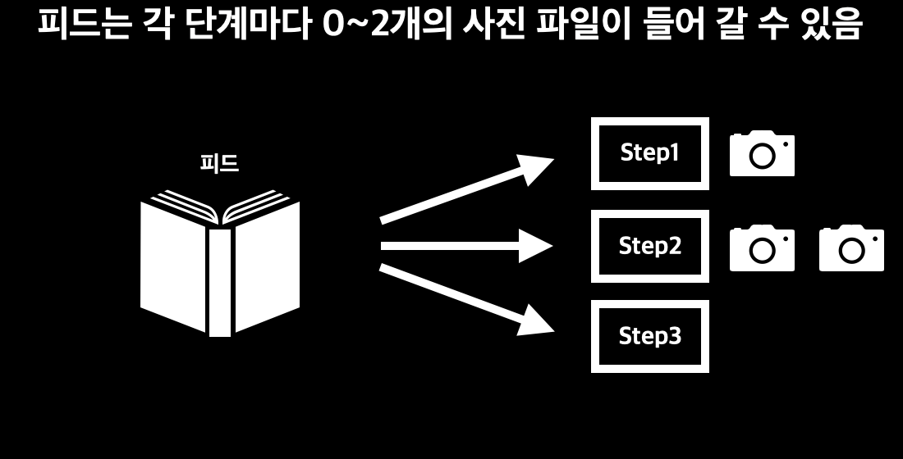
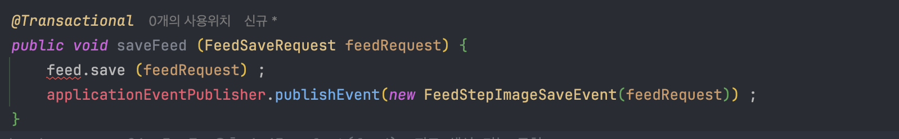
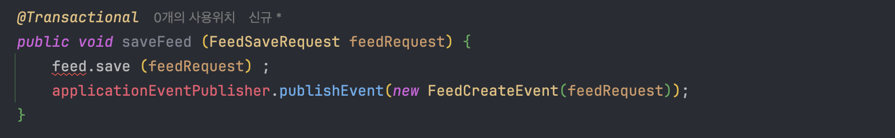
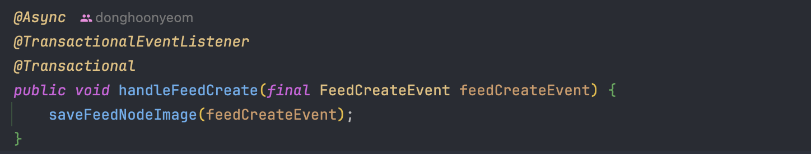

## [들어가며]

이번 프로젝트를 진행하며 Event를 활용하여 요구사항을 해결한 적이 있다. 그 과정을 기록하고자 이 글을 쓰게 되었다.

## [요구사항]

피드를 생성하는 로직이 있다. 이 피드는 각 단계가 있고, 각 단계에 사진 파일이 여러개 저장될 수 있다.

이 로직은 간단해보이지만 다음과 같은 문제점이 있다.

> 1. I/O가 실패하여 사진이 없어도 피드 생성 자체는 되어야한다라는 요구사항이 있다.
> 2. I/O중 예외가 발생하면 피드 생성 자체가 롤백된다.
> 3. 각 사진 파일은 I/O가 발생한다. 한 요청에 파일 I/O가 10번이상 발생할 수 있으니 트랜잭션이 굉장히 길게 걸린다.
> 4. 파일 I/O 후 경로와 같은 메타 데이터를 DB에 저장해야한다.

즉, 파일 I/O하는 서브 로직은 피드 생성이라는 본 로직과 강하게 결합되면 안된다는 결론이 나온다.

## [고려한 방법]

다음과 같은 방법을 고려했었다.

### 스프링 트랜잭션 전파(Spring Transaction propagation) 레벨 활용

`Spring`의 `Transaction propagtion`을 활용하여서 피드 생성 트랜잭션과 파일 I/O 트랜잭션을 분리할 수 있다.
`Progation.REQUIRES_NEW`를 이용하면 쉽게 분리할 수 있을 것이다.

하지만 이 방법은 단순히 트랜잭션만 분리한 방법이다. 즉, 두 로직의 결합도를 낮추지는 못한다.

이러한 문제의 일환으로 피드 생성 트랜잭션이 파일 I/O 트랜잭션과 강하게 결합되어있기 때문에 여전히 굉장히 오래 걸린다. 즉, 피드 생성 트랜잭션의 시간이 파일 I/O 트랜잭션에 영향을 받는 것이다.

## [해결책]

그래서 생각한 방법은 `Spring Event`를 활용하는 것이었다. 피드를 생성하는 본 로직에서 특정 `Event`를 발행하고, `EventListener`에서 파일 I/O를 하는 방법이다.

다음은 내가 고민했던 부분이다. 여기서는 비동기 `Event`와 관련된 내용은 설명하지 않는다.

###  두 로직의 결합도 낮추기

처음에는 다음과 같이 이미지를 저장하는 이벤트인 `FeedStepImageSaveEvent`를 발생 시켰다.

이 로직은 `EventListener`에서 비동기로 쓰레드를 새로 생성해서 이미지 저장 로직을 수행하기 때문에 물리적인 의존도는 줄었다고 볼 수있다.

하지만 이미지 저장 로직의 정책이 바뀌어서 이벤트가 변경 되었을때, 피드 저장 로직의 이벤트도 함께 변경이 되어야한다. 어떤 일을 해야 하는 지를 메시지 발행자가 알려주는 경우(Command), 해야하는 일이 변경될 때 메시지 발행자와 수신자 양쪽 모두의 코드가 변경돼야 하기 때문에 높은 결합도가 존재하게 된다.

또한 이미지 저장 로직 자체를 발행하며 이미지 저장이라는 비즈니스 로직을 알고있으니 논리적으로도 결합이 느슨해졌다고 얘기할 수 없다. 즉, 물리적인 의존도는 줄었지만 개념적으로는 의존도가 높은 것이다.

메시지 발행 시 대상 도메인에게 기대하는 목적을 담았기 때문에 의존도가 남아있다. 대상 도메인에게 기대하는 목적을 담았다면, 이는 이벤트라 부르지 않는다고 한다. 이것은 이벤트 시스템을 활용한 비동기 요청이다.

이를 다음과 같이 수정했다.

대상 도메인에게 기대하는 목적을 담는게 아닌 피드 생성 이벤트 자체를 발생시킨다.

`FeedCreateEvent`를 listen하는 객체에서 이미지를 저장한다.

이렇게 하면 피드 생성이라는 본 로직과 파일 저장이라는 서브 로직의 결합도를 물리적, 논리적, 개념적으로 느슨하게 할 수 있다.
피드 생성 로직은 더 이상 파일 저장 로직에 영향을 받지 않는다.

## [정리]

비즈니스 로직에서 분리되어야하는 부분이 있을 때 비동기 Event를 고민할 수 있다. 위 내용에서 `EventListener` 부분에서 Message Queue를 활용하면 시스템 자체를 분리할 수 있다. 

