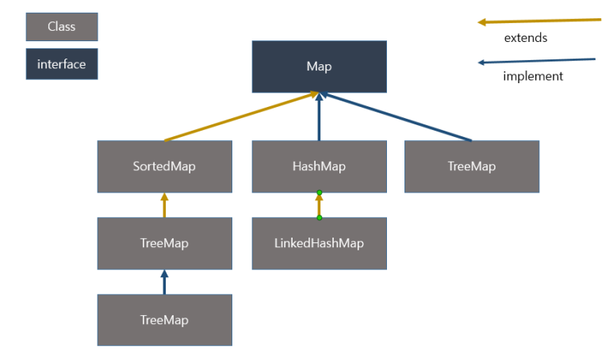

## 맵(Map)이란?

맵은 특정 순서에 따라 키와 매핑된 값의 조합으로 형성된 자료구조이다. 맵은 키-값 쌍의 집합으로, 특정 키를 통해 연결된 값을 검색하고 저장하는 데 사용된다.



## 맵의 특징

- 유일한 키(Key) : 하나의 키는 맵 내에서 유일해야 합니다. 중복된 키를 허용하지 않는다.
- 효율적인 검색 : 키를 사용하여 값을 검색하는 과정이 빠르고 효율적이어야 한다. 맵은 일반적으로 해시 테이블(hash table) 등을 이용하여 빠른 검색을 지원
- 동적 크기 조정 : 맵은 동적으로 크기를 조정하여 새로운 key-value 쌍을 추가하거나 기존 키-값 쌍을 삭제할 수 있어야 한다.
- 순서 보장 여부 : 일부 맵 구현은 삽입된 순서를 보장하여 데이터를 저장하지만, 다른 구현은 순서를 보장하지 않을 수 있다. 언어 또는 라이브러리에 따라 다를 수 있다.

> 맵 자료구조는 다양한 프로그래밍 시나리오에서 사용된다. 예를 들어, 데이터베이스 결과를 처리하거나, 카운팅 및 집계 작업, 키워드 검색, 캐시 관리 등에 유용하다.

## 자바에서 맵 구현

자바에서의 맵 사용 예를 들어보려고 한다.

```java
import java.util.HashMap;
import java.util.Map;

public class ExampleHashMap {
    public static void main(String[] args) {
        // HashMap 생성과 값 추가
        Map<String, Integer> myMap = new HashMap<>();
        myMap.put("apple", 1);
        myMap.put("banana", 2);
        myMap.put("orange", 3);

        // 값 접근
        int appleValue = myMap.get("apple");
        System.out.println("Apple: " + appleValue); // 출력: Apple: 1

        // 값 수정
        myMap.put("banana", 5);

        // 새로운 값 추가
        myMap.put("grape", 4);

        // 특정 키가 맵에 있는지 확인
        if (myMap.containsKey("orange")) {
            System.out.println("Orange exists!");
        }

        // 키-값 쌍 순회
        for (Map.Entry<String, Integer> entry : myMap.entrySet()) {
            String key = entry.getKey();
            int value = entry.getValue();
            System.out.println(key + ": " + value);
        }

        // 키 목록 가져오기
        // (Java 8 이상에서는 keySet() 메서드를 사용하면 더 간단하게 처리 가능)
        for (String key : myMap.keySet()) {
            System.out.println("Key: " + key);
        }

        // 값 목록 가져오기
        for (int value : myMap.values()) {
            System.out.println("Value: " + value);
        }

        // 특정 키 삭제
        myMap.remove("apple");
    }
}
```

위 예시에서 `HashMap`을 이용하여 맵을 생성하고, `put` 메서드를 사용하여 키-값 쌍을 추가하고 수정, `get` 메서드를 사용하여 특정 키에 대응하는 값을 가져온다. `containsKey` 메서드로 특정 키가 맵에 있는지 확인, `entrySet`, `keySet`, `values` 메서드를 통해 맵의 키-값 쌍, 키 목록, 값 목록을 순회할 수 있다. 마지막엔 `remove` 메서드를 사용하여 특정 키를 삭제하는 것을 확인할 수 있다.