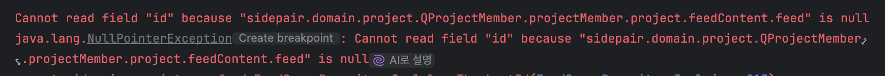
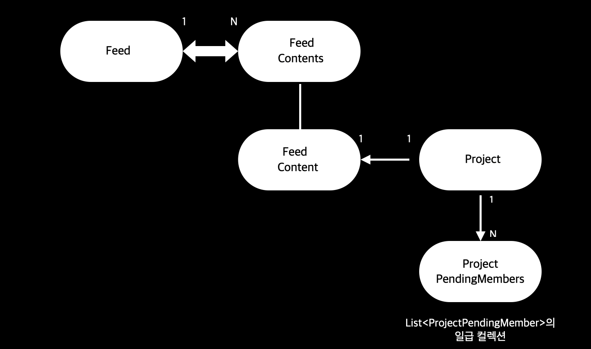
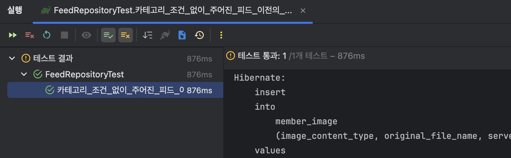
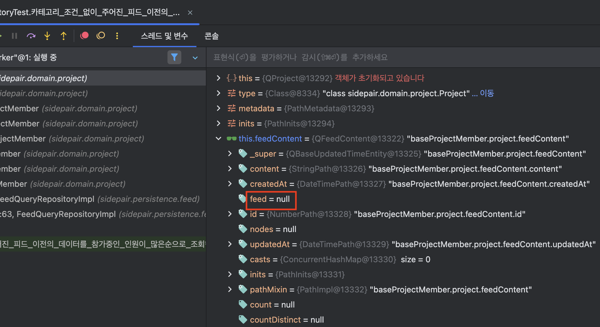
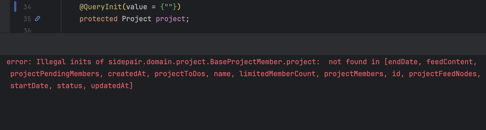
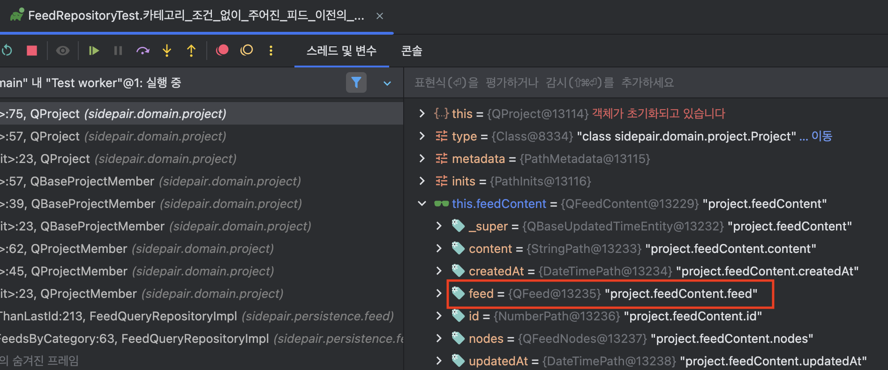
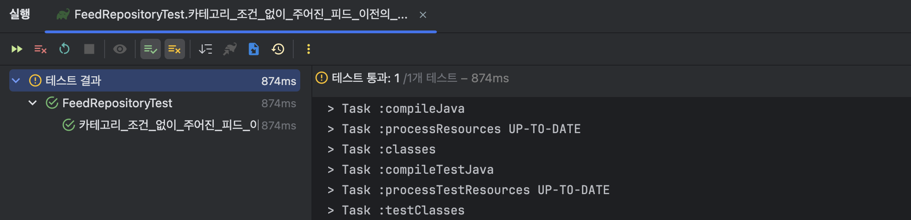
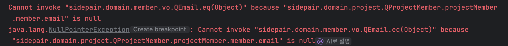

## [들어가며]

프로젝트를 진행하면서 동적 쿼리를 작성할 일이 많아 QueryDSL을 도입하면서 발생했던 NullPointerException 오류를 해결하면서 배웠던 내용을 정리하고자 작성하게 되었다.



    java.lang.NullPointerException: Cannot read field "id" because "sidepair.domain.project.QProjectMember.projectMember.project.feedContent.feed" is null


## [도메인 구조]



하나의 피드 본문(FeedContent) 정보에 대해서 하나의 프로젝트(Project)가 생성될 수 있고, 하나의 프로젝트에 대해서 여러 개의 프로젝트 대기 멤버(ProjectPendingMembers)가 생길 수 있다는 것이다.

위 문제를 발견하게 된 테스트 코드는 아래와 같다.

```java
@Test
void 카테고리_조건_없이_주어진_피드_이전의_데이터를_참가중인_인원이_많은순으로_조회한다() {
    ...

    final Feed serviceFeed1 = 노드_정보를_포함한_피드를_생성한다("서비스 피드", creator, serviceCategory);
    final Feed serviceFeed2 = 노드_정보를_포함한_피드를_생성한다("서비스 피드2", creator, serviceCategory);
    final Feed commerceFeed = 노드_정보를_포함한_피드를_생성한다("이커머스 피드", creator, commerceCategory);
  
    final Project serviceFeed1Project = 프로젝트를_생성한다(serviceFeed1.getContents().getValues().get(0), creator);
    final Project serviceFeed2Project = 프로젝트를_생성한다(serviceFeed2.getContents().getValues().get(0), creator);
    final Project commerceFeedProject = 프로젝트를_생성한다(commerceFeed.getContents().getValues().get(0), creator);

    // serviceFeed1 : 참가인원 0명
    // serviceFeed2 : 참가인원 1명
    final List<ProjectMember> serviceFeed2ProjectMembers = List.of(
            new ProjectMember(ProjectRole.LEADER, LocalDateTime.now(), serviceFeed2Project, creator));
    projectMemberRepository.saveAll(serviceFeed2ProjectMembers);

    // commerceFeed : 참가인원 2명
    final List<ProjectMember> commerceFeedProjectMembers = List.of(
            new ProjectMember(ProjectRole.LEADER, LocalDateTime.now(), commerceFeedProject, creator),
            new ProjectMember(ProjectRole.FOLLOWER, LocalDateTime.now(), commerceFeedProject, follower));
    projectMemberRepository.saveAll(commerceFeedProjectMembers);

    final FeedCategory category = null;
    final FeedOrderType orderType = FeedOrderType.PARTICIPANT_COUNT;

    // when
    final List<Feed> firstFeedRequest = feedRepository.findFeedsByCategory(category, orderType,
            null, 2);
    final List<Feed> secondFeedRequest = feedRepository.findFeedsByCategory(category, orderType,
            serviceFeed2.getId(), 10);

    ...
}

```

코드가 상당히 복잡하지만 별거없다. 그냥 피드를 생성하고, 피드에 대한 참가인원을 추가하는 코드이다.
해당 코드는 아래와 같이 구현이 되어 있다.

```java
@Override
public List<Feed> findFeedsByCategory(final FeedCategory category, final FeedOrderType orderType,
                                            final Long lastId, final int pageSize) {

    return selectFrom(feed)
            ...
            .where(
                    lessThanLastId(lastId, orderType)
           	)
            .fetch();
}

```

```java
private BooleanExpression lessThanLastId(final Long lastId, final FeedOrderType orderType) {
    ...
    final NumberPath<Long> projectMemberFeedId = projectMember.project.feedContent.feed.id;
    return participantCountCond(projectMemberFeedId.eq(feed.id))
            .lt(participantCountCond(projectMemberFeedId.eq(lastId)));
}

```

인자로 받은 lastId (현재는 피드의 PK 값이 들어오고 있다.)에 해당하는 피드의 참여자 수보다 더 적은 참여자 수를 구하는 피드를 구하는 쿼리이다. 


## [NPE가 발생할 지점을 찾아보기]

처음에 이 오류를 접했을 때는 아래와 같은 예외 메시지 중에서 단순하게 이 부분에만 집중을 했었다.
sidepair.domain.project.QProjectMember.projectMember.project.feedContent.feed is null

그래서 projectMember를 저장한 후에 피드에 대한 정보가 제대로 저장이 안 되어 있나 싶어서 findAll로 찾아보았다.

```java
final List<ProjectMember> projectMembers = projectMemberRepository.findAll();
assertThat(projectMembers.get(0).getProject().getFeedContent().getFeed().getId()).isNotNull();
assertThat(projectMembers.get(1).getProject().getFeedContent().getFeed().getId()).isNotNull();
assertThat(projectMembers.get(2).getProject().getFeedContent().getFeed().getId()).isNotNull();

```
NPE니까 당연히 feed의 id 값이 Null이 되어서 테스트가 실패하겠지?라고 생각하였다.



하지만 테스트가 놀랍게도 성공한 것을 볼 수 있었다. 그래서 값 자체는 제대로 들어갔겠구나 싶어서 다른 방향을 탐색해보았다.


## [QueryDSL의 객체 그래프]

```java
final NumberPath<Long> projectMemberFeedId = projectMember.project.feedContent.feed.id;

```

문제가 발생했던 라인은 정확하게 위 라인이었다.
어떠한 값이 들어가고 말고의 문제를 떠나서, 객체 그래프를 탐색할 때 뭔가 문제가 있을 것 같다는 생각이 들었다.
그래서 열심히 구글링을 해본 결과, 아래와 같은 글을 발견하게 되었다.

> [NullPointerException on QueryDSL where clause](https://stackoverflow.com/questions/48380798/nullpointerexception-on-querydsl-where-clause)

그리고 답변 내용에서 말해 주신 `공식 문서`를 한 번 읽어보았다.


>By default Querydsl initializes only reference properties of the first two levels. 
>In cases where longer initialization paths are required, these have to be annotated in the domain types via
>com.mysema.query.annotations.QueryInit annotations. 
> QueryInit is used on properties where deep initializations are needed.

기본적으로 QueryDSL은 초기 2단계의 레벨에 있는 프로퍼티만 초기화하게 된다.
만약 그 이상의 path를 초기화하고 싶다면 `@QueryInit` 어노테이션을 통해서 직접 지정해줄 수 있다.
한 번 우리의 문제 상황에 적용해보자.


## @QueryInit

`@QueryInit`의 경우 기본적으로 @Entity 어노테이션이 붙어 있는 클래스의 필드에 대해서 적용이 가능하다.
내부 인자로 초기화하고 싶은 path를 지정해줄 수 있으며, *을 통해 와일드카드를 통해서도 지정이 가능하다.

먼저, `@QueryInit`을 지정하지 않았을 때의 큐파일을 디버깅해보았다. (QProject)



> #### QProject -> QFeedContents -> QFeed(null)

확인해보면 Project에서 QFeedContent까지의 값은 잘 가져오지만, QFeed에 대해서는 정의가 되어 있지 않은 것을 볼 수 있다. 여기서 QFeed 값이 null로 정의되었기 때문에 탐색이 불가능했던 것이다.


```java
public class ProjectMember {

   ...

    @ManyToOne(fetch = FetchType.LAZY)
    @JoinColumn(name = "project_id", nullable = false)
    @QueryInit(value = {"feedContent.feed"})
    protected Project project;
}

```

그래서, 위와 같이 ProjectMember 엔티티가 Project 엔티티를 정의한 필드에 `@QueryInit`을 정의해주었다.
이렇게 되면 QProject이 초기화될 때 FeedContent와 Feed 정보까지 함께 초기화가 가능할 것이다.
참고로, 내부 value의 값은 project 엔티티가 참조하고 있는 실제 필드명으로 작성해야 한다.

이런 식으로 잘못된 필드 값을 입력하게 되면 컴파일 타임 때 오류가 발생한다.



#### project가 실제로 의존하고 있는 필드명으로 작성해야 한다.


```java
@ManyToOne(fetch = FetchType.LAZY)
@JoinColumn(name = "project_id", nullable = false)
@QueryInit(value = {"feedContent.*"})
protected Project project;

```

#### 추가적으로, 이렇게 와일드카드로 명시해도 잘 동작한다.




> #### QProject -> QFeedContents -> QFeed

수정 후에 다시 디버깅을 진행해보면 이번에는 feed에 대한 정보도 잘 채워진 것을 확인할 수 있다



테스트도 정상적으로 통과한다.


+) 추가적으로, 이렇게 `@QueryInit`을 특정 필드에 적용하고 나면 기존에 잘 돌아가던 쿼리들이 안 돌아갈 수도 있다.
나 같은 경우에는 비슷한 다른 쿼리에서 오류가 발생했었는데, 2단계 레벨에 있는 필드에 대해서 NPE가 발생했었다.



비슷한 오류지만 projectMember -> member -> email (VO여서 단계에 반영하지 않는 것 같다. 공식문서에서 명시 되어 있듯이 3단계는 반영되지 않는것 같다.)에 대해서 오류가 발생한 것이었다.
`@QueryInit`을 달지 않았을 때는 3단계까지 잘 갔었는데, 명시적으로 어노테이션을 지정해주니까 이렇게 된 것 같다.


```java
@ManyToOne(fetch = FetchType.LAZY)
@JoinColumn(name = "project_id", nullable = false)
@QueryInit(value = {"feedContent.feed"})
protected Project project;

@ManyToOne(fetch = FetchType.LAZY)
@JoinColumn(name = "member_id", nullable = false)
@QueryInit(value = {"email"})
protected Member member;

```

그래서 member 필드에 대해서는 이렇게 email에 대해서도 정의를 해주었다.

## [정리]

`@QueryInit` 어노테이션을 직접 사용해보니 더 자세히 알게 된 것 같다.
사실 해결 방법은 아주 간단했는데 처음 마주한 오류여서 해결하는 데 시간이 오래 걸렸다.
