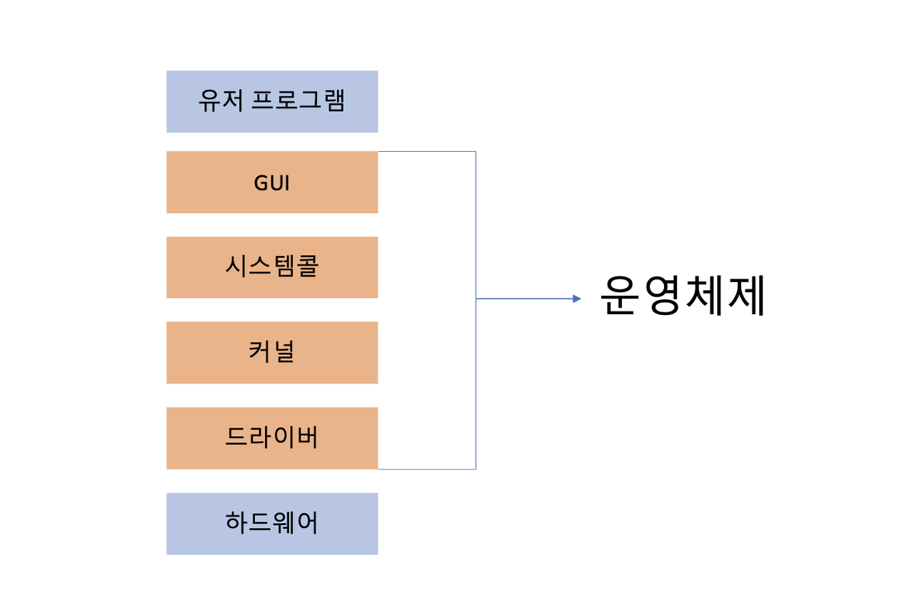

## 들어가며

운영체제(Operating System)는 줄여서 OS라고 부르기도 한다. 컴퓨터 시스템에서 하드웨어와 응용 소프트웨어 사이에서 동작하며, 컴퓨터의 자원을 효율적으로 관리하고 제어하는 소프트웨어입니다. 운영체제는 컴퓨터 시스템의 핵심 구성 요소로서, 하드웨어와 소프트웨어 사이의 인터페이스 역할을 수행하며, 사용자와 컴퓨터 시스템 간의 상호 작용을 지원합니다.

우리가 알고 있는 대표적인 운영체제는 Windows, Linux, Mac OSX, iOS 등이 있다.

## 운영체제의 역할

운영체제는 시스템에서 중요한 역할을 수행하는 소프트웨어입니다. 주요 역할들을 설명해 보겠습니다.

1. 자원 관리 : 운영체제는 컴퓨터의 자원을 효율적으로 관리합니다. 이는 CPU, 메모리, 저장장치, 입출력 장치 등을 포함합니다. 운영체제는 여러 프로세스 또는 작업이 공유 자원을 사용할 수 있도록 조정하고, 자원의 할당과 해제를 관리하여 시스템의 성능과 안정성을 유지합니다.
2. 메모리 관리 : 운영체제는 시스템의 메모리를 관리하여 프로세스가 메모리에 적절하게 할당되도록 합니다. 메모리의 주소 공간을 관리하고, 메모리 할당 및 해제를 처리하여 프로세스가 메모리를 효율적으로 사용할 수 있도록 합니다.
3. 파일 시스템 관리 : 운영체제는 파일 시스템을 관리하여 파일의 생성, 삭제, 읽기, 쓰기 등을 처리합니다. 파일과 디렉터리의 구조를 유지하고, 파일에 대한 접근 권한을 관리하며, 데이터의 안정성을 보장하기 위해 백업 및 복구 기능을 제공합니다.
4. 프로세스 관리 : 운영체제는 실행 중인 프로세스를 관리합니다. 프로세스 스케줄링을 통해 CPU 시간을 공정하게 분배하고, 프로세스의 생성, 종료, 일시 정지, 재개 등을 관리합니다. 이를 통해 다중 작업 환경에서 여러 프로세스가 동시에 실행될 수 있도록 합니다.
5. 입출력 관리 : 운영체제는 입출력 장치를 관리하여 프로세스가 입출력을 수행할 수 있도록 합니다. 입출력 장치의 드라이버를 관리하고, 입출력 작업을 대기시키고 완료된 작업을 처리하여 프로세스와 입출력 장치 간의 효율적인 상호 작용을 지원합니다.
6. 사용자 인터페이스 제공 : 운영체제는 사용자와 컴퓨터 사이의 상호 작용을 위한 인터페이스를 제공합니다. 이는 텍스트 기반 명령 줄 인터페이스(CLI)부터 그래픽 사용자 인터페이스(GUI)까지 다양한 형태일 수 있습니다. 사용자는 운영체제를 통해 프로그램 실행, 파일 관리, 시스템 설정 등을 수행할 수 있습니다.

## 운영체제의 구조

- 유저 프로그램(User Program) : 사용자가 작성한 응용 소프트웨어입니다. 운영체제 위에서 실행되며, 사용자의 요구에 따라 특정 작업을 수행합니다. 예를 들면 워드 프로세서, 웹 브라우저, 게임 등이 있습니다.
- GUI(Graphical User Interface) : 그래픽 기반의 사용자 인터페이스를 제공하는 운영체제의 구성 요소입니다. 유저가 마우스, 키보드 등을 사용하여 그래픽 환경에서 응용 프로그램을 조작하고 상호 작용할 수 있도록 합니다. 이를 통해 사용자는 유저 프로그램과 운영체제의 다른 요소들을 직관적이고 편리하게 사용할 수 있습니다.
- 시스템 콜(System Call) : 유저 프로그램이 운영체제의 기능을 사용할 수 있도록 하는 인터페이스입니다. 유저 프로그램은 시스템 콜을 호출하여 운영체제에게 특정 작업을 요청하고, 운영체제는 해당 요청을 처리합니다. 예를 들면 파일 입출력, 메모리 할당, 프로세스 생성 등의 작업을 시스템 콜을 통해 수행할 수 있습니다.
- 커널(Kernel) : 운영체제의 핵심 부분으로, 가장 중요한 기능을 담당합니다. 커널은 시스템 콜을 처리하고, 프로세스 스케줄링, 메모리 관리, 파일 시스템, 네트워킹 등의 핵심 기능을 수행합니다. 일반적으로 커널은 운영체제의 가장 중요한 부분으로서 메모리 상에 상주하여 실행됩니다.
- 드라이버(Driver) : 운영체제와 하드웨어 간의 통신을 담당하는 소프트웨어입니다. 각 하드웨어 장치는 운영체제에서 인식하고 제어하기 위해 해당 장치에 대한 드라이버가 필요합니다. 드라이버는 특정 하드웨어와 통신하여 하드웨어의 기능을 사용하고, 운영체제에 필요한 데이터를 전달합니다.
- 하드웨어(Hardware) : 컴퓨터 시스템의 물리적인 구성 요소입니다. 이는 CPU, 메모리, 저장 장치, 입출력 장치 등 컴퓨터의 실제 기기를 포함합니다. 운영체제는 하드웨어와 상호 작용하여 자원을 관리하고 사용자 요청을 처리합니다.

이러한 요소들은 운영체제의 구조에서 상호 작용하여, 사용자는 GUI를 통해 유저 프로그램을 실행하고, 유저 프로그램은 시스템 콜을 호출하여 커널의 기능을 사용합니다.

커널은 드라이버를 통해 하드웨어와 통신하여 자원을 관리하고, 하드웨어는 운영체제와 상호 작용하여 명령을 수행합니다. 이렇게 함께 동작함으로써 운영체제는 컴퓨터 시스템을 효율적으로 제어하고 사용자에게 필요한 서비스를 제공합니다.

### 시스템 콜(System Call)

시스템 콜은 유저 모드에서 커널 모드로 전환되어 운영체제의 특권 명령을 실행하고, 그 결과를 유저 프로그램에게 반환합니다.

시스템 콜의 동작 과정을 자세히 알아 보겠습니다.

1. 유저 프로그램 호출 : 유저 프로그램은 운영체제의 기능을 사용하기 위해 시스템 콜을 호출합니다. 시스템 콜은 특정 함수 또는 명령으로 제공됩니다. 예를 들어 파일을 열거나, 메모리를 할당하거나, 프로세스를 생성하는 등의 작업을 수행하기 위해 해당하는 시스템 콜을 호출합니다.
2. 유저 모드에서 커널 모드로 전환 : 시스템 콜은 특권 명령을 실행하기 위해 유저 모드에서 커널 모드로 전환됩니다. 유저 모드에서는 제한된 권한으로 작업을 수행하지만, 커널 모드에서는 운영체제의 모든 권한과 자원에 접근할 수 있습니다. 이 전환은 보안을 위해 운영체제가 관리하며, 전환하는 과정에서 프로세스의 상태와 실행 위치 등이 저장됩니다.
3. 시스템 콜 처리 : 커널 모드로 전환된 후, 시스템 콜을 처리하기 위해 커널 내의 해당하는 함수 또는 서비스 루틴으로 이동합니다. 이는 운영체제의 커널 코드에서 실행됩니다.
   시스템 콜은 유저 프로그램에 의해 전달된 매개변수를 확인하고, 필요한 동작을 수행하기 위해 해당하는 서비스를 호출합니다. 예를 들어 파일을 열기 위한 시스템 콜은 파일 이름과 접근 권한 등을 확인하고, 파일 시스템 서비스를 호출하여 파일을 엽니다.
4. 커널 모드에서 유저 모드로 복귀 : 시스템 콜 처리가 완료되면, 커널 모드에서 유저 모드로 다시 전환됩니다. 이때 커널은 처리 결과를 유저 프로그램에게 반환합니다. 반환 값이나 오류 코드 등을 이용하여 유저 프로그램은 시스템 콜 호출 이후의 동작을 결정할 수 있습니다. 예를 들어 파일 열기 시스템 콜은 파일 핸들(식별자)을 반환하여 유저 프로그램이 파일에 접근할 수 있게 합니다.

reference : https://fjvbn2003.tistory.com/306 ,
https://career-gogimandu.tistory.com/58 
