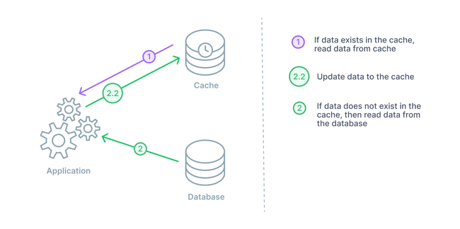
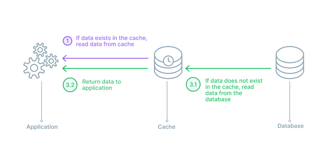
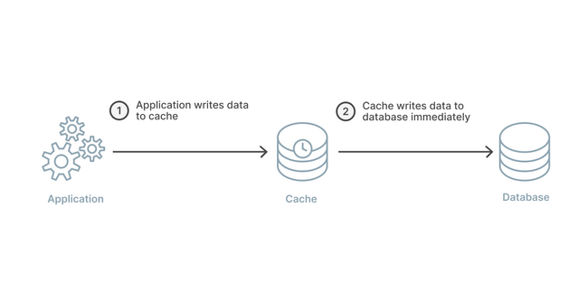
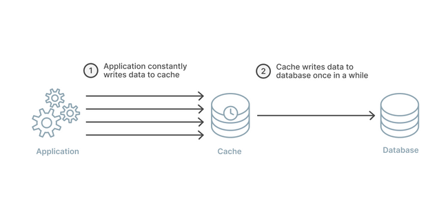
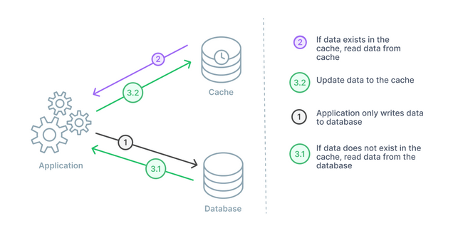

## [들어가며]

프로젝트에 캐싱을 통해서 성능 개선을 하면서 Redis를 사용한 경험을 기록하고자 이 글을 쓰게 되었다.

## [캐싱에 레디스를 선택한 이유]

- 높은 성능 : Redis는 기본적으로 전체 데이터를 메모리에서 관리한다. 데이터 백업 같은 작업은 디스크에 저장하긴 하지만 이는 비동기로 작동하기 때문에 응답 성능에는 거의 영향을 미치지 않는다. 그에 반해 RDB는 기본적으로 데이터를 디스크에서 관리한다. 요즘 RDB들도 메모리를 많이 활용하긴 하지만 결국에는 디스크에 저장된다. 즉, Redis는 RDB와 다르게 Disk I/O가 자주 발생하지 않기 때문에 성능이 몇 배 빠를 수 밖에 없다.
- 개발 용이성 : 어플리케이션과 연동하기 쉽게 여러 개발 언어를 지원한다. 그리고 다른 NoSQL과는 다르게 문법이 직관적이고, 개발 코드 양 또한 적다. 또한 싱글스레도로 명령을 처리하기 때문에 개발자가 race condition에 대한 걱정을 거의 안해도 된다.

여기까지는 Memcached와 같은 메모리 기반 캐시와 비슷하다. 하지만 Redis는 다음과 같은 차이점을 가지고있다.

- 다양한 자료 구조: Redis는 자체적인 Collection을 가지고 있다. 단순 String뿐만 아니라 List, Set, Sorted Set, Hash 등 여러가지 자료구조를 가지고 있다. 이를 응용해서 여러가지 요구사항을 효율적으로 처리할 수 있는 장점이 있다. 
- 고가용성(High Availability) : Redis는 단순 Replication 뿐만 아니라, 고가용성을 위해 Sentinel과 Cluster를 지원한다. 이는 하나의 Redis 인스턴스에 오류가 생겨도 개발자의 다른 설정 없이 자동으로 다른 인스턴스로 대체할 수 있도록 해준다. 이를 페일 오버 기능이라고 하고 이 기능을 통해 고가용성을 확보할 수 있게 해준다.

반면에 Redis는 메모리 기반으로 동작하기 때문에 캐싱 데이터의 크기가 할당된 메모리 용량보다 큰 경우에 사용할 수 없다. 그리고 Memcached는 멀티 쓰레드로 작동하기 때문에 Redis보다 성능이 좀 더 좋다고 할 수 있다.

이번 프로젝트에서는 redis로 감당하지 못할 만큼 용량이 엄청나게 큰 데이터를 캐싱할 일이 없다. 그리고 위에 나온 장점을 모두 활용하고, redis를 데이터 저장소처럼 사용하는 경우도 있기 때문에 redis를 도입하기로 결정했다.

## [캐싱 전략 선택]

### 읽기 전략 
캐싱 읽기 전략에는 크게 Cache Aside와 Read Through이 있다. 이 둘을 비교해보자.

#### Cache Aside

Cache Aside 패턴을 위 그림 순서대로 설명하면 다음과 같다.

- (1) 캐시에 해당 데이터가 있는지 확인한다(Cache hit). 만약 데이터가 있으면 바로 데이터를 반환한다.
- (2) 캐시에 데이터가 없으면(Cache miss) DB에 쿼리를 날려서 데이터를 찾아온다.
- (2.2) 데이터를 캐시에 적재한다.

이 패턴의 장점은 캐시에 문제가 생겨도 Application에는 문제가 없다는 것이다. 캐시에 장애가 발생하여서 Cache miss가 발생하여도 그냥 DB로 가서 데이터를 가져오면 된다. 즉, Application의 안정성이 높다.

다만, 캐시가 죽은 경우 순간적으로 DB에 Connection이 쏠려 순간적으로 부하가 걸릴 수 있다는 단점이 있다.

#### Read Through

Read Through 패턴을 위 그림 순서대로 설명하면 다음과 같다.

- (1) 캐시에 해당 데이터가 있는지 확인한다(Cache hit). 만약 데이터가 있으면 바로 데이터를 반환한다.
- (3.1) 캐시에 데이터가 없으면 캐시에서 데이터베이스에 접근하여 데이터를 가져온다.
- (3.2) 데이터를 반환한다.

이 패턴은 사실 Redis로 구현하기 조금 힘들다. Redis에서 직접 DB에 접근하는 기능이 없는 것 같다. DynamoDB와 DAX를 이용해서 구현이 가능하다고는 한다.
cache aside 전략과 차이점은 DB에 접근하는 주체에 있다. Cache에서 DB에 접근하게 되면 Application은 단순하게 Cache와의 Connection만을 유지하면 되므로 부담이 적다.

하지만 Cache가 장애가 생기면 Application 전체에 장애가 발생하는 위험이 있다. 그리고 cache aside 전략과 마찬가지로 데이터 정합성 문제가 발생할 여지가 있다.

#### Cache Aside를 선택한 이유

두 전략 모두 데이터 정합성에 대한 이슈가 있다. 하지만 이는 데이터 변경/삽입/삭제 시 고려해야하는 문제이므로 선택 기준에서 제외했다.
Cache Aside를 사용하게 되면 Application의 안정성을 확보할 수 있다. 그리고 Read Through는 redis로 구현하기가 힘들기도하고, 안정성이 떨어진다. 그래서 `Cache Aside` 전략을 사용하도록 결정했다.

### 쓰기 전략

#### Write-through

Write-throught 패턴을 위 그림 순서대로 설명하면 다음과 같다.

- (1) Application에서 쓰기 요청 시 Cache에 데이터를 넣는다.
- (2)그 데이터를 그대로 DB에 넣는다.

#### Write Back(Behind) 패턴

Write Back 패턴은 Write Through와 비슷하지만, cache에서 db로 배치 업데이트를 하는 식이다.
이 패턴도 Cache와 DB와의 정합성을 맞추는데 용이하다는 장점이 있다.
하지만 Cache에 있는 데이터가 아직 DB에 반영되지 않고, Cache가 죽을 경우 데이터가 유실될 위험이 있다.

이 전략 또한 캐싱 하는 데이터가 여러 테이블을 join하는 복잡한 구조의 json 데이터여서 사용하기에 불편했다.

이 패턴은 DB와 캐시가 항상 동기화 되어있어 Cache의 데이터를 최신의 상태로 유지가 가능하다. 데이터 유실이 발생하면 안되는 상황에 유리한 조건이다.
하지만 나의 경우 캐싱 하는 데이터가 여러 테이블을 join하는 복잡한 구조의 json 데이터여서 사용하기에 불편했다.

#### Write Around 패턴

Write Around 패턴을 위 그림 순서대로 설명하면 다음과 같다.
- (1)DB에 데이터를 쓴다.
- (2)데이터 조회 시 데이터가 캐시에 있으면 데이터를 반환한다.
- (3.1) 데이터가 없을 시 DB에서 데이터를 가져온다.
- (3.2) 데이터를 캐시에 적재하고 응답값을 반환한다.

이 패턴의 경우 사실 쓰기 전략이라고 하기 애매하긴 하다. Cache Aside 패턴과 DB에 쓰는 방법을 합친 패턴이라고 볼 수 있다.
가장 직관적이고 효율적인 방법이지만 캐시와 DB와의 데이터 정합성이 맞지 않을 수도 있다는 단점이 있다.

#### Cache Aside를 선택한 이유

Write Through와 Write Back 패턴은 위에서도 얘기 했듯이 복잡한 데이터를 캐싱하기에 구현이 힘들다. DB 상에서 여러 테이블을 join 하고 어플리케이션에서 가공한 데이터를 캐싱하는데, 단순히 데이터를 넣거나 업데이트 할때 이러한 복잡한 데이터를 변경하기 힘들다.
물론 Event나 AOP를 활용하여 구현할 수 있겠지만, 캐싱에서 변경되는 데이터 대상이 하나가 아니기 때문에 비효율적이라고 느꼈다. 그리고 캐싱이 적용되는 데이터들은 변경이 많지 않은 데이터였기 때문에 굳이 이 전략들을 사용할 필요가 없었다.
Write Around는 쓰기 작업 시 단순히 DB에 데이터를 넣기만 하면된다. 동시에 데이터 정합성을 맞추기 위해서 캐싱 되어있는 데이터들을 Redis에서 삭제했다. 이렇게 되면 해당 데이터 조회 시 캐시에 없으므로 DB에서 값을 가져와서 캐시에 적재하고, 그 다음부터는 캐시된 데이터를 사용하게 된다. 내가 선택한 프로세스는 다음과 같다.

1. 쓰기 요청 시 DB에 데이터를 넣음
2. 동시에 Redis에 있는 기존 데이터들 삭제
3. 읽기 요청 시 Redis 확인. 존재하면 바로 반환
4. 존재하지 않으면 DB에서 가져와서 Redis에 적재

### 캐싱 전략 선택 정리

위와 같은 이유로 읽기 전략은 Cache Aside, 쓰기 전략은 Write Around를 사용했다. 캐싱 프로세스는 다음과 같다.

[읽기]
1. 데이터가 Redis에 존재하는지 확인한다. 존재하면 바로 반환한다.
2. 데이터가 존재하지 않으면 DB에 가서 읽어온다.
3. 읽어온 데이터를 Redis에 적재하고 반환한다.

[쓰기]
1. 데이터를 DB에 저장한다.
2. Redis에 존재하는 해당 데이터와 관련된 캐시들을 모두 삭제한다.

생각보다 글이 너무 길어져서 1, 2편을 나눴습니다. Spring boot에서 Redis Cache 적용하기를 보려면 다음 글을 참고해주세요!
