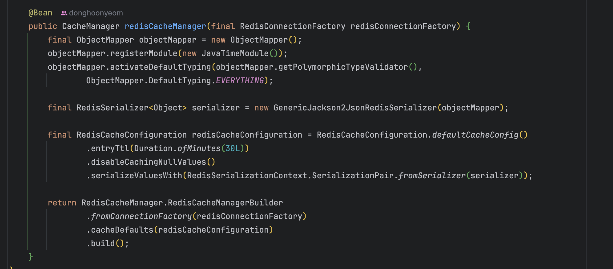
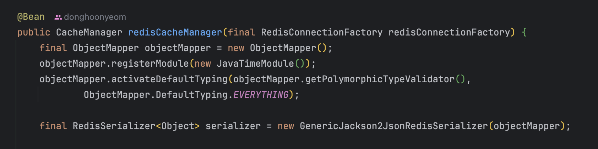
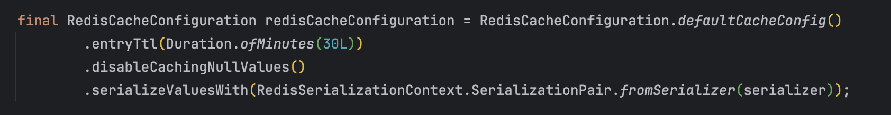
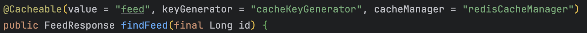
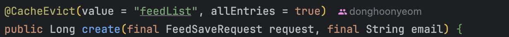
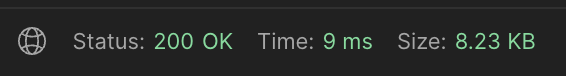

## [Spring에서 Redis Cache 도입]

캐시 전략을 선택했으니 이제 프로젝트에 진행할 차례이다. Redis는 다양한 언어를 지원하고 여러 프레임워크에서 Redis를 위한 추상화가 잘 되어있어서 도입하기 굉장히 편하다. 이번 프로젝트는 Spring boot 3.1 버젼 Java 17 버젼이로 이루어져 있으니 이 기준인 점 참고 바란다.

### [Redis 설정]


redis를 통해 캐시를 하려면 몇몇 설정들이 필요하다. 위의 설정을 하나씩 살펴보자.

로컬 캐싱의 경우, 객체 자체가 어플리케이션 메모리에 보관되기 때문에 타입 정보가 그대로 유지되고, 객체의 상태가 변하지 않는다. 그래서 직렬화, 역직렬화가 필요하지 않거나 필요한 경우에도 객체의 값이 변하는 걱정은 하지않아도 된다.

하지만 글로벌 캐싱(redis)의 경우, 데이터를 문자열이나 JSON 같은 포맷으로 저장한다. 어플리케이션에서는 이 데이터가 어떤 객체인지 정확하게 모르고, 역직렬화(json -> 객체) 시 타입이 변환되거나 값이 변할 가능성이 생긴다.

그래서 redis를 직렬화, 역직렬화를 위해서 type을 정확하게 알려주는 Custom ObjectMapper를 만들어야할 필요가 있다.
Custom ObjectMapper에 대해서 하나씩 살펴보자.




```java
objectMapper.registerModule(new JavaTimeModule());
```

이 설정은 Java8의 날짜와 시간 API를 지원하기 위해 등록해야한다.

```java
objectMapper.activateDefaultTyping(objectMapper.getPolymorphicTypeValidator(), ObjectMapper.DefaultTyping.EVERYTHING);
```

이 설정은 보안 상 안전하지 않은 타입의 역직렬화를 방지하는 목적이다. 즉, 외부에서 들어오는 데이터를 역직렬화하여 어플리케이션으로 가져왔을때 이 객체가 안전한 객체인지 확인하고 역직렬화를 진행하도록 하는 것이다. 예를 들어 위험한 명령어(ex -> DB 조작, 파일 삭제 등)가 포함 되어있는 객체가 어플리케이션 내로 들어오면 큰일 나기 때문에 이를 방지하는 것이다.
activateDefaultTyping를 통해서 역직렬화할 객체의 화이트리스트를 정의할 수 있고, DefaultTyping을 설정하여 보안을 강화할 수 있다.

***하지만 위 설정은 잘못 되어있다.*** 위 설정은 모든 객체에 대해서 역직렬화를 하겠다는 설정인데 이는 굉장히 위험한 설정이다.
현재는 redis가 private instance에 떠있고 지금 어플리케이션에서만 사용하기 때문에 안전한 객체만이 들어오기 때문에 당장은 문제가 없다. 
하지만 ***redis를 통해 위험한 객체가 들어오면 무방비인 상태이기 때문에 화이트리스트 설정 및 DefaultTyping을 더 안전한 옵션으로 바꿔줘야한다.***
내가 일단 이렇게 한 이유는 화이트리스트 객체를 설정하는 효율적인 기준에 대한 학습이 부족하고, 무엇이 안전한지 최선의 방법을 모르기 때문이다. 몇몇 방법을 적용해봤는데, 적용하기 굉장히 까다로워서 코드가 많이 수정되거나, API 스펙이 바뀌는 경우가 발생했다. 깊게 학습한 후에 최선의 방법을 찾아서 변경할 예정이다.




이 부분은 redisCache 설정 관련된 부분이다. ttl을 30분으로 설정하고 Null인 데이터는 캐싱하지 않겠다는 뜻이다. 그리고 위에서 정의한 serializer를 등록해준다.

그리고 Config 파일에 `@EnableCaching`을 붙혀주면 redis를 이용해 캐싱을 사용할 준비를 마치게된다.

### [Spring AOP를 통해 Cache 적용하기]

Spring은 Cache를 AOP를 통해서 프로덕션 코드에 비침투적이고 쉽게 적용할 수 있다. 방법은 다음과 같다.



`@Cacheable` 어노테이션을 이용하면 해당 메소드에 쉽게 캐시를 적용할 수 있다. 동작 과정은 다음과 같다.

1. 해당 메서드(findRoadmap)이 실행되기 전에 CacheHit를 한다.
2. 캐시가 존재하면 해당 메소드를 실행하지 않고 바로 데이터를 반환한다.
3. 캐시가 존재하지 않으면 해당 메소드를 실행한다. 
4. 해당 메소드 종료 후 메소드를 통해 생성된 데이터를 캐시에 넣는다.
5. 데이터를 반환한다.

그리고 몇몇 옵션을 설정할 수 있는데 하나씩 살펴보자.

#### Value

CacheName을 설정하는 옵션이다. 이는 cache의 식별자로 사용이되며 생명주기가 같은 캐시끼리 같은 이름을 맞추어야한다.

#### KeyGenerator

캐시에 적용되는 키 값을 생성하는 객체를 설정할 수 있다. key를 설정하는 제일 간단한 방법은 SpEL을 이용하는 것이다. 좀 더 정교하게 키를 생성하고 싶은 경우 해당 옵션을 사용하여 Key를 생성하는 객체를 설정할 수 있다.

#### CacheManager

메소드마다 사용할 CacheManager를 설정하는 방법이다. 메소드마다 적용하고 싶은 옵션이 다를 수도 있으니 해당 옵션을 통해 직접 CacheManager를 설정하여 메소드에 맞는 설정을 적용할 수 있다.

이외에도 여러가지 옵션이 있으니 필요에 따라 활용하면 된다.

### [Spring AOP를 통해 캐시 데이터 정합성 맞추기]

캐시 적용과 마찬가지로 Spring은 AOP를 활용해서 데이터 정합성을 맞출 수 있도록 추상화 되어있다. 방법은 다음과 같다.



`@CacheEvict`를 통해서 해당 메소드가 실행이 되면, value(cacheName)에 맞는 캐시들이 모두 초기화 되게 하는 옵션이다. 나 같은 경우에는 캐시에 정렬과 페이징이 적용이 되어있어서 어떤 피드 추가, 삭제, 수정이 되면 모든 캐시를 초기화 하도록 해서 데이터 정합성을 맞추었다. 만약 특정 캐시만 삭제하고 싶거나 복잡한 비즈니스 로직이 있으면 해당 어노테이션의 옵션을 사용하던가 직접 AOP를 구현하는 방법을 사용할 수 있다.

## [성능 측정]

어플리케이션에 Redis를 적용했으니 얼마나 성능이 개선 되었는지 테스트 해보자. 다음과 같은 환경으로 테스트를 진행했다.

테스트 도구 : postman

테스트 환경 : local

테스트 API : 메인 페이지에 나가는 피드 조회 API를 선택

조건 : 정렬 조건은 최신순, size는 20으로 설정

### [Redis Cache 적용 전]


### [Redis Cache 적용 후]



## [정리]
성능 개선 : 70ms -> 9ms

성능 개선 퍼센트 : 87% 개선
