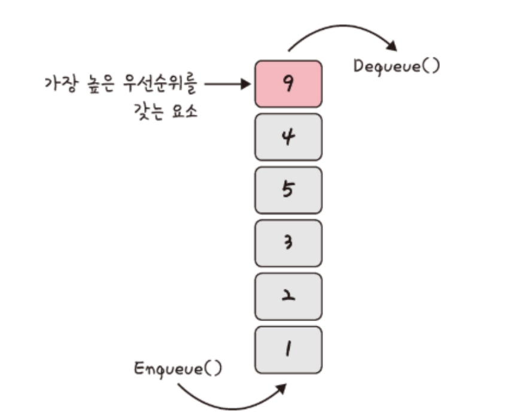

## 우선순위 큐란?

각 요소들이 각각의 우선 순위를 갖고있고, 요소들의 대기열에서 '우선 순위가 높은 요소'가 '우선 순위가 낮은 요소'보다 먼저 제공되는 자료구조다. 힙을 기반으로 구현되나 힙과는 다른 개념이다.

힙은 기본적으로 중점이 되는 것이 '최솟값 또는 최댓값 빠르게 찾기'인 반면, 우선순위 큐는 우선순위가 높은 순서대로 요소를 제공받는다.

기본적으로 큐와 유사한 형태를 가지고 있으며, 다만 큐는 데이터가 들어온 순서대로 처리되지만, 우선순위 큐는 우선순위가 높은 데이터가 먼저 처리됩니다. 우선순위 큐는 최댓값이나 최솟값을 빠르게 찾아내는데 유용하게 사용됩니다.

### 우선순위 큐의 연산

- 삽입(Insertion): 요소를 우선순위에 맞게 삽입
- 삭제(Deletion): 우선순위가 가장 높은(또는 낮은) 요소를 삭제
- 최댓값 또는 최솟값 확인(Peek): 우선순위가 가장 높은(또는 낮은) 요소를 반환하지만 삭제하지는 않는다.

> 우선순위 큐 알고리즘은 삽입과 삭제 연산 시에 이진 힙의 성질을 유지하는 것이 중요하다. 이진 힙의 성질을 유지하지 않으면 올바른 우선순위 큐로 동작하지 않을 가능성이 있다.

### 우선순위 큐의 활용

- 작업 스케줄링(Job Scheduling): 우선순위가 높은 작업을 먼저 처리하기 위해 사용
- 힙 정렬(Heap Sort): 우선순위 큐를 활용하여 정렬을 수행하는 정렬 알고리즘
- Huffman 코딩: 데이터 압축 알고리즘에서 사용되는 특별한 형태의 우선순위 큐