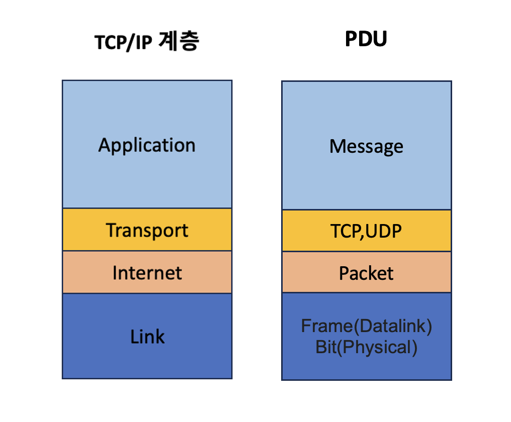

## PDU의 의미

네트워크의 계층에서 계층으로 데이터를 전달할 때 한 덩어리의 단위를 PDU라고 합니다. PDU는 제어 관련 정보들이 포함된 헤더와 데이터를 의미하는 페이로드로 구성되어 있습니다.

위 그림처럼 PDU는 각 계층마다 부르는 이름이 다릅니다.

- 애플리케이션계층 : 메시지
- 전송계층 : 세그먼트(TCP), 데이터그램(UDP)
- 인터넷계층 : 패킷
- 링크계층 : 프레임(데이터링크계층),비트(물리계층)

PDU 중 아래 계층인 bit로 송수신하는 것이 모든 PDU 중 가장 빠르고 효율성이 높습니다. 하지만 애플리케이션계층에서는 문자열을 기반으로 송수신을 하는데, 그 이유는 헤더에 authorization값 등 다른 값들을 넣는 확장이 쉽기 때문입니다.

### 헤더

헤더란? 저장되거나 전송되는 데이터 블록의 맨 앞에 위치한 보충 데이터를 말합니다. 데이터 전송에서 헤더를 따르는 데이터는 페이로드(payload), 바디(body)로 불리기도 합니다.

예를 들어 e-mail을 보낼 때 텍스트(바디)는 보내는 사람, 받는 사람, 제목, 보내는 시간표, 받는 시간표, 마지막 메일 전송 에이전트 등이 전제되어야 합니다.

헤더 구성은 구문 분석을 위하여 뚜렷하고 모호하지 않은 규격이나 포맷을 따라야 합니다.