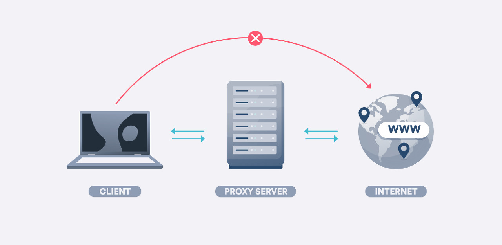

## 프록시서버의 의미

프록시서버는 서버와 클라이언트 사이에서 클라이언트가 자신을 통해 다른 네트워크서비스에 간접적으로 접속할 수 있게 해주는 컴퓨터 시스템이나 응용프로그램을 말합니다.

## 프록시 서버의 동작원리

프록시 서버는 사용자를 인터넷에서 분리하는 중간서버 역활을 하기 때문에 프록시 서버가 없다면 트래픽이 직접 웹사이트로 흐르게 되고, 프록시 서버를 사용하면 요청한 웹사이트에 이동전에 트래픽이 프록시로 먼저 이동하게 됩니다. 여기서 웹사이트에서의 모든 응답도 프록시 서버에 먼저 갔다가 사용자에게 전달 됩니다.

### 프록시 서버의 사용

- CloudFlare

CloudFlare는 전세계적으로 분산된서버가 있고 이를 통해 어떠한시스템의 콘텐츠전달을 빠르게 할 수 있는 CDN 서비스 입니다.
CloudFlare를 사용하여 누릴 수있는 이점으로는 DDOS 공격 방어, HTTPS구축이 있습니다.

## 프록시 서버를 사용하는 이유

### 1. 익명성 유지

프록시 서버를 사용하면 웹 요청을 보낼 때 실제 IP 주소를 숨길 수 있습니다. 이는 개인 정보 보호와 익명성을 유지할 수 있도록 도와줍니다. 특히 공용 Wi-Fi 네트워크나 공공 장소에서 인터넷을 사용할 때 개인 정보를 보호하는 데 도움이 됩니다.

### 2. 지리적 제한 우회

일부 웹 사이트나 온라인 서비스는 특정 지역에서만 이용 가능하도록 설정되어 있습니다. 프록시 서버를 사용하면 자신의 위치를 숨기고 다른 지역으로 연결하여 이러한 지리적 제한을 우회할 수 있습니다.

### 3. 캐시와 가속

프록시 서버는 인터넷 트래픽을 캐시하여 효율적으로 관리할 수 있습니다. 이는 웹 페이지 로딩 속도를 향상시키고 대역폭 사용을 줄여줍니다. 특히 동일한 내용을 반복해서 요청하는 경우에는 프록시 서버에서 캐시된 데이터를 제공함으로써 웹 페이지의 응답 속도를 크게 개선할 수 있습니다.

### 보안 및 필터링

프록시 서버는 웹 트래픽을 모니터링하고 보안 위협이나 악성 소프트웨어를 차단하는 데 도움을 줄 수 있습니다. 특히 기업이나 학교에서는 프록시 서버를 사용하여 내부 네트워크 보안을 강화하고 웹 필터링 정책을 적용하는 경우가 많습니다.

### 콘텐츠 제어

프록시 서버를 사용하면 특정 유형의 콘텐츠에 대한 액세스를 제어할 수 있습니다. 예를 들어, 부적절한 콘텐츠를 차단하거나 특정 웹 사이트에 대한 액세스를 제한할 수 있습니다. 이는 가정이나 조직에서 인터넷 사용 정책을 시행하거나 부모가 자녀의 온라인 활동을 관리하는 데 도움이 됩니다.

 

