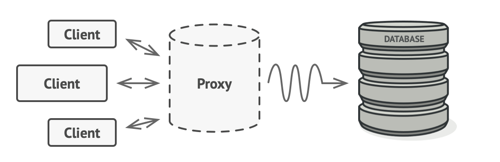
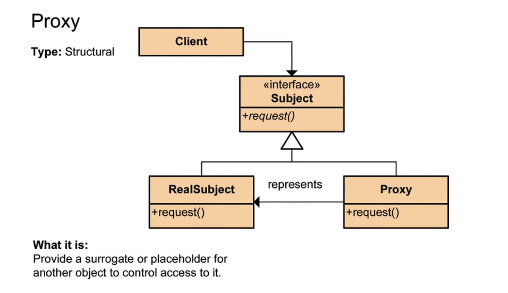
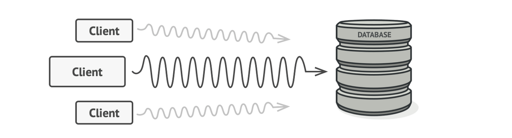
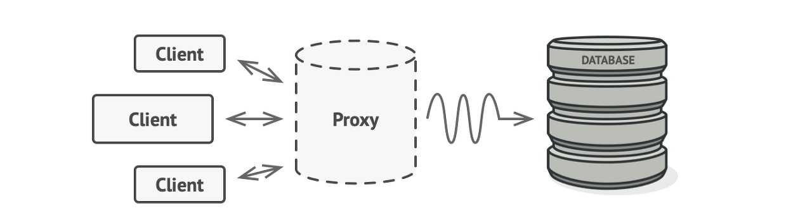

## 들어가며

프록시 패턴을 설명하기 전 먼저 프록시의 의미부터 설명하겠습니다.
우리는 소프트웨어 기술에서 종종 **'프록시'라는 용어를 듣게 되는데 리버스프록시,프록시서버, lazy전략에서 사용되는 프록시객체, 프록시패턴 등등 프록시란 '대리'라는 의미로 프록시에게 어떤 일을 대신시키는 것입니다.**
대신 중요한 건 클라이언트 쪽에서 실제  실행시킬 클래스에 대한객체를 통해 메서드를 호출하고 반환 값을 받는지, 대리자 객체를 통해 메서드를 호출하고 반환 값을 받는지 전혀 모르게 처리한다는 것입니다.
예를 들어 보안분야에서, 보안상의 이유로 서버를 외부에 노출시키지 않기 위해 서버와 클라이언트단 중간에서 접점을 담당하는 서버를 보고 프록시서버라고 부릅니다.



## 프록시 패턴

- 프록시 패턴은 대상 객체에 접근하기 전 그 접근에 대한 흐름을 가로채서 대상 객체 앞단의 인터페이스 역할을 하는 디자인 패턴
- 이를 통해 객체의 속성. 변환 등을 보완하며 보안, 데이터검증, 캐싱, 로깅에 사용합니다.



클라이언트가 어떤 일에 대한 요청(`RealSubject`의 `request()` 메서드 호출)을 하면, Proxy가 대신 `RealSubject`의 `request()`메서드 호출을 하고 그 반환 값을 클라이언트에게 전달합니다.

위 그림을 코드로 구현해 보겠습니다.

### `Subject.interface`

```java
public interface Subject {
    String request();
}
```

### `RealSubject.class`

```java
public class RealSubject implements Subject {
    @Override
    public void request(){
        return "Proxy Pattern";
    }
}
```

### `Proxy.class`

```java
public class Proxy implements Subject {
    private final RealSubject realSubject = new RealSubject();
    
    @Override
    public String request() {
        return RealSubject.request(); // 프록시가 실제 메소드를 호출한다.
    }
}
```

### `main.class`

```java
public static void main(String[] args) {
    // Subject클래스의 메소드를 호출하는이 아닌 프록시클래스의 메소를 호출한다.
    Subject subject = new Proxy();
    System.out.println(subject.request()); // 내부적으로 Subject의 메소드를 호출한다.
}
```

위 코드에서 인터페이스를 중간에 두어서 구체클래스들에게 영향을 받지 않도록 구성되어 있고, 직접 접근하지 않고 Proxy를 통해 한번 더 우회하여 접근하게 되어있습니다. 

### 프록시 패턴을 사용하는 이유

#### 1. 흐름을 제어할 수 있다.



위 사진처럼 많은 양의 리소스를 필요로 하는 상황에서 DB쿼리가 매우 느려질 수 있다. 이런 상황에서는 지연초기화를 위한 코드 작성을 필요로 하는데 이를 모든 클래스에 직접 넣게 되면 많은 코드중복이 발생하게 된다. 



위 사진처럼 프록시객체를 사용한다면 프록시객체가 먼저 리소스요청을 받게 되고 흐름을 제어하면서 DB에 쿼리를 날릴 수 있게 된다.

#### 2. 실제 메서드가 호출되기 이전에 필요한 기능(전처리등의)을 구현객체 변경 없이 추가할 수 있다.

코드변경의 최소화

#### 3. 캐시를 사용할 수 있다.

프록시가 내부캐시를 통해 데이터가 캐시에 존재하지 않는 경우에만 주체클래스에서 작업이 실행되도록 할 수 있다. 

## 마치며

프록시 패턴은 중요한 디자인 상황에서 객체에 대한 간접적인 접근을 제공하면서, 프록시는 코드의 변화에 대응하는 데 도움이 되어 유지보수성을 향상시키는데 기여한다.
그러나 동시에 프록시 패턴을 적용할 때는 코드 중복, 복잡성, 그리고 성능 저하와 같은 단점들도 고려해야 한다. 이러한 측면들을 극복하기 위해서는 디자인을 신중하게 계획하고 패턴을 적용할 때의 상황을 명확히 이해해야 한다고 생각한다.
프록시 패턴은 어떤 상황에서는 필수적인 해결책이 될 수 있지만, 언제 사용해야 하는지에 대한 판단이 필요하다.
