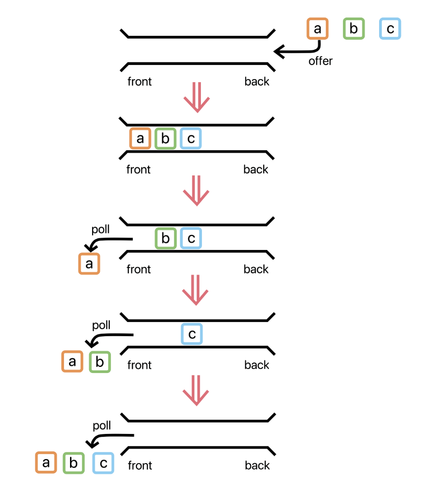

## 들어가며

큐(Queue)는 데이터를 임시로 저장하고 처리하는 자료구조 중 하나입니다. 이는 데이터를 선입선출(First-In-First-Out, FIFO)의 순서로 다루는 구조이며, 스택과는 반대되는 개념을 가지고 있다. 삽입 및 삭제에 O(1) , 탐색에 O(n)이 걸린다.

큐는 일상 생활에서 줄 서기와 유사한 개념으로 이해할 수 있습니다. 가장 먼저 온 사람이 먼저 서비스를 받는 것과 같이, 큐에 추가된 데이터도 가장 먼저 처리되어 나옵니다. CPU작업을 기다리는 프로세스, 스레드 행렬, 네트워크 접속을 기다리는 행렬, 너비 우선 탐색, 캐시도 같은 개념이다.

