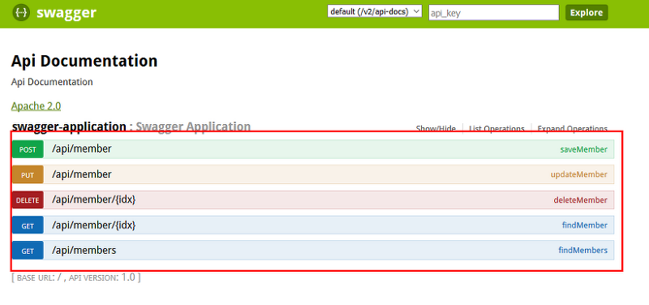

## [들어가며]

지금은 솔로 프로젝트이지만 다른 프로젝트를 잔행할 때 프론트 팀원과 협업하게 될 경우 필요할것 같았고, 과거 Swagger를 구축해본 경험이 있기도 해서 개인으로 욕심으로 한 번 직접 구축해보고 싶다는 생각이 들어 프로젝트 하는김에 함께 진행하게 되었다.

## [Rest-docs는?]

Spring Rest Docs는 Restful 서비스에 대해 정확하고 읽기 쉬운 문서를 생성할 때 도움을 주는 문서 자동화 도구이다.
흔히 백엔드, 프론트엔드가 협업할 때 프론트엔드는 API endPoint를 알고 있어야 해당 API로 요청을 보내서 response를 받아 처리한다. 만약 백엔드 개발자가 API 문서를 수정했다면 프론트엔드 개발자한테 어떻게 알려야 할까?
직접 메신저로 '요구사항이 변경되었어요' 라고 말할 수도 있겠지만, 이는 매우 번거롭다.
만약 프론트엔드 개발자가 당장 수정해야 하는 hotfix 요구사항임에도 메신저를 읽지 못했다면? 혹은, 원하는 시간에 서로 소통할 수 없다면? 하나의 정형화된 문서를 통해서 관리하는 게 훨씬 쉬울 것이다. 
Swagger를 사용하는 경우도 있고, Rest docs를 사용하는 경우도 있을 텐데 각각의 장단점이 뚜렷하다.



Swagger의 경우 테스트 코드 작성에 부담이 없지만, 프로덕션 코드 자체에 문서에 대한 설정 내용이 어노테이션으로 들어가기 때문에 이 자체가 부담이 될 수 있다. Swagger에서 Rest docs로 전환해야 한다면 프로덕션 코드 자체를 전부 바꿔야 하기 때문이다.
하지만, Rest-docs보다는 비교적 적용하기가 쉬우며, 문서 자체는 우리가 직접 구축할 필요없이 알아서 만들어주고, 직접 테스트를 해볼 수 있는 화면을 제공하기 때문에 프론트엔드 개발자 입장에서는 조금 더 편할 수도 있다.

반면에 Rest-docs의 경우 테스트 코드를 기반으로 하기 때문에 프로덕션 코드에는 영향을 끼치지 않는다.
이 말은 곧, 테스트 코드가 정말 꼼꼼하게 짜여 있어야 한다는 것이다. 성공했을 때, 예외가 발생했을 때 등등... 
response 값이 변화하여 내려가는 경우에는 웬만하면 테스트 코드를 작성해야 한다. (그렇기 때문에 RestAssured보다 덜 무거운 MockMvc를 활용하는 게 더 낫다고 판단한 점도 있다.)
또한, 스웨거에 비해 구축이 어려운 편이다. 문서 구축 자체는 빌드된 adoc 파일을 직접 조립해야 하고, 프론트엔드 개발자가 직접 테스트해볼 수도 없다. 하지만, 직접 구축하기 때문에 문서 내부에 어떤 내용이 들어갈지 조금 더 세분화하여 개발자가 작성할 수 있다.


개인적으로 규모가 작다면 swagger를 사용해볼만 하다고 생각하지만, 프로덕션 코드 자체를 수정하는 게 찝찝하기 때문에 rest-docs를 조금 더 선호하는 편이다. 한 번 적용해두면 그뒤부터 응용은 쉽기 때문에 처음 러닝커브만 조금 견디면 된다.


## [SetUp - build.gradle]

그전에, Rest Docs의 경우 기본적으로 'Asciidoctor'라는 친구를 사용하는데, 이 친구는 일반 텍스트를 처리하면서 HTML 형태로 만들어주는 친구다. 이 친구의 개념 자체가 중요한 건 아니지만, HTML로 문서를 생성하기 위한 일종의 전처리 도구라고 생각하자.
또한, 각각의 테스트 코드가 성공하면 'snippet'이라는 친구가 생성되는데, 이러한 스니펫들을 조립하여 문서를 생성한다고 생각하자.


먼저, build.gradle에 다음과 같은 내용을 추가해야 한다.

```java
plugins {
	id 'org.asciidoctor.jvm.convert' version '3.3.2'
}
configurations {
    asciidoctorExt
}

ext {
    snippetsDir = file('build/generated-snippets')
}
test {
    outputs.dir snippetsDir
}

asciidoctor {
    inputs.dir snippetsDir
    configurations 'asciidoctorExt'
    dependsOn test

    sources {
        include("**/index.adoc")
    }

    baseDirFollowsSourceFile()
}

asciidoctor.doFirst {
    delete file('src/main/resources/templates/docs')
}

task copyDocument(type: Copy) {
    dependsOn asciidoctor
    from file("build/docs/asciidoc")
    into file("src/main/resources/templates/docs")
}

build {
    dependsOn copyDocument
}

dependencies {
    asciidoctorExt 'org.springframework.restdocs:spring-restdocs-asciidoctor'
    testImplementation 'org.springframework.restdocs:spring-restdocs-mockmvc'
}

bootJar {
    dependsOn asciidoctor
    from ("${asciidoctor.outputDir}/html5") {
        into 'static/docs'
    }
}
```

생각보다 설정해줄 것이 굉장히 많기 때문에 조금씩 나눠서 보도록 하자.

```java
plugins {
    id "org.asciidoctor.jvm.convert" version "3.3.2" (1)
}

configurations {
    asciidoctorExt (2)
}

ext {
    snippetsDir = file('build/generated-snippets') (3)
}

tasks.named('test') {
    outputs.dir snippetsDir (4)
}
```
1. Asciidoctor 플러그인을 적용한다.
2. asciidoctorExt를 프로젝트의 configuration에 추가한다.
   asciidoctorExt는 Asciidoctor를 사용하여 문서를 생성하고 포맷하는 데 사용하는 플러그인인데, 이를 이용하여 HTML 형식으로 출력할 수 있도록 만든다고 생각하면 된다.
3. 생성된 스니펫들을 어느 위치에 저장할 것인지 지정하는 것이다. (디폴트로 build 폴더 밑에 생성하는 편)
4. 저장한 스니펫 경로가 테스트 결과로 생성되는 디렉터리에 추가되도록 설정하는 것이다.
   테스트가 실행될 때 스니펫이 생성되면, 해당 디렉터리에 저장되는 것이다.

```java
asciidoctor {
    inputs.dir snippetsDir (5)
    configurations 'asciidoctorExt' (6)
    dependsOn test (7)

    sources {
        include("**/index.adoc") (8)
    }

    baseDirFollowsSourceFile() (9)
}

asciidoctor.doFirst {
    delete file('src/main/resources/templates/docs') (10)
}
```

5. asciidoctor가 할 일을 정의하는 부분이다.
   이전에 설정한 스니펫 저장 경로를 입력 디렉터리로 만들어서, asciidoctor가 문서를 생성할 때 어디를 참조할지 지정하는 것이다.
6. ext에서 구성한 asciidoctorExt를 구성 파일로 사용하도록 만드는 것이다.
7. 문서가 생성되기 전에 테스트가 실행될 수 있도록, test에 종속적이도록 만든다. (test 실행 -> 문서 생성 느낌!)
8.  rest-docs 문서의 경우, .adoc 파일을 바탕으로 생성하게 되는데 이때 source를 지정하게 되면 특정 adoc만 HTML로 만든다.
    만약 모든 adoc에 대해 각각 html을 만들고 싶다면 해당 옵션은 제거해도 된다.
9. 특정 .adoc에 다른 adoc을 include 하고 싶을 때 경로를 baseDir로 맞춰주는 역할이다.
   나 같은 경우 index.adoc으로 세부 adoc을 로드하도록 만들었기 때문에 이 옵션을 활성화해주었다.
10. static.docs 파일을 초기화하고 다시 만들도록 설정하는 것이다.
    기본적으로는 static 하위에 두는 경우가 많은데, 미션에서 타임리프를 사용하다 보니 templates 폴더 하위로 설정하였다.

```java
task copyDocument(type: Copy) { (11)
    dependsOn asciidoctor
    from file("build/docs/asciidoc")
    into file("src/main/resources/templates/docs")
}

build {
    dependsOn copyDocument (12)
}

dependencies {
    asciidoctorExt 'org.springframework.restdocs:spring-restdocs-asciidoctor' (13)
    testImplementation 'org.springframework.restdocs:spring-restdocs-mockmvc' (14)
}

bootJar {
    dependsOn asciidoctor (15)
    from ("${asciidoctor.outputDir}/html5") {
        into 'templates/docs'
    }
}
```

11. asciidoctor 작업한 이후 (dependsOn), build/docs/asciidoc을 보면 상단에서 설정해준 source 옵션에 따라 html이 생기게 된다. 나 같은 경우 프로덕션 코드에서 html에 접근할 수 있도록 하기 위해서 resources/templates/docs에 복사를 진행하였다.
12. 빌드 작업이 copyDocument 이후에 진행되도록 설정한다.
13. asciidoctorExt configuration을 사용하여 restdocs-asciidoctor 라이브러리에 대한 의존성을 설정한다.
    이렇게 하면 .adoc 파일에서 빌드, 생성된 스니펫을 가리키도록 스니펫 속성이 자동으로 구성된다.
14. MockMVC를 활용하여 rest-docs를 구성할 때 사용한다. (Rest-Assured를 사용하면 spring-restdocs-restassured 사용)
15. 생성된 문서를 jar 파일에 패키징해서 정적 컨텐츠로 제공할 때 사용하는 것이다.
asciidoctor에 종속적이도록 만들어서, jar 파일을 빌드하기 전에 문서가 생성되었는지 체크한다.
    이렇게 되면 jar 파일이 빌드되기 전에 문서가 생성되고, 생성된 문서는 jar 파일에 포함된다.
asciidoctor 진행 이후 문서를 templates/docs로 이동시킨다.

#### 결과적으로 ./gradlew clean build를 진행하게 되면 test -> asciidoctor -> copyDocument -> build 순으로 세팅이 진행된다.

## 코드에 적용하기 (Junit5 기준)

우선, 테스트할 대상 클래스에 다음과 같은 셋업 작업을 진행해준다.
controller가 여러 개라면 공통적으로 사용할 부분은 빼는 것이 좋기 때문에, 나는 별도의 helper 클래스를 생성해두었다.

```java
@ExtendWith(RestDocumentationExtension.class) (1)
public class RestDocsHelper {

    private MockMvc mockMvc;

    private RestDocumentationResultHandler documentationResultHandler;

    @BeforeEach
    void setUp(final WebApplicationContext webApplicationContext,
               final RestDocumentationContextProvider restDocumentationContextProvider) {

        this.documentationResultHandler = MockMvcRestDocumentation.document(
                "{class-name}/{method-name}", (2)
                Preprocessors.preprocessRequest(Preprocessors.prettyPrint()), (3)
                Preprocessors.preprocessResponse(Preprocessors.prettyPrint()));

        this.mockMvc = MockMvcBuilders.webAppContextSetup(webApplicationContext) (4)
                .addFilter(new CharacterEncodingFilter("UTF-8", true)) (5)
                .alwaysDo(MockMvcResultHandlers.print()) (6)
                .alwaysDo(documentationResultHandler) (7)
                .apply(documentationConfiguration(restDocumentationContextProvider)) (8)
                .build();
    }
}
```

1. Junit5에서 사용할 수 있으며, Spring Rest Docs의 RestDocumentationExtension 클래스를 사용하여 테스트를 확장시키는 것이다. 어렵게 생각할 필요없이, API 문서를 생성하기 위해 환경을 설정한다고 보면 된다.
2. 문서의 세부 경로를 설정해주는 부분이다. build/generated-snippets 패키지 밑에, class-name 패키지, 그리고 method-name 패키지 하단에 각각의 스니펫이 생성되도록 만드는 설정이다.
- 사실 이 부분에 나중에 배포될 때를 대비하여 프로토콜 정보나 host 정보도 지정해줄 수 있다. (Preprocessors.modifyUris 활용)
3. request, response에 대해서 전처리 작업을 해주는 것인데 요청, 응답에 대해 읽기 쉽도록 만들어준다.
4. 각각의 테스트 메서드가 실행되기 전에 공통적으로 실행할 작업을 정의한다.
mockMvc에 대해서 설정하는 것을 볼 수 있는데, 이를 통해 Spring REST docs에서 생성된 컨텍스트를 사용하여 API를 테스트할 수 있도록 만들어주는 전초 작업이라고 볼 수 있다.
5. 문서 생성 시 한글이 깨질 수 있기 때문에 이를 위해 인코딩 형식을 지정해주는 부분이다.
6. 처리한 내용에 대해 항상 로깅 작업을 수행하도록 print를 해주는 부분이다.
7. 위에서 설정한 정보들을 항상 적용하도록 만드는 것이다.