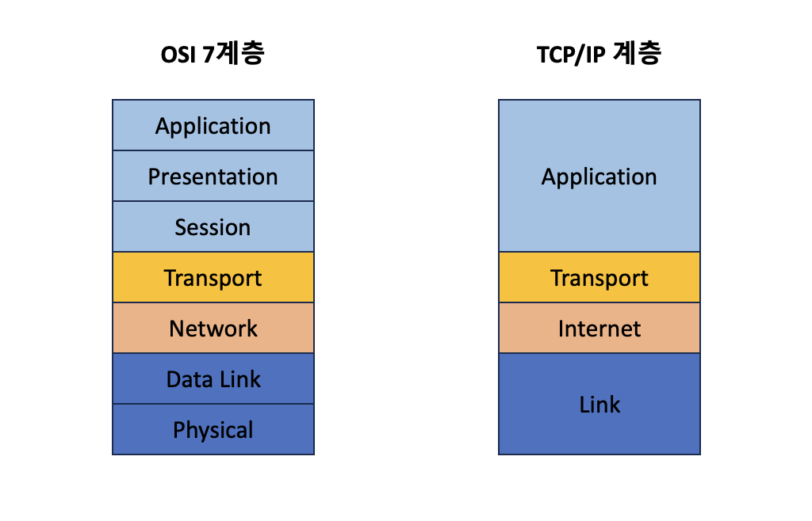
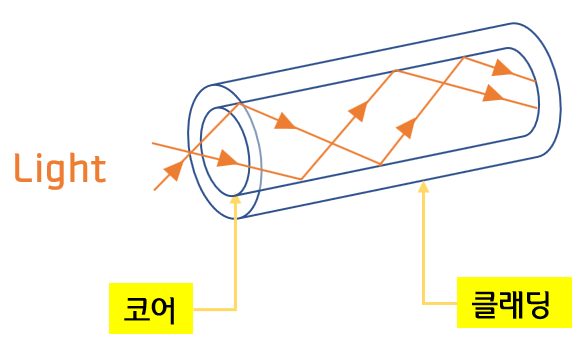

## 들어가며
인터넷 프로토콜 스위트는 인터넷에서 컴퓨터들이 서로 정보를 주고받는 데 사용하는 프로토콜의 집합이다. 이를 TCP/IP 4 계층 모델로 설명하거나 OSI 7 계층 모델로 주로 설명하는 경우가 많습니다. 여기서 TCP/IP 4 계층 모델은 OSI 7 계층과는 다르게 통신 프로토콜의 집합으로 계층들은 프로토콜의 네트워킹 범위에 따라 4개의 추상화 계층으로 구성되어 있습니다.

## TCP/IP 계층과 OSI 7계층 비교

위 그림을 확인해보면 OSI 계층과 TCP/IP 계층의 다른 점을 몇 가지 확인할 수 있다. 첫 번째는 OSI 계층은 TCP/IP 계층의 애플리케이션계층을 3개로 나누고 있고, 두번째는 링크 계층을 데이터 링크 계층과 물리 계층으로 나누고 있다. 세번쨰는 네트워크 계층을 인터넷 계층으로 부르고 있다는 점입니다.

## Application 계층

애플리케이션계층은 FTP, HTTP, SSH, SMTP, DNS 등 응용프로그램이 사용되는 프로토콜 계층이며 웹서비스나 이메일등 서비스를 실질적으로 사람들에게 제공하는 계층입니다.
 
- FTP : 파일 전송 프로토콜(File Transfer Protocol)의 약자입니다. 그 의미를 자세히 살펴보면 기본적으로 '프로토콜' 또는 인터넷 프로토콜은 전자기기가 서로 통신하는 데 필요한 절차나 규칙을 말합니다. ***FTP는 TCP/IP 네트워크상의 장치가 파일을 전송할 때 사용하는 프로토콜입니다.***
- SSH : 네트워크 상 다른 컴퓨터의 쉘을 사용할 수 있게 해 주는 프로그램 혹은 그 프로토콜을 의미합니다. SSH를 사용하면 원격에서 네트워크 상의 컴퓨터에 접속할 수 있습니다. 쉽게 말해 ***보안되지 않은 네트워크 서비스를 안전하게 운영하기 위한 암호화 네트워크 프로토콜입니다.*** 교환된 대칭 키를 이용해 SSH 서버와 클라이언트 간 모든 통신은 암호화하여 진행되기 때문에, SSH 연결은 매우 안전합니다.
- HTTP : HTML 문서와 같은 리소스들을 가져올 수 있도록 해주는 프로토콜입니다. ***HTTP는 웹에서 이루어지는 모든 데이터 교환의 기초이며, 클라이언트-서버 프로토콜이기도 합니다.*** 클라이언트-서버 프로토콜이란 (보통 웹브라우저인) 수신자 측에 의해 요청이 초기화되는 프로토콜을 의미합니다. 
- SMTP : ***전자 메일 전송을 위한 인터넷 표준 통신 프로토콜 입니다.*** 한 메일서버에서 다른 메일서버로 메일을 전송할 때, 송신자의 user agent에서 본인의 메일서버로 메일을 전송할때 SMTP가 사용됩니다. 참고로 SMTP는 HTTP보다 훨씬 더 오래전부터 사용되고 있습니다.
- DNS : 전 세계에 배포된 서비스로  www.naver.com 같이 사람이 읽을 수 있는 이름을 192.0.2.1과 같은 숫자 IP 주소로 변환하여 컴퓨터가 서로 통신할 수 있도록 합니다. ***인터넷의 DNS 시스템은 이름과 숫자 간의 매핑을 관리하여 마치 전화번호부와 같은 기능을 합니다.*** DNS 서버는 이름을 IP 주소로 변환하여 도메인 이름을 웹 브라우저에 입력할 때 최종 사용자를 어떤 서버에 연결할 것인지를 제어합니다. 이 요청을 쿼리라고 부릅니다.

## Transport 계층

전송계층은 송신자와 수신자를 연결하는 통신 서비스를 제공하고, 연결 지향 데이터 스트림 지원, 신뢰성, 흐름제어를 제공할 수 있으며 애플리케이션 계층과 인터넷 계층 사이에 데이터를 전달할 때 중계 역할을 하는 계층입니다. 대표적으로 TCP와 UDP가 있습니다.

- TCP : Transmission Control Protocol의 약자로 패킷 사이의 순서를 보장하고 연결지향 프로토콜을 사용해서 연결하여 신뢰성을 구축하여 수신 여부를 확인가능하며 ***가상 회선 패킷 교환 방식***을 사용합니다.
- UDP : User Datagram Protocol의 약자로 패킷 사이의 순서를 보장하지 않고 수신 여부를 확인하지 않으며 단순히 데이터만 주는 ***데이터그램 교환 방식***을 사용합니다.

### 가상 회선 패킷 교환 방식 VS 데이터그램 교환 방식

- 가상 회선 패킷 교환 방식 : 데이터를 전송하기 전에 논리적 연결을 설정하게 된다. 이를 가상회선이라 칭한다. 각각의 패킷에는 가상 회선 식별 번호(VCI)가 포함되어 있고, 모든 패킷들을 전송하면 가상회선이 해제되며 패킷들은 전송한 순서대로 도착합니다. (연결 지향)

- 데이터그램 교환 방식 : 데이터를 전송하기 전 논리적 연결을 설정하지 않고, 패킷들이 독립적으로 전송된다. 이를 데이터그램이라 칭한다. 패킷을 수신한 라우터는 최적의 경로를 선택하여 패킷을 전송하는데, 하나의 매시지에서 분할되어 있는 여러 개의 패킷은 서로 다른 경로로 전송될 수 도 있습니다. (비연결 지향형)

#### 차이점 

- 데이터 그램은 패킷마다 라우터가 경로를 선택하지만, 가상회선 방식은 경로를 설정할 때 한 번만 수행한다.
- 정해진 시간 안이나 다량의 데이터를 연속으로 보낼 때는 가상 회선 방식이 적합하지만, 짧은 메시지의 일시적인 전송에는 데이터그램 방식이 적합하다.
- 네트워크 내에 한 노드가 다운되면 데이터그램 방식은 다른 경로를 새로 찾아서 설정하지만, 가상 회선 패킷 교환 방식은 다운된 노드를 지나는 모든 가상 회선을 잃게 된다.

## Internet 계층

인터넷 계층은 장치로부터 받은 네트워크 패킷을 IP 주소로 지정된 목적지로 전송하기 위해 사용되는 계층입니다. IP, ARP, ICMP 등이 있고, 패킷을 수신해야 할 상대의 주소를 지정하여 데이터를 전달합니다. 상대가 제대로 받았는지에 대해 보장하지 않는 비연결형적인 특징을 가지고 있습니다.

## Link 계층

링크 계층은 전선이나 광섬유, 무선 등을 이용하여 실질적인 데이터를 전달하며 장치 간 신호를 주고받는 규칙을 정하는 계층입니다. 다른 말로는 네트워크 접근 계층이라고 부르기도 합니다.

링크 계층을 물리계층과 데이터 링크 계층으로 나누기도 하는데 ***물리계층은 무선 LAN과 유선 LAN을 통해 0과 1 로이루어진 데이터를 보내는 계층***을 말하며, ***데이터 링크 계층은 '이더넷 프레임'을 통해 에러 확인, 흐름제어, 접근제어를 당당하는 계층***을 말합니다.

유선 LAN을 이루는 이더넷은 IEEE802.3이라는 프로토콜을 따르며, 양쪽의 장치가 동시에 송수신할 수 있는  방식인 전이중화(full duplex) 통신을 사용합니다. 전이중화 방식은 송신로와 수신로를 나누어 같은 시간에 데이터를 주고받을 수 있습니다. 현대의 고속 이더넷은 전이중화 방식을 기반으로 통신하고 있습니다.

유선 LAN은 과거 ***CDMA/CD*** 방식을 사용했었다. 이 방식은 데이터를 보낸 후 충돌이 발생할 시 일정시간 이후에 재전송하는 방식을 말합니다. 전이중화 방식과는 다르게 한경로를 송신과 수신을 함께 보내는 방식이어서 데이터 충돌에 대비해야 했습니다.

### 광섬유 케이블

광섬유 케이블은 말 그대로 광섬유를 사용하여 만든 케이블을 말합니다. 빛을 이용하여 통신하기 때문에 과거에 사용했던 동축 케이블이나 구리선과는 비교할 수 없을 만큼의 장거리 통신이나 고속의 통신이 가능합니다. 보통 100 Gbps 속도를 내며, 밑의 그림에서 처럼 광섬유 내에서 빛이 반사하면서 반대편 끝까지 가는 원리입니다. 굴절률이 높은 부분을 코어, 낮은 부분을 클래딩이라고 합니다.

