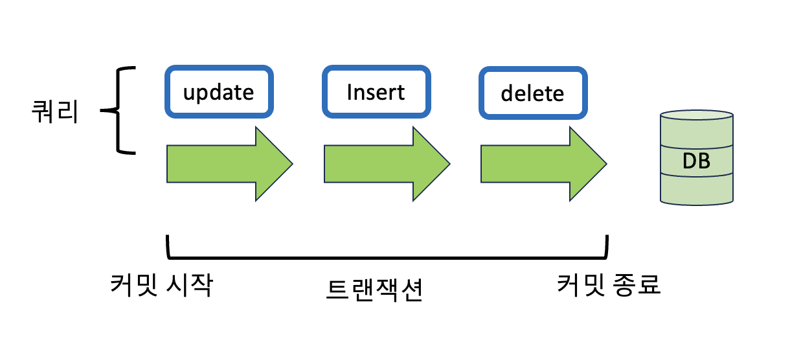
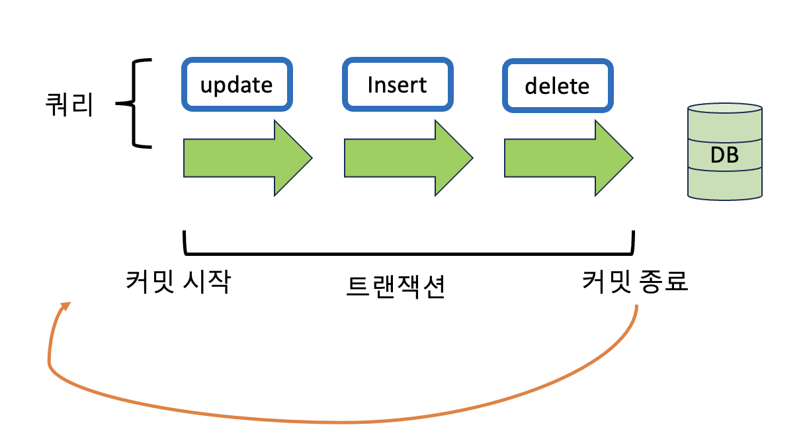
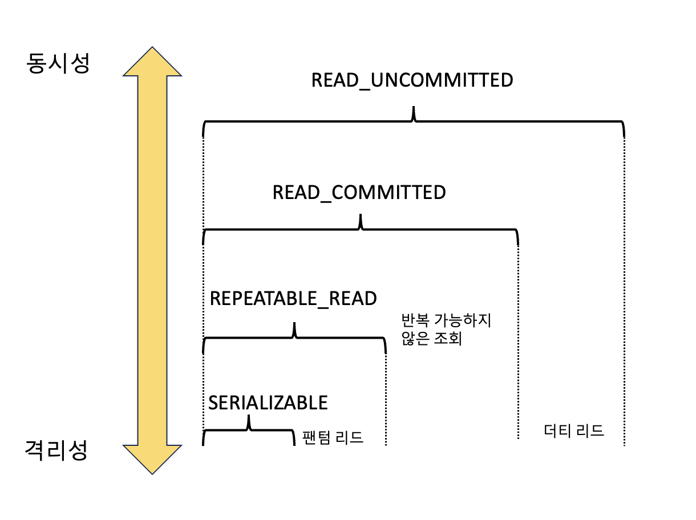

## 들어가며

트랜잭션(Transaction)은 데이터베이스에서 하나의 논리적 기능을 수행하기 위한 작업의 단위를 말하며, 데이터베이스에 접근하는 방법은 쿼리이므로, 즉 여러 개의 쿼리들을 하나로 묶는 단위를 말한다. 트랜잭션은 ***원자성(Atomicity)***, ***일관성(Consistency)***, ***격리성(Isolation)***, 그리고 ***지속성(Durability)*** 이라는 특성을 갖는다. 이 네 가지 특성은 트랜잭션의 안전성과 무결성을 보장하는데 중요한 역할을 한다.

### 트랜잭션의 흐름

1. 트랜잭션 시작 (BEGIN 또는 START TRANSACTION 명령)
2. 데이터베이스 작업 수행 (SELECT, INSERT, UPDATE, DELETE 등)
3. 모든 작업이 성공적으로 수행되면 커밋 (COMMIT 명령으로 트랜잭션 완료)
4. 오류 또는 중단이 발생하면 롤백 (ROLLBACK 명령으로 트랜잭션 취소)

## 원자성(Atomicity)

트랜잭션은 ***작업의 모든 단계가 완벽하게 수행되거나 전혀 수행되지 않아야 한다.*** 예를 들어 트랜잭션을 커밋했는데, 문제가 발생하여 롤백하는 경우 그 이후에 모두 수행되지 않음을 보장하는 것을 말한다. 하나의 원자적인 단위로 묶여있기 때문에 중간 단계의 실패로 인해 데이터베이스가 비일관성 상태에 빠지는 것을 방지한다.

### 커밋과 롤백(Commit, Roll back)

***커밋은 트랜잭션이 성공적으로 완료되어 데이터베이스에 수행한 모든 작업들이 영구적으로 저장되도록 하는 명령이다.*** 즉, 커밋 명령을 실행하면 트랜잭션 내의 모든 데이터베이스 작업들이 데이터베이스에 반영되고, 이후에는 해당 트랜잭션에서 수행한 변경 사항이 영구적으로 유지된다. 커밋 이후에는 데이터베이스는 일관성을 유지하며, 다른 트랜잭션들도 해당 변경 사항을 볼 수 있게 된다.



> 위 그림처럼 update,insert,delete의 쿼리가 하나의 트랜잭션 단위로 수행되고 이후에 데이터 베이스에 영구 저장된다.

***롤백은 트랜잭션을 취소하고 트랜잭션 이전의 상태로 되돌리는 명령이다.*** 즉, 트랜잭션 내에서 오류가 발생하거나 트랜잭션을 중단해야 하는 경우 롤백 명령을 실행하여 이전 상태로 데이터베이스를 되돌린다. 롤백을 실행하면 트랜잭션에서 수행한 모든 변경 사항들이 취소되고, 데이터베이스는 트랜잭션 이전의 상태로 돌아간다. 이후에는 해당 트랜잭션에서 수행한 작업들이 데이터베이스에 영향을 미치지 않은 것처럼 보인다.



> 이러한 커밋과 롤백으로 데이터의 무결성이 보장되고, 데이터 변경 전에 변경사항을 쉽게 확인할 수 있고 해당 작업을 그룹화할 수 있다.

### 트랜잭션 전파

트랜젝션을 수행할 때 커넥션 단위로 수행하기 때문에 커넥션 객체를 넘겨서 수행해야 한다. 하지만 이를 매번 넘겨주기가 어렵기도 하고 귀찮기도 하다. 이를 넘겨서 수행하지 않고 여러 트랜잭션 관련 메서드의 호출을 하나의 트랜잭션에 묶이도록 하는 것을 트랜잭션 전파라고 한다.

```java
@Service 
@Transactional(readOnly = true) 
public class MemberService {
    private final MemberRepository memberRepository;

    public MemberService(MemberRepository memberRepository) {
        this.memberRepository = memberRepository;
    }
}
```

> 위 코드처럼 `@Transactional` 애너테이션을 통해 여러 쿼리 관련 코드들을 하나의 트랜잭션으로 처리한다.

## 일관성(Consistency)

***트랜잭션의 시작 전과 끝난 후에도 데이터베이스는 일관된 상태를 유지해야 한다.*** 즉, 트랜잭션이 실행되기 전과 후에 정의된 규칙과 제약 조건, 허용된 방식을 만족해야 한다. 트랜잭션이 성공적으로 완료된 경우 데이터베이스의 상태가 항상 일관성을 유지해야 한다.

## 격리성(Isolation)

***여러 개의 트랜잭션이 동시에 실행될 때, 각 트랜잭션은 다른 트랜잭션들로부터 독립적으로 수행되는 것처럼 보이도록 격리되어야 한다.*** 즉, 하나의 트랜잭션이 다른 트랜잭션의 영향을 받지 않고, 서로 간섭하지 않도록 보장해야 한다. 이를 통해 트랜잭션들이 동시에 실행될 때 발생할 수 있는 문제들을 방지하고 데이터 일관성을 보장한다.



> 격리 수준은 SERIALIABLE, REPEATABLE_READ, READ_COMMITTED, READ_UNCOMMITTED가 있다.
> 위로 갈수록 동시성은 강해지고, 격리성은 낮아 지고, 아래로 갈수록 격리성은 강해지고, 동시성은 낮아진다.

- 팬텀 리드(Phantom Read): ***하나의 트랜잭션 내에서 같은 쿼리를 두 번 이상 실행했을 때, 첫 번째 쿼리에 없던 새로운 행이나 레코드가 두 번째 쿼리에서 나타나는 현상을 말합니다.*** 이는 다른 트랜잭션에 의해 삽입되거나 삭제된 데이터 때문에 발생할 수 있습니다.
  > 예를 들어 사용자 A가 회원 테이블에서 age가 13 이상인 회원들을 조회하는 쿼리를 보냈다는 가정했을 때 결과로 3개의 테이블  을 조회한다고 해보면 그다음 사용자 B가 age가 15인 회원 레코드를 삽입한다. 그러면 3개가 아닌 4개가 조회된다.
- 반복 가능하지 않은 조회(Non-repeatable Read): ***하나의 트랜잭션 내에서 같은 쿼리를 두 번 이상 실행했을 때, 첫 번째 쿼리에서 조회한 데이터와 두 번째 쿼리에서 조회한 데이터가 다른 현상을 말합니다.*** 이는 다른 트랜잭션에 의해 데이터가 변경되거나 삭제되었을 때 발생할 수 있습니다.
  > 예를 들어 사용자 A가 조회 했을 때 특정 레코드를 조회하고, 그 후에 사용자 B가 동일한 레코드를 수정하거나 삭제하면, 트랜잭션 A는 같은 쿼리를 다시 실행했을 때 이전과 다른 결과를 얻을 수 있다.
- 더티 리드(Dirty Read): ***하나의 트랜잭션에서 아직 커밋되지 않은 다른 트랜잭션의 변경 사항을 읽는 것을 말합니다.*** 즉, 다른 트랜잭션이 아직 롤백되거나 커밋되지 않았으므로 데이터베이스에 영구적으로 적용되지 않은 값을 읽게 됩니다.
  >예를 들어 사용자 A가 큰돌의 보석개수 100을 1로 변경한 내용이 커밋되지 않은 상태라도 그 이후 사용자 B가 조회한 결과가 1로 나오는 경우를 말한다.
  
### SERIALIZABLE (직렬화)

가장 높은 격리 수준으로, 트랜잭션이 순차적으로 실행되는 것처럼 보장된다.
다른 트랜잭션에서 데이터를 수정하거나 추가하는 것을 완전히 차단하여 펜텀 리드(Phantom Read)와 반복 가능하지 않은 조회(Non-repeatable Read)를 방지한다. 다른 격리 수준에 비해 더 많은 락(Lock)을 사용하므로 동시성이 떨어질 수 있습니다.

### REPEATABLE READ (반복 가능한 읽기)

트랜잭션 내에서 동일한 쿼리를 여러 번 실행해도 항상 동일한 결과를 얻을 수 있다.
반복 가능하지 않은 조회(Non-repeatable Read)는 발생하지 않지만, 펜텀 리드(Phantom Read)가 발생할 수 있다.
REPEATABLE READ 격리 수준에서는 트랜잭션이 커밋되기 전까지 다른 트랜잭션에서 해당 데이터를 수정하거나 추가할 수 없도록 락(Lock)을 사용한다.

### READ COMMITTED (읽기 커밋)

다른 트랜잭션에서 커밋한 변경 사항만 읽을 수 있다.
더티 리드는 발생하지 않지만, 반복 가능하지 않은 조회(Non-repeatable Read)와 펜텀 리드(Phantom Read)가 발생할 수 있다.
일반적으로 가장 기본적으로 사용되는 격리 수준이며, 많은 데이터베이스 시스템에서 기본으로 설정된다.

### READ UNCOMMITTED (미허용 읽기)

가장 낮은 격리 수준으로, 다른 트랜잭션에서 아직 커밋되지 않은 변경 사항도 읽을 수 있다. 더티 리드(Dirty Read)가 발생할 수 있으며, 다른 트랜잭션에서 롤백되거나 커밋되지 않은 값을 읽을 수 있다. 데이터 일관성과 무결성이 보장되지 않기 때문에 일반적으로 권장되지 않는 격리 수준입니다.

## 지속성(Durability)

***트랜잭션이 성공적으로 완료되면, 그 결과는 영구적으로 유지되어야 한다.*** 시스템 장애나 손상된 상태에서도 데이터베이스는 지속적으로 트랜잭션의 결과를 보존해야 한다. 데이터 베이스는 이를 위해 체크섬, 저널링, 롤백 등의 기능을 제공한다.

## 무결성(Integrity)

데이터의 정확성, 일관성, 유효성을 유지하는 것을 말하며, 무결성이 유지되어야 데이터 베이스에 저장된 데이터 값과 그 값에 해당하는 현실 세계의 실제 값이 일치하는지에 대한 신뢰가 생긴다.

|    이름    |                                  설명                                   |
|:--------:|:---------------------------------------------------------------------:|
|  개체 무결성  |                      기본키로 선택된 필드는 빈 값을 허용하지 않는다.                      |
|  참조 무결성  |              서로 참조 관계에 있는 두 테이블의 데이터는 항상 일관된 값을 유지해야 한다.              |
|  고유 무결성  |        특정 속성에 대해 고유한 값을 가지도록 조건이 주어진 경우 그 속성 값은 모두 고유한 값을 가진다.        |
| NULL 무결성 |   특정 속성 값에 NULL이 올 수 없다는 조건이 주어진 경우 그 속성 값은 NULL이 될 수 없다는 제약 조건이다.    |

