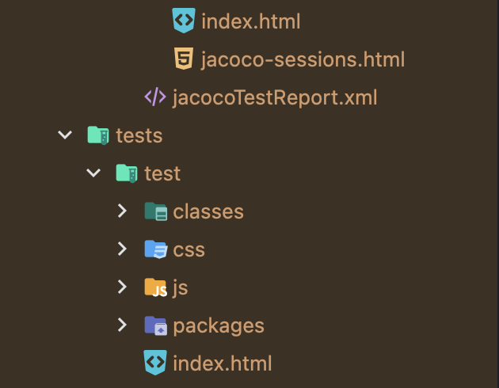
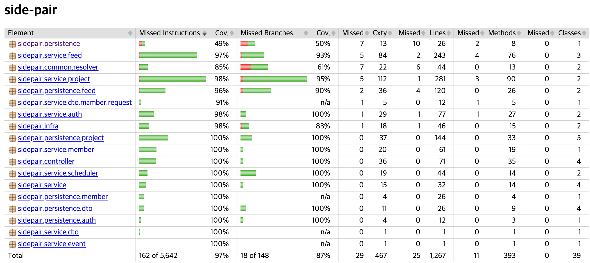
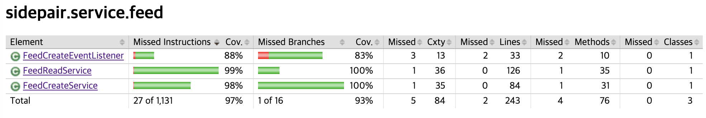
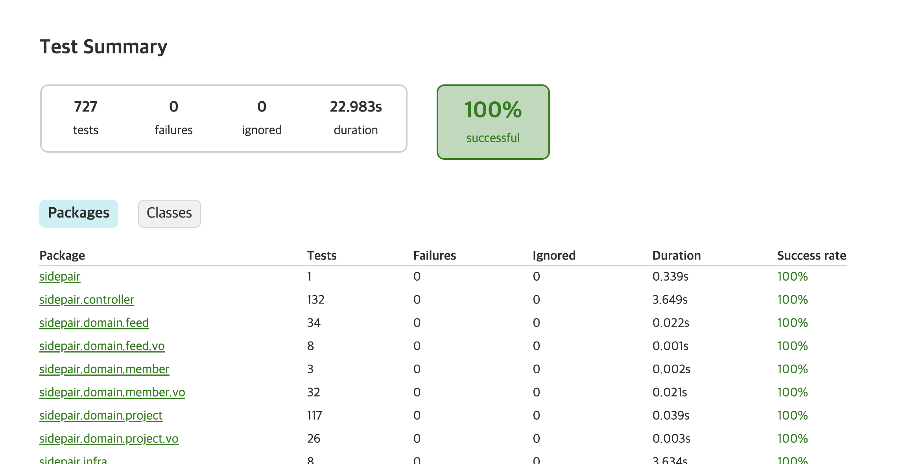
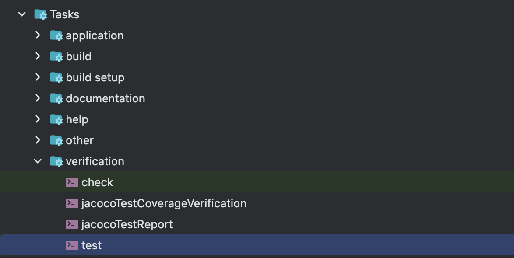
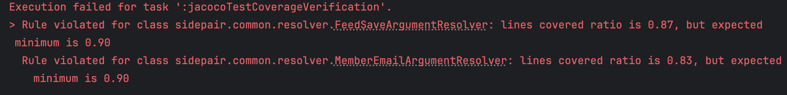
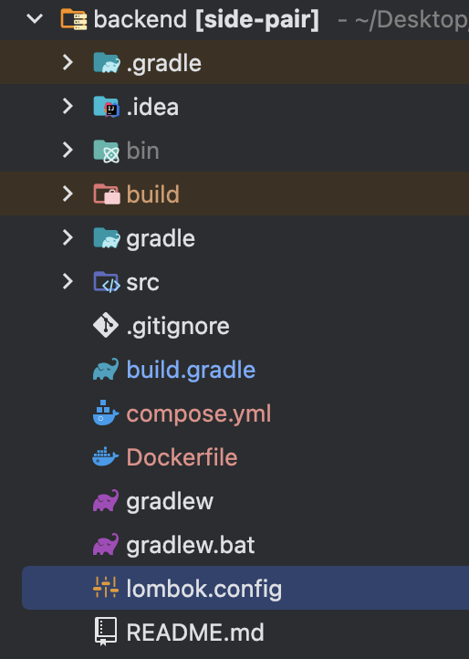

## [들어가며]

이번 프로젝트 CI 플로우 과정 중에서 Jacoco를 활용하여 테스트 리포트를 발행하고, 커버리지를 체크하고 있다.
CI에 대한 글은 다음에 완전하게 구축된 이후에 작성하는 게 좋을 것 같아서, 오늘은 Jacoco에 대해서만 가볍게 짚고 넘어가고자 한다.

## [Jacoco 설정하기]

Jacoco는, 테스트 코드 커버리지를 분석해주는 자바의 무료 라이브러리이다.Jacoco 플러그인에는 JacocoTestReport와 JacocoTestCoverageVerification Task 등이 존재한다.
(여기서는 이 2가지를 위주로 알아보도록 하자.)
- JacocoTestReport: 커버리지 결과를 리포트로 저장하는 역할
- JacocoTestCoverageVerification: 원하는 커버리지 기준을 만족하는 확인하는 Task

### build.gradle 설정해주기 - JacocoTestReport

```java
plugins {
    id 'jacoco'
}

jacoco {
    toolVersion = "0.8.10" // https://www.jacoco.org/jacoco/trunk/doc/changes.html
}

jacocoTestReport {
    dependsOn test
    reports {
        html.required = true
        xml.required = true
    }

    // QueryDSL QDomain 제외시키기
    def QDomains = []

    for (qPattern in '**/QA'..'**/QZ') {
        QDomains.add(qPattern + '*')
    }
    afterEvaluate {
        classDirectories.setFrom(
                // 그 외의 매칭되는 클래스도 제외 대상
                files(classDirectories.files.collect {
                    fileTree(dir: it, excludes: [
                            "sidepair.domain.**.**",
                            "**/*Application*",
                            "**/*Config*",
                            "**/*Dto*",
                            "**/*Request*",
                            "**/*Response*",
                            "**/*Interceptor*",
                            "**/*Exception*"
                    ] + QDomains)
                })
        )
    }
    // 리포트 생성 후 커버리지 체크
    finalizedBy jacocoTestCoverageVerification
}

jacocoTestCoverageVerification {
    // QueryDSL QDomain 제외시키기
    def QDomains = []
    // qPattern = "*.QA","*.QB","*.QC", ... "*.QZ"
    for (qPattern in '*.QA'..'*.QZ') {
        QDomains.add(qPattern + '*')
    }

    violationRules {
        rule {
            // rule 활성화
            enabled = true

            // 클래스 단위로 룰 체크
            element = 'CLASS'

            // 라인 커버리지를 최소 80% 만족
            limit {
                counter = 'LINE'
                value = 'COVEREDRATIO'
                minimum = 0.80
            }
						
            // 마찬가지로 제거 대상 지정
            excludes = [
                    "sidepair.domain.**.**",
                    "**.*Application*",
                    "**.*Config*",
                    "**.*Dto*",
                    "**.*Request*",
                    "**.*Response*",
                    "**.*Interceptor*",
                    "**.*Exception*"
            ] + QDomains
        }
    }
}

tasks.named('test') {
    outputs.dir snippetsDir
    useJUnitPlatform()
    // test 수행 이후 리포트 생성
    finalizedBy jacocoTestReport
}

```

build.gradle 코드가 상당히 길기는 한데, 그렇게 어려운 내용은 아니다.

```java
plugins {
    id 'jacoco'
}

jacoco {
    toolVersion = "0.8.10" // https://www.jacoco.org/jacoco/trunk/doc/changes.html
}

```

먼저, jacoco에 대한 플러그인을 설정해주는 부분이다.
현재 스냅샷 버전 제외 가장 최신 버전이 0.8.10이길래 이 버전으로 설치를 해주었다.

```java
jacocoTestReport {
    reports {
        html.required = true
        xml.required = true
    }

    // QueryDSL QDomain 제외시키기
    def QDomains = []

    for (qPattern in '**/QA'..'**/QZ') {
        QDomains.add(qPattern + '*')
    }
    
    ...
}

tasks.named('test') {
    ...
    // test 수행 이후 리포트 생성
    finalizedBy jacocoTestReport
}

```
jacoco에서 제공하는 테스트 리포트 발행을 위해 사용하는 부분이다.
test가 실행된 다음에 리포트를 발행해야 하기 때문에 finalizedBy을 통해서 test 실행 이후 동작하도록 만들었다.
finalizedBy는 A task의 성공과 실패에 상관없이 A가 끝나야 B가 실행되기 때문에 주의해서 사용하도록 하자.
(성공해야 실행되도록 하려면 dependsOn을 사용한다. 테스트가 실패하더라도 리포트를 발행해야 하기 때문에 여기서는 finalizedBy를 활용하였다.)

이후, xml과 html에 모두에 대해서 리포트를 발행하도록 하였다.
사실 실제로는 html만 보는 경우가 많아서 꼭 xml까지 하지 않아도 된다고 생각한다.

```java
  ...
    
    // QueryDSL QDomain 제외시키기
    def QDomains = []

    for (qPattern in '**/QA'..'**/QZ') {
        QDomains.add(qPattern + '*')
    }
    afterEvaluate {
        classDirectories.setFrom(
								// 그 외의 매칭되는 클래스도 제외 대상
                files(classDirectories.files.collect {
                    fileTree(dir: it, excludes: [
                            "sidepair.domain.**.**",
                            "**/*Application*",
                            "**/*Config*",
                            "**/*Dto*",
                            "**/*Request*",
                            "**/*Response*",
                            "**/*Interceptor*",
                            "**/*Exception*"
                    ] + QDomains)
                })
        )
    }
    finalizedBy jacocoTestCoverageVerification
    
 }

```

프로젝트에서 현재 QueryDSL을 사용하고 있기 때문에 QueryDSL로 인해 생성된 QDomain이라는 것이 존재한다.
이 친구들이 테스트 커버리지에 들어가게 되면 50% 이하로 커버리지가 안 나오는 기이한 현상이 발생하기 때문에 qDomain은 패턴 매칭을 통해서 제외시켜주었다. 또한, Dto나 Config, Exception 같은 클래스는 테스트할 필요가 없다고 생각해서 제외해두었다.

위 코드에서는 도메인과 인터셉터까지 있는데, 인터셉터는 추후 제거할까 생각 중이다. (충분히 테스트가 가능하니까)
도메인의 경우 테스트를 짜고 있기는 하지만, 나중에 도메인 객체를 전부 작성하게 되면 추가할까 생각 중이다.

마지막으로 리포트를 발행하고 나면 커버리지를 설정할 수 있도록 태스크를 연결해두었다.

이렇게 완성된 리포트의 경우 기본적으로 build/reports/jacoco/test/html 하위에 생성된다.



여기서 jacoco-resources 밑쪽에 있는 index.html이랑 tests 쪽의 index.html 둘로 나뉘어져 있는데, 나오는 정보가 살짝 다르다.
상위에 있는 index.html이 jacoco에 의해서 생성된 리포트이고, 아래의 index.html은 gradle에서 자동으로 만들어주는 것으로 알고 있다.





상위의 index.html의 경우 위와 같이 어느 클래스에서 어떤 파일이 커버리지에 불충족하는지 나오게 된다.



하위의 테스트 리포트는 위와 같이 걸린 시간이나 몇 개의 테스트가 성공하고 실패한지 확인할 수 있다.


### build.gradle 설정해주기 - JacocoTestCoverageVerification

```java
jacocoTestCoverageVerification {
    // QueryDSL QDomain 제외시키기
    def QDomains = []
    // qPattern = "*.QA","*.QB","*.QC", ... "*.QZ"
    for (qPattern in '*.QA'..'*.QZ') {
        QDomains.add(qPattern + '*')
    }

   ...
}

```

이번에는 커버리지에 대한 설정 부분이다.
마찬가지로 QDomain에 대해서는 측정할 필요가 없기 때문에 제거하도록 한다.

```java
 ...
 
 violationRules {
        rule {
            // rule 활성화
            enabled = true

            // 클래스 단위로 룰 체크
            element = 'CLASS'

            // 라인 커버리지를 최소 80% 만족
            limit {
                counter = 'LINE'
                value = 'COVEREDRATIO'
                minimum = 0.80
            }
						
            // 마찬가지로 제거 대상 지정
            excludes = [
                    "sidepair.domain.**.**",
                    "**.*Application*",
                    "**.*Config*",
                    "**.*Dto*",
                    "**.*Request*",
                    "**.*Response*",
                    "**.*Interceptor*",
                    "**.*Exception*"
            ] + QDomains
        }
    }

```

다음으로는 세부적인 커버리지 룰에 대해서 지정하는 부분이다.

1. element: 커버리지를 체크할 기준 정하기
- BUNDLE: 프로젝트의 모든 파일을 합친 것 (디폴트)
- CLASS: 클래스- GROUP: 논리적 번들 그룹
- METHOD: 메서드
- PACKAGE: 패키지
- SOURCEFILE: 소스 파일

나는 클래스 단위로 설정하기 위해 CLASS라고 지정해주었으며, 대부분 클래스 단위로 많이 보시는 것 같다.
좀 더 빡세게 하고 싶다면 METHOD로 해도 될 것 같은데, 그럼 너무 확인하기 힘들지 않을까 싶다.

2. counter: limit을 통해 지정할 수 있으며, 커버리지 측정을 위한 최소 단위. 자바 바이트 코드의 실행을 기준으로 측정된다.
- BRANCH: 조건문 등의 분기 수
- CLASS: 클래스 수, 내부 메서드가 한 번이라도 실행되었다면 실행된 것으로 간주한다
- COMPLEXITY: 복잡도
- INSTRUCTION: Java 바이트코드 명령의 수 (디폴트)
- METHOD: 메서드 수, 메서드가 한 번이라도 실행되었다면 실행된 것으로 간주
- LINE: 빈 줄을 제외한 실제 코드의 라인 수, 라인이 한 번이라도 실행되었다면 실행된 것으로 간주

여기서 몇 퍼센트의 커버리지를 가졌을 때 빌드 실패를 터트릴 것인지 설정할 수 있다.
나는 조금 더 빡세게 하고 싶어서 LINE 기준으로 80%의 기준을 잡았다.
조금 더 널널하게 하고 싶다면 METHOD로 해도 될 것 같은데, 어차피 모든 분기점에 대해 테스트를 작성하려면 라인으로 하는 게 가장 나을 것 같다고 생각했다.

3. value: limit을 통해 지정할 수 있으며, 측정한 커버리지를 어떠한 방식으로 보여줄 것인지 정한다.
- COVEREDCOUNT: 커버된 개수
- COVEREDRATIO: 커버된 비율, 0~1 사이의 수로 1이 100% (기본값)
- MISSEDCOUNT: 커버되지 않은 개수- MISSEDRATIO: 커버되지 않은 비율, 0~1 사이의 수로 1이 100%
- TOTALCOUNT: 전체 개수
   

```java
task copyDocument(type: Copy) { (11)
    dependsOn asciidoctor
    from file("build/docs/asciidoc")
    into file("src/main/resources/templates/docs")
}

build {
    dependsOn copyDocument (12)
}

dependencies {
    asciidoctorExt 'org.springframework.restdocs:spring-restdocs-asciidoctor' (13)
    testImplementation 'org.springframework.restdocs:spring-restdocs-mockmvc' (14)
}

bootJar {
    dependsOn asciidoctor (15)
    from ("${asciidoctor.outputDir}/html5") {
        into 'templates/docs'
    }
}
```

커버되지 않은 비율을 보여주는 것보다 커버된 비율을 보여주는 게 도움이 될 것 같다고 생각했다.

4. minimum: counter 값을 value에 맞게 표현하였을 때의 최소값, 이를 통해서 커버리지 판단의 성공 여부가 결정된다고 볼 수 있다.
- 기본적으로 표기한 자리수만큼 value가 출력되기 때문에 90%의 커버리지를 원한다면 0.9가 아닌 0.90으로 입력해줘야 한다. 아니면 0.9로 입력하면 0.9x 값을 모두 0.9로 인식한다

나는 우선 80% 정도로 설정하였는데, 90%까지 올릴 생각은 있다.

5. excludes: 커버리지 측정 시 제외할 클래스를 지정할 수 있다.
- 패키지 레벨의 경로로 지정해야 하며, 경로에는 *와 ?을 사용할 수 있다.

여기는 아까 테스트 리포트 발행했을 때의 경로랑 동일하게 지정해주면 된다.

### 실행해보기

Test 실행의 경우 ./gradlew test, ./gradlew clean build로도 실행이 가능하고, intellij를 사용하면 gradle 도구를 활용할 수도 있다.



만약 minimum값에 0. 90을 입력하고 결과를 보면, 아래와 같이 커버리지를 넘지 못했을 때 빌드 실패가 발생하게 된다.



이때는 테스트 리포트 보면서 어디가 부족한지 보고 확인하면서 진행하면 된다.

참고로, Lombok의 어노테이션에 대한 코드 커버리지가 0%로 나오는 문제를 방지하기 위해서 lombok.config를 추가로 설정해주자.

```java
lombok.addLombokGeneratedAnnotation = true

```



위와 같이 프로젝트의 최상단 경로에 적용해두어야 적용이 된다.
참고로 메서드 단위로 측정을 패스하는 게 없을 때는 커버리지 측정을 원하지 않는 클래스라면 패키지 단위로 묶어두는 게 좋다.
