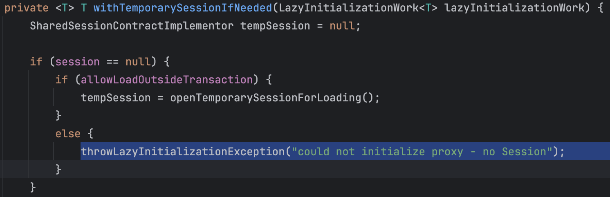
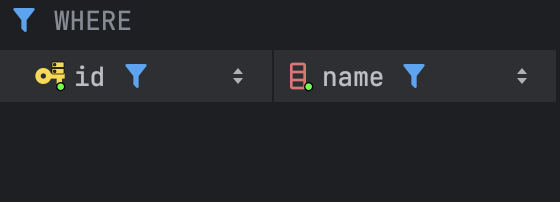

## [들어가며]

이번 프로젝트에서 E2E 테스트 환경을 구축하기 위해서 @SpringBootTest를 통해 테스트 코드를 작성하고 있는데, 아래와 같은 오류를 만나게 되었다.

> failed to lazily initialize a collection of role:  sidepair.domain.feed.FeedContent.nodes.values: could not initialize proxy - no Session

상황은 아래와 같다. (추후 코드로 더 잘 살펴볼 예정이다.)
A라는 생성 API와 B라는 조회 API가 있을 때, 팀 내에서 기능을 세분화한 다음 각자 개발을 진행하다 보니 B를 개발하는 시점에 A라는 API가 없어, 통합 테스트 때 repository를 의존하여 직접 save를 하게 되었다.

하지만, save 후 반환된 엔티티의 객체를 조회할 때 지연 로딩을 사용하다 보니 트랜잭션이 필요하게 되었는데, 테스트 메서드에서는 repository를 호출하는 시점에서만 트랜잭션이 걸리고, 해당 객체를 사용하는 시점에는 트랜잭션이 없어 영속성 컨텍스트가 없는 상태가 된 것이다. 그러다 보니 세션 정보가 없어 지연 로딩을 사용할 수 없다는 오류가 발생하게 되었다.

당시 이 오류를 처음 접했을 때는 테스트 메서드의 트랜잭션이 없어서 발생한 문제니까, A api가 merge 된 이후에 작업하셔도 충분할 것 같았지만, 곰곰이 생각해보니 이게 과연 옳은 해답인가? 라는 생각이 들었다.

앞으로도 이런 테스트 상황이 생길 텐데, 그럴 때마다 이럴 수는 없기 때문에 이번에 공부하면서 새로운 방법을 적용하게 되었다.


## [엔티티 소개]


현 문제 상황에서 필요한 간단한 엔티티 다이어그램이다.
피드 (Feed)는 피드 내용들(FeedContents)에 대해서 1:N 관계를 맺고 있으며, 각 피드 내용(FeedContent)은 피드 노드들(FeedNodes)에 대해서 또 다시 1:N 관계를 가지고 있다.

이를 코드로 봤을 때는 대략적으로 아래와 같이 구성된다.

```java
@Entity
@NoArgsConstructor(access = AccessLevel.PROTECTED)
@AllArgsConstructor
public class Feed extends BaseCreatedTimeEntity {
     ...

    @Embedded
    private FeedContents contents = new FeedContents();
    
    ...
}

```

```java
@Entity
@NoArgsConstructor(access = AccessLevel.PROTECTED)
@Getter
public class FeedContent extends BaseUpdatedTimeEntity {

    ...

    @Embedded
    private final FeedNodes nodes = new FeedNodes();

   ...

    public FeedNodes getNodes() {
        return nodes;
    }
}

```

```java
@Embeddable
@NoArgsConstructor(access = AccessLevel.PROTECTED)
public class FeedNodes {

    @OneToMany(fetch = FetchType.LAZY, cascade = {CascadeType.PERSIST, CascadeType.MERGE}, mappedBy = "feedContent")
    private final List<FeedNode> values = new ArrayList<>();

    ...
    
    public List<FeedNode> getValues() {
        return new ArrayList<>(values);
    }
}

```

여기서 봐야하는 점은, 피드(Feed) - 피드 본문(FeedContent)과 피드 본문(FeedContent)과 피드 노드(FeedNode) 모두가 LAZY 전략을 사용하고 있다는 것이다.


## [문제 상황]

아래의 테스트 코드는 @SpringBootTest(webEnvironment = SpringBootTest.WebEnvironment.RANDOM_PORT)을 통해서 통합 테스트 환경을 구축한 상태에서 진행된다.

```java
@Test
void 테스트() throws JsonProcessingException {
    ...

    final Long 피드_아이디 = 피드를_생성한다(액세스_토큰, 카테고리.getId(), "피드 제목", "피드 소개글", "피드 본문",
            30, List.of(노드1, 노드2));

    final FeedContent 피드_본문 = 피드로부터_본문을_가져온다(피드_아이디);
    final List<FeedNode> 피드_노드들 = 피드_본문.getNodes().getValues(); // Here!
    ...
}

private FeedContent 피드로부터_본문을_가져온다(final Long 피드_아이디) {
    final Feed 피드 = feedRepository.findById(피드_아이디).get();
    return feedContentRepository.findFirstByFeedOrderByCreatedAtDesc(피드).get();
}

```

코드의 첫 라인을 보면 `피드를_생성한다();` 메서드를 통해 피드 아이디를 반환받고 있다. 여기서는 실제 API call을 진행하고 있기 때문에 실제로 생성된 피드의 아이디만을 반환받는다. 
반환받은 아이디를 바탕으로 피드 엔티티를 얻어오기 위해 `findById()`를 통해 피드 엔티티를 조회해오며, 
여기서 가장 최근에 생성된 피드 본문 엔티티를 가져오기 위해 한 번 더 조회를 진행한다.

> 물론, 피드 엔티티로부터 가장 최근의 피드 본문을 받아오는 방법도 있겠지만, 현 프로덕션 코드에서는 해당 부분이 필요하지 않았고, 
> 만약 그렇게 코드를 작성했다면 본문을 가져오는 과정에서부터 오류가 발생했을 것이다. 또한, 현재 작성한 부분은 생성 API가 아직 
> 만들어지지 않은 상태로 조회 API를 만들다 보니 생성을 위한 엔티티를 만드려고 '피드 노드들' 엔티티를 조회해온 코드여서 
> 추후 생성 API가 만들어진다면 제거될 부분이긴 하다

### cf. findFirst~() 메서드에서는 트랜잭션이 어딨을까?

```java
public interface FeedContentRepository extends JpaRepository<FeedContent, Long> {

    Optional<FeedContent> findFirstByFeedOrderByCreatedAtDesc(final Feed feed);
}

```

feedContentRepository의 경우 위와 같이 JpaRepository를 상속받고 있다.


이때, JpaRepository 인터페이스의 구현체인 SimpleJpaRepository 클래스를 가면 위와 같이 `@Transactional`이 붙어 있는 것을 볼 수 있다. 그렇기 때문에 해당 메서드가 호출하는 시점에 대해서만 트랜잭션이 걸려있게 되는 것이다.

기본적으로 스프링에서 영속성 컨텍스트는 트랜잭션과 생명주기가 동일하기 때문에, feedContentRepository로부터 조회해온 FeedContent는 트랜잭션이 종료되면서 영속성 컨텍스트의 관리 범위에서도 함께 벗어나게 된다. 현재 피드 본문 엔티티는 준영속 상태가 되었음을 기억하자.

```java
final List<FeedNode> 피드_노드들 = 피드_본문.getNodes().getValues(); // Here!

```

다시 돌아와서, here! 이라고 특정된 부분을 보자. 해당 부분이 오류가 발생하는 지점이다.
피드 본문으로부터 노드에 대한 정보를 가져오려고 할 때 오류가 발생한 것이다.

```java
public List<FeedNode> getValues() {
    return new ArrayList<>(values);
}

```

노드에서 getValues() 메서드를 호출하면 values()에 대한 접근이 일어나게 되는데, 이때 아래와 같은 일들이 발생한다.


read() 라는 메서드를 따라 들어가다 보면, 어떠한 초기화 작업이 처음에 발생하는 것을 볼 수 있다.


그리고, 지연 로딩 작업을 세션으로부터 컬렉션 정보를 초기화하는 것을 볼 수 있다.
상위의 주석을 잘 읽어보면, 초기화가 불가능할 때 `LazyInitializationException`이 발생함을 볼 수 있다.



그리고, 해당 메서드를 타고 들어가면 session 정보가 없을 때 외부의 트랜잭션을 사용할 수 있는지 판단하는데, 사용 불가능하기 때문에 (allowLoadOutsideTransaction=false) 하단의 else 구문으로 제어가 내려가게 되어 오류가 발생하게 된다.


참고로, allowLoadOutsideTransaction의 경우 제일 처음 세션 정보를 세팅해줄 때 위의 메서드에서 적용된다.
세션 정보로부터 지연 로딩임에도 트랜잭션을 사용할 수 있는지 정보를 받아오는 것 같다.

그렇다면 트랜잭션 정보가 있으면 되는 게 아닐까?
한 번 천천히 해결해나가보자.


### 그냥 @Transactional을 붙이면 되지 않나?

```java
@Test
@Transactional // 트랜잭션!
void 테스트() throws JsonProcessingException {
    ...
	
    final FeedCategory 카테고리 = 피드_카테고리를_저장한다("이커머스");
    final Long 피드_아이디 = 피드를_생성한다(액세스_토큰, 카테고리.getId(), "피드 제목", "피드 소개글", "피드 본문",
            30, List.of(노드1, 노드2));

    final FeedContent 피드_본문 = 피드로부터_본문을_가져온다(피드_아이디);
    final List<FeedNode> 피드_노드들 = 피드_본문.getNodes().getValues(); 
    ...
}

 private FeedCategory 피드_카테고리를_저장한다(final String 카테고리_이름) {
    final FeedCategory 피드_카테고리 = new FeedCategory(카테고리_이름);
    return feedCategoryRepository.save(피드_카테고리);
}

```

트랜잭션이 없어서 생긴 문제라면, `@Transactional`을 붙이면 된다고 생각할 수 있다.
여기서 아까 예제와 다르게 피드에 대한 카테고리 생성 메서드가 추가된 것을 볼 수 있는데, 오류가 발생한 포인트이기 때문에 넣어두었다. 카테고리의 경우 생성하는 API가 없기 때문에 (나중에 admin 기능을 추가하면 넣을 예정이었다.) 위와 같이 직접 save를 해준다.


하지만, 정말 뜬금없이 NPE가 발생하는 것을 볼 수 있다. 이는, 응답값이 제대로 반환되지 않으면서 response header 값이 제대로 내려오지 않았기 때문이다.


실제로 해당 로그의 상단으로 올라가보면, 위와 같이 카테고리에 대한 Exception이 발생한 것을 볼 수 있다.


이는, 피드 생성 API가 호출되면서 create 하는 과정에 request body 값으로 받은 피드 카테고리 아이디에 대한 유효성을 검증하게 되고, 해당 로직에서 카테고리 정보가 존재하지 않아 발생한 오류이다.

분명 위에서 `피드_카테고리를_저장한다()` 메서드를 통해 저장을 했는데, 이게 어떻게 된 일일까?
이는, `@SpringBootTest`(webEnvironment = SpringBootTest.WebEnvironment.RANDOM_PORT) 때문이다.
이전에 테스트 컨텍스트에 대한 블로그 글을 읽은 적이 있는데, 그때 random_port 옵션에 대해 이와 같이 커멘트를 봤었다.

> 만약 @SpringBootTest(webEnvironment = WebEnvironment.RANDOM_PORT)을 사용하게 된다면 실제 웹 환경이 구성
되기 때문에 다른 컨텍스트 정보를 지정하게 되면 다른 웹 서버가 띄워지게 된다.


random_port 옵션을 지정하게 되면 별개의 스레드에서 컨테이너가 실행된다는 것이다.
= 즉, 프로덕션 코드에서 작성한 메서드의 스레드와 `@SpringBootTest`의 메서드의 스레드가 다르다는 의미이다.

기본적으로 `@Transactional`이 붙게 되면 작업 스레드는 커넥션 풀에서 Connection 객체를 가져와서 사용하게 되는데, 스레드가 달라지게 되면 사용하게 되는 Connection이 달라지게 된다. 즉, 트랜잭션이 아예 달라지게 되는 것이다.
그렇기 때문에 프로덕션 코드가 실행되는 피드 생성 API의 스레드 입장으로서는 테스트 메서드인 피드_카테고리를_생성한다() 스레드가 하는 일을 인식하지 못하기 때문에 카테고리에 대한 정보를 받아올 수 없는 것이다.


여기서 한 가지 실수를 했는데, 콘솔상으로는 쿼리가 발생하길래 계속 insert가 된다고 생각했었다. (IDENTITY 전략으로 인해)



하지만, 실제로 DB에 가서 확인해보니 결과가 저장되지 않았었고, 아마 쿼리만 발생한 것 같다고 추측된다.
(트랜잭션 시작 후 커밋이 되지 않은 상태라고 보는 게 더 정확할 것 같다.)


`@Transactional`을 제거하면 위와 같이 레코드가 저장된다. (트랜잭션이 없으니 바로 DB에 저장)


그러면 이 문제를 어떻게 해결해야 할까?
RANDOM_PORT를 사용하지 않게 되면 E2E 테스트의 의미가 없고, API call로 대체할 수 없는 상황이다.

### 지연 로딩이 필요한 시점에서만 트랜잭션을 생성하기 - 메서드 분리하기

근본적인 문제는, 지연 로딩을 하는 시점에 트랜잭션이 존재하지 않아 조회를 해올 수 없었던 것이다.
그렇다면 조회하는 시점에 새로운 트랜잭션을 생성해주는 건은 어떨까?

```java
@Test
void 테스트() throws JsonProcessingException {
    ...
	
    final FeedCategory 카테고리 = 피드_카테고리를_저장한다("이커머스");
    final List<FeedNode> 피드_노드들 = 피드_노드들을_반환한다(액세스_토큰, 카테고리, 노드1, 노드2);
    
    ...
}


@Transactional // 트랜잭션!
public List<FeedNode> 피드_노드들을_반환한다(final String 액세스_토큰, final FeedCategory 카테고리, final FeedNodeSaveRequest 노드1,
                                        final FeedNodeSaveRequest 노드2) {
    final Long 피드_아이디 = 피드를_생성한다(액세스_토큰, 카테고리.getId(), "피드 제목", "피드 소개글", "피드 본문",
            30, List.of(노드1, 노드2));

    final FeedContent 피드_본문 = 피드로부터_본문을_가져온다(피드_아이디);
    return 피드_본문.getNodes().getValues();
}

```

하지만, 위 코드는 동작하지 않는다. 이는 기본적으로 `@Transactional`은 Spring AOP를 사용하여 구현되기 때문이다.

이때 크게 2가지의 특징이 존재한다.
1. 타겟 클래스를 상속하여 프록시 객체를 생성하기 때문에 상속 자체가 불가능한 private 메서드에 대해서는 적용 불가
2. 동일한 클래스의 내부 메서드를 호출하게 되면 프록시를 호출하지 않고 대상 객체를 직접 호출하게 되어 적용 불가

위 코드에서는 2번의 경우, 내부 메서드를 사용했기 때문에 트랜잭션을 적용할 수 없는 것이다.
   그렇다면, 내부 메서드 대신에 외부 클래스를 활용하면 되지 않을까?

### 지연 로딩이 필요한 시점에서만 트랜잭션을 생성하기 - 클래스 분리하기

```java
@Component
@TestConstructor(autowireMode = AutowireMode.ALL)
public class FeedTestHelper {

    private final FeedRepository feedRepository;
    private final FeedContentRepository feedContentRepository;

    public FeedTestHelper(final FeedRepository feedRepository,
                             final FeedContentRepository feedContentRepository) {
        this.feedRepository = feedRepository;
        this.feedContentRepository = feedContentRepository;
    }

    @Transactional(readOnly = true)
    public List<FeedNode> 피드_노드들을_조회한다(final Long 피드_아이디) {
        final FeedContent 피드_본문 = 피드로부터_본문을_가져온다(피드_아이디);
        return 피드_본문.getNodes().getValues();
    }

    private FeedContent 피드로부터_본문을_가져온다(final Long 피드_아이디) {
        final Feed 피드 = feedRepository.findById(피드_아이디).get();
        return feedContentRepository.findFirstByFeedOrderByCreatedAtDesc(피드).get();
    }
}

```

피드 노드를 조회하기 위한 별도의 Helper 클래스를 생성해준다.
피드_본문 엔티티가 detached 상태가 되지 않도록 조회를 해오는 시점의 메서드부터 helper 클래스에 두었으며, 본문으로부터 노드 정보를 지연로딩을 통해 가져와서 반환하도록 만들었다.

```java
@Test
void 테스트() throws JsonProcessingException {
    ...
	
    final FeedCategory 카테고리 = 피드_카테고리를_저장한다("이커머스");
    final Long 피드_아이디 = 피드를_생성한다(액세스_토큰, 카테고리.getId(), "피드 제목", "피드 소개글", "피드 본문",
            30, List.of(노드1, 노드2));
    
    // Here!
    final List<FeedNode> 피드_노드들 = feedTestHelper.피드_노드들을_조회한다(피드_아이디);
    ...
}

```

그리고 기존의 테스트 코드에서 helper 클래스를 통해서 노드를 조회해왔다.


하지만, 위 방법은 매우 찝찝하다. 지연로딩이 필요한 코드마다 이렇게 테스트 클래스로 분리해야 하기 때문이다.
만약 테스트하는 케이스가 정말 많아진다면 그럴 때마다 helper 클래스에 메스드가 엄청나게 늘어나게 될 것이다.
이는 전혀 개발자답지 못한 해결 방법이기 때문에 다른 방법을 모색할 필요가 있다.

### 지연 로딩이 필요한 시점에서만 트랜잭션을 생성하기 - 함수형 인터페이스 활용하기

필요할 때마다 helper 클래스의 메서드로 분리하는 게 아니라, 트랜잭션이 필요한 로직에 대해서만 외부 클래스에서 실행되도록 만들 수는 없을까? 즉, 메서드를 인자로 넘겨서 어떠한 곳에서 처리하고 싶은 것이다.

자바에서는 메서드를 파라미터로 전달하기 위해서 람다식을 활용할 수 있다.
우리는 인자로 넘긴 값으로 List<FeedNode>를 받아야 하기 때문에 T를 반환하는 시그니처를 가진 함수형 인터페이스를 하나 설정할 수 있다.

```java
@FunctionalInterface
public interface TransactionalTask<T> {
    T execute();
}

```

> 함수형 인터페이스란?
> 오직 1개의 추상 메서드를 가지는 인터페이스.
> 여기서 추상 메서드란, 자식 클래스에서 반드시 오버라이딩 해야 사용할 수 있는 메서드이다.

그리고, 트랜잭션이 필요한 작업을 도와준다는 의미로 하나의 헬퍼 클래스를 생성하도록 하자.

```java
@Component
public class TransactionHelper {

    @Transactional(readOnly = true)
    public <T> T getResult(final TransactionalTask<T> task) {
        return task.execute();
    }
}

```

헬퍼 클래스에서는 TransactionTask 타입의 어떠한 람다식을 받아서, 해당 람다식을 `@Transactional`이 걸린 상태로 실행해주는 역할을 진행한다. 이제 이 헬퍼 클래스를 활용하게 되면 아래와 같이 테스트 코드를 작성할 수 있다.

```java
@Test
void 테스트() throws JsonProcessingException {
    ...
	
    final FeedCategory 카테고리 = 피드_카테고리를_저장한다("이커머스");
    final Long 피드_아이디 = 피드를_생성한다(액세스_토큰, 카테고리.getId(), "피드 제목", "피드 소개글", "피드 본문",
            30, List.of(노드1, 노드2));
            
    final List<FeedNode> 피드_노드들 = transactionHelper.getResult(new TransactionalTask<List<FeedNode>>() {
            @Override
            public List<FeedNode> execute() {
                final FeedContent 피드_본문 = 피드로부터_본문을_가져온다(피드_아이디);
                return 피드_본문.getNodes().getValues();
            }
        });
    ...
}

```

transactionHelper 클래스의 getResult() 메서드의 인자로 함수형 인터페이스의 추상 메서드인 execute()의 익명 클래스가 들어간다.
그리고, 해당 구현체에 피드 본문을 조회하여 피드 노드를 반환하는 로직을 넣었다.

> 익명 클래스
> - 클래스의 선언과 인스턴스화를 동시에 진행할 수 있는 클래스로, 이름이 없는 클래스라 익명 클래스라고 부른다.

이때, 익명 클래스의 경우 람다로 축약할 수 있기 때문에 아래와 같이 더 간결하게 리팩터링을 진행할 수 있다.

```java
@Test
void 테스트() throws JsonProcessingException {
    ...
	
    final FeedCategory 카테고리 = 피드_카테고리를_저장한다("이커머스");
    final Long 피드_아이디 = 피드를_생성한다(액세스_토큰, 카테고리.getId(), "피드 제목", "피드 소개글", "피드 본문",
            30, List.of(노드1, 노드2));
            
    final List<FeedNode> 피드_노드들 = transactionHelper.getResult(() -> {
    	final FeedContent 피드_본문 = 피드로부터_본문을_가져온다(피드_아이디);
    	return 피드_본문.getNodes().getValues();
    });
    
    ...
}

```


최종적으로 실행해보면 위와 같이 테스트 코드도 잘 실행되는 것을 볼 수 있다! 

이제 테스트 코드에서 지연로딩이 필요한 부분에 대해 (then절 같이 응답값을 꺼내어 검증할 때) 이를 잘 사용하면 된다.
오랜만에 함수형 인터페이스 같은 개념을 보다 보니까 헷갈렸는데, 아무쪼록 잘 해결할 수 있어서 다행이다.
꽤 의미있는 트러블 슈팅을 한 것 같아서 재밌었다 


### 추가
더 좋은 방법을 찾게되어서 작성해보고자 한다.

```java
@Autowird
private TransactionTemplate transactionTemplate;

@Test
void 테스트() throws JsonProcessingException {
    ...
	
    final FeedCategory 카테고리 = 피드_카테고리를_저장한다("이커머스");
    final Long 피드_아이디 = 피드를_생성한다(액세스_토큰, 카테고리.getId(), "피드 제목", "피드 소개글", "피드 본문",
            30, List.of(노드1, 노드2));
    
    final List<FeedNode> 피드_노드들 = transactionTemplate.execute(new TransactionCallback<List<FeedNode>>() {
            @Override
            public List<FeedNode> doInTransaction(final TransactionStatus status) {
                final FeedContent 피드_본문 = 피드로부터_본문을_가져온다(피드_아이디);
                return 피드_본문.getNodes().getValues();
            }
        });
    
    ...
}

```

스프링에서는 이미 TransactionTemplate 이라는 인터페이스를 통해서 제공을 해주고 있었다..
위와 같이 반환값이 필요한 경우라면 TransactionCallback을 인자로 받으면 된다.
람다를 활용하면 더 축약이 가능하다.

```java
@Autowird
private TransactionTemplate transactionTemplate;

@Test
void 테스트() throws JsonProcessingException {
    ...
	
    final FeedCategory 카테고리 = 피드_카테고리를_저장한다("이커머스");
    final Long 피드_아이디 = 피드를_생성한다(액세스_토큰, 카테고리.getId(), "피드 제목", "피드 소개글", "피드 본문",
            30, List.of(노드1, 노드2));
    
    final List<FeedNode> 피드_노드들 = transactionTemplate.execute(status -> {
            final FeedContent 피드_본문 = 피드로부터_본문을_가져온다(피드_아이디);
            return 피드_본문.getNodes().getValues();
    });
    
    ...
}

```

지금 보면 직접 만든 transactionHelper와 완전 동일하다고 봐도 무방하다. 그냥 요렇게 사용하는 게 더 좋을 것 같다.

만약, 반환값이 필요없다면 TransactionCallbackWithoutResult를 인자로 받으면 된다.

```java
@Autowird
private TransactionTemplate transactionTemplate;

@Test
void 테스트() throws JsonProcessingException {
    ...
	
    final FeedCategory 카테고리 = 피드_카테고리를_저장한다("이커머스");
    final Long 피드_아이디 = 피드를_생성한다(액세스_토큰, 카테고리.getId(), "피드 제목", "피드 소개글", "피드 본문",
            30, List.of(노드1, 노드2));
    
    transactionTemplate.execute(new TransactionCallbackWithoutResult() {
            @Override
            protected void doInTransactionWithoutResult(final TransactionStatus status) {
                final FeedContent 피드_본문 = 피드로부터_본문을_가져온다(피드_아이디);
                피드_본문.getNodes().getValues();
            }
        });
        
    ...
}

```
